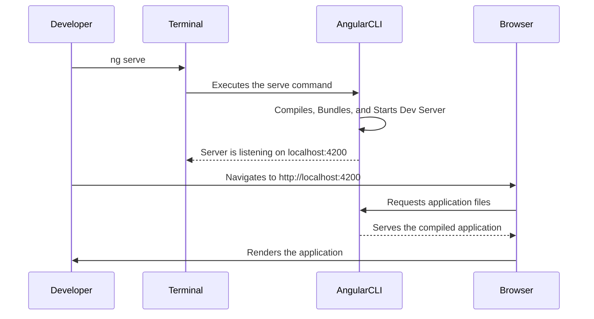

# Module 1.3: Your First Angular Application

**Objective:** By the end of this module, you will be able to:
- **Generate** a new, modern, standalone-based Angular application using the Angular CLI.
- **Run** the application using the local development server.
- **Understand** the key CLI commands and prompts involved in creating and running a project.
- **Verify** that the application is working correctly in your browser.

---

### Creating the Project

The Angular CLI makes project initialization straightforward with the `ng new` command. **Before proceeding, ensure you have Node.js, npm, and the Angular CLI installed as covered in Module 1.2.**

**The Command:**

Open your terminal and navigate to the directory where you want to create your projects. Then, run the following command:

```bash
# Note on Naming: Use kebab-case (e.g., my-cool-app) for project names.
# This is a common convention and avoids potential issues with web servers.
ng new my-angular-app --standalone
```

**Dissecting the Command:**

*   `ng new`: The CLI command to generate a new Angular workspace.
*   `my-angular-app`: The name for your application. The CLI will create a new folder with this name.
*   `--standalone`: This is the most important flag for a modern Angular project. It instructs the CLI to set up the project using the latest **standalone architecture**, which does not require `NgModules`. This results in a simpler structure and less boilerplate code.

**`ng new` Command Options Summary:**

| Option           | Description                                                                 | Default Value (if applicable) |
| :--------------- | :-------------------------------------------------------------------------- | :---------------------------- |
| `--standalone`   | Generates a standalone application (no `NgModules`).                        | `true` (for new projects)     |
| `--routing`      | Generates a routing module.                                                 | `true`                        |
| `--style=<css|scss|sass|less|styl>` | Specifies the stylesheet format.                                            | `css`                         |
| `--skip-tests`   | Do not generate `spec.ts` files for the new project.                        | `false`                       |
| `--ssr`          | Generates an application with Server-Side Rendering (SSR) enabled.          | `false`                       |
| `--strict`       | Enables strict mode for TypeScript and Angular templates.                   | `true`                        |
| `--prefix=<name>`| Defines a prefix to apply to generated selectors.                           | `app`                         |

**CLI Prompts:**

After you run the command, the CLI will ask you two questions:

1.  **`Which stylesheet format would you like to use?`**
    *   **Recommendation:** Select **CSS**. It's the web standard and the easiest to start with. You can always change this later if you decide to use a preprocessor like Sass. (See [Module 10.5: Performance Optimization Techniques](./10.5-performance-optimization.md) for more on styling).

2.  **`Do you want to enable Server-Side Rendering (SSR) and Static Site Generation (SSG)?`**
    *   **Recommendation:** Select **No** for now. These are advanced topics that will be covered in a later module. (See [Module 11.3: Server-Side Rendering (SSR) & Hydration](../11-enterprise-architecture/11.3-ssr-hydration.md) for more details).

**Note:** Project settings like the stylesheet format can be changed later by editing the `angular.json` file.

The CLI will then create the project files and install all the required npm packages. This might take a few minutes.

**Troubleshooting:** If the installation fails or hangs, check your internet connection, ensure you have sufficient disk space, and review the terminal output for specific error messages. Sometimes, clearing the npm cache (`npm cache clean --force`) and retrying can help. For more help, refer to the [official npm troubleshooting documentation](https://docs.npmjs.com/cli/v10/using-npm/troubleshooting).

### Running the Application

Once the installation is complete, you need to navigate into the newly created project directory and start the development server.

**The `ng serve` Command:**

This is the command you will use every day during development.

```bash
# Navigate into your project folder
cd my-angular-app

# Compile and serve the application
ng serve
```

**Note:** To stop the development server, press `Ctrl+C` in the terminal where it is running.

**What `ng serve` Does:**

This single command performs several actions:

1.  **Builds:** It compiles the TypeScript code into JavaScript and the SCSS/Sass into CSS.
2.  **Bundles:** It bundles all the necessary files into a few optimized files for the browser.
3.  **Serves:** It starts a local, lightweight web server.
4.  **Watches:** It continuously watches your source files for changes. If you save a file, it will automatically rebuild and reload the application in your browser (a feature known as **live reload**).

This entire process is illustrated below:



**Text Summary of `ng serve` Process:**

1.  **Developer initiates `ng serve`** in the terminal.
2.  The **Angular CLI** compiles the application, bundles the code, and starts a local development server.
3.  The server listens on `http://localhost:4200`.
4.  The **Developer** opens a browser and navigates to this URL.
5.  The **Browser** requests the application files from the Angular CLI's development server.
6.  The **Angular CLI** serves the compiled application to the browser.
7.  The **Browser** renders the application, and the developer sees the running app. The CLI continues to watch for file changes, automatically recompiling and reloading the browser as needed.

### Viewing Your Application

Once the terminal shows `✔ Compiled successfully.`, open your web browser and go to:

> **http://localhost:4200**

You will be greeted by the default Angular welcome page. This confirms that your environment is set up correctly and your new application is running.

**Troubleshooting:** If the page doesn't load, check for errors in the browser's developer console (F12 or Ctrl+Shift+I). Common issues include network problems, browser extensions blocking content, or errors from the `ng serve` command.

A simplified version of the default welcome page's HTML looks like this:

```html
<!-- To customize this page, edit src/app/app.component.html -->
<main>
  <h1>Hello, World!</h1>
  <p>
    Welcome to my-angular-app!
  </p>
  
  <!-- ... more content ... -->
</main>

<router-outlet></router-outlet>
```

---

### Key Takeaways

*   The `ng new` command is used to scaffold new Angular projects, with `--standalone` being the recommended flag for modern apps.
*   The `ng serve` command compiles your application, starts a development server, and provides live reloading for efficient development.
*   Angular applications are served from `http://localhost:4200` by default.
*   The initial project structure includes `angular.json`, `package.json`, `src/`, and `tsconfig.json`.

### Self-Assessment Checklist
- [ ] I can generate a new standalone Angular application using `ng new`.
- [ ] I know how to start the development server with `ng serve`.
- [ ] I can find and view my running application in the browser.
- [ ] I know how to stop the development server.
- [ ] I can locate the main application component file (`app.component.html`) to make changes.

---

**Previous:** [1.2 Environment Setup](./1.2-environment-setup.md)

**Next:** [1.4 Project Files Deep Dive](./1.4-project-files-deep-dive.md)
