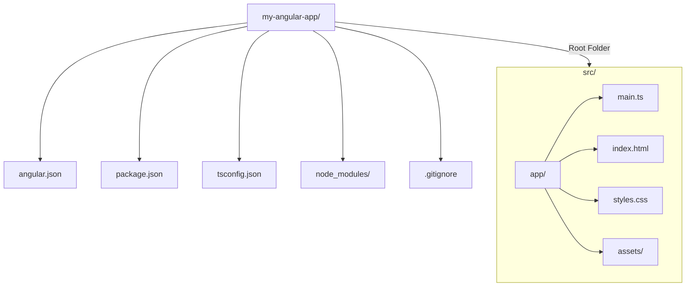

# Module 1.4: Core Project Files Deep Dive

**Objective:** By the end of this module, you will be able to:
- **Identify** and **explain** the purpose of each core file and folder in a standard Angular project.
- **Understand** the roles of `angular.json`, `package.json`, and `tsconfig.json`.
- **Navigate** the `src/` folder and locate key files like `index.html`, `main.ts`, and the root `app` component.

---

### The Anatomy of an Angular Workspace

When the Angular CLI creates a new project, it generates a standard, predictable folder structure. Understanding this structure is essential for navigating and managing your application effectively. This consistent structure also greatly aids **teamwork and long-term maintainability** of the codebase.

**Text Summary of Workspace Anatomy:**

An Angular workspace typically consists of a root folder (e.g., `my-angular-app/`) containing configuration files like `angular.json`, `package.json`, `tsconfig.json`, a `.gitignore` file, the `node_modules/` directory for dependencies, and the crucial `src/` folder. The `src/` folder further contains the application's main entry points (`main.ts`, `index.html`, `styles.css`), an `assets` folder for static files, and the `app/` directory, which houses the root component and its configuration.

### Root-Level Files & Folders

These files are located in the root directory of your project (`my-angular-app/`).

| File/Folder        | Purpose                                                                 |
| :----------------- | :---------------------------------------------------------------------- |
| `node_modules/`    | Contains all third-party dependencies.                                  |
| `src/`             | Contains the application's source code.                                 |
| `angular.json`     | Angular CLI configuration for the workspace.                            |
| `package.json`     | Manages project dependencies and defines scripts.                       |
| `tsconfig.json`    | TypeScript compiler configuration.                                      |
| `.gitignore`       | Specifies intentionally untracked files that Git should ignore.         |

1.  **`node_modules/`**
    *   **What it is:** This folder contains all the third-party libraries (dependencies) that your project needs to function, as listed in `package.json`. This folder is managed by npm and can become very large. 
    *   **Rule of Thumb:** You should **never** manually edit files in this folder or commit it to source control.

2.  **`.gitignore`**
    *   **What it is:** A configuration file for the Git version control system. It tells Git which files and folders to ignore when tracking changes. By default, it includes `node_modules/`, build output folders (`dist/`), and various temporary files.

3.  **`src/`**
    *   **What it is:** The most important folder. It contains the **source code** for your application—all the components, templates, styles, and logic that you will write.

4.  **`angular.json`**
    *   **What it is:** The primary configuration file for the Angular CLI. It defines the structure of your workspace and includes settings for building, serving, and testing your application.
    *   **Key Sections:**
        *   `projects`: Defines the configuration for each project in the workspace (you can have multiple).
        *   `architect`: Inside each project, this section defines configurations for different CLI commands (`build`, `serve`, `test`). For example, you can specify production build optimizations here.

5.  **`package.json`**
    *   **What it is:** A standard file in every Node.js project. It serves two main purposes:
        1.  **Lists Dependencies:** It records all the libraries your project depends on (`dependencies`) and the libraries needed only for development (`devDependencies`).
        2.  **Defines Scripts:** The `scripts` section contains convenient aliases for running CLI commands, such as `npm start` (which runs `ng serve`) and `npm test` (which runs `ng test`).

6.  **`tsconfig.json`**
    *   **What it is:** The configuration file for the **TypeScript compiler**. It tells the compiler how to translate your TypeScript code into JavaScript that browsers can understand. It includes rules for type checking, module resolution, and which ECMAScript version to target.

### The `src/` Folder: Your Application's Home

This is where you will spend most of your development time.

1.  **`index.html`**
    *   **What it is:** The single, main HTML page that is served to the user. The entire Angular application is loaded into this one page.
    *   **Key Element:** Inside the `<body>`, you will find `<app-root></app-root>`. This is a custom HTML tag that represents your **root component**. Angular finds this tag and injects your main application component here.

2.  **`main.ts`**
    *   **What it is:** The **entry point** of your application. This is the very first file that gets executed.
    *   **Primary Job:** Its main responsibility is to **bootstrap** (start up) the Angular application. In a modern standalone project, it calls the `bootstrapApplication` function, passing in your root component (`AppComponent`).

3.  **`styles.css`**
    *   **What it is:** The place for **global styles**. CSS rules defined in this file will apply to your entire application. This is where you would put things like CSS resets, theme variables, or global font styles.

4.  **`assets/`**
    *   **What it is:** A folder for storing static assets that will be copied as-is when you build your project. This is the perfect place for images, fonts, and other files that don't need to be processed.

5.  **`app/`**
    *   **What it is:** This folder contains the files for your root component, `AppComponent`. In a new project, you will find:
        *   `app.component.ts`: The TypeScript class for the component's logic.
        *   `app.component.html`: The HTML template for the component's view.
        *   `app.component.css`: The CSS styles that are **scoped** specifically to this component.
        *   `app.config.ts`: Application-specific configuration for a standalone app, such as registering router providers.

---

### Key Takeaways

*   An Angular project has a well-defined, predictable folder structure.
*   `angular.json`, `package.json`, and `tsconfig.json` are crucial configuration files.
*   The `src/` folder is where all your application's source code resides.
*   `index.html` is the single entry point, and `main.ts` bootstraps the application.
*   `node_modules/` should never be manually edited or committed to source control.

---

**Previous:** [1.3 First Application](./1.3-first-application.md)

**Next:** [1.5 TypeScript Fundamentals](./1.5-typescript-fundamentals.md)
