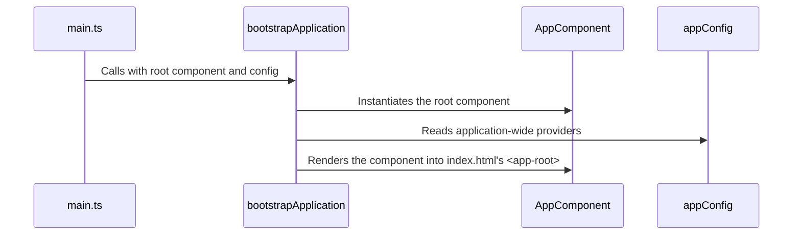

# Module 3.2: Creating & Bootstrapping a Standalone App

**Objective:** By the end of this module, you will be able to understand the role of `main.ts` in bootstrapping a standalone Angular application and configure application-wide services and features using `app.config.ts`.

---

### The New Entry Point: `main.ts`

In a modern standalone Angular application, the entire startup process is handled in the `src/main.ts` file. This file is the very first piece of your code that executes. It replaces the old `main.ts`/`AppModule` combination.

Its role is simple but critical: to **bootstrap** the root component of your application and provide any necessary application-wide configuration.

### The `bootstrapApplication` Function

This function is the heart of the standalone startup process. It directly launches a component rather than an `NgModule`.

**Syntax:**

```typescript
// src/main.ts
import { bootstrapApplication } from '@angular/platform-browser';
import { AppComponent } from './app/app.component';
import { appConfig } from './app/app.config';

// The bootstrap call
bootstrapApplication(AppComponent, appConfig)
  .catch((err) => console.error(err));
```

Let's break down the arguments:

1.  **`AppComponent`**: This is the **root component** of your application.
2.  **`appConfig`**: An **application configuration object**. It's where you provide all the services, routing information, and other features that need to be available to the entire application. If omitted, the application will bootstrap with a default configuration.



### Application Configuration: `app.config.ts`

When you generate a new standalone project, the CLI creates a file at `src/app/app.config.ts`. This file is dedicated to defining your application-level configuration.

**Example `app.config.ts`:**

```typescript
import { ApplicationConfig } from '@angular/core';
import { provideRouter } from '@angular/router';
import { routes } from './app.routes';

export const appConfig: ApplicationConfig = {
  providers: [
    provideRouter(routes)
  ]
};
```

**The `providers` Array:**

This is the most important part of the `appConfig`. The `providers` array is where you register services and features that should be available to the entire application.

**What goes in `providers`?**

*   **Routing:** `provideRouter(routes)`
*   **HttpClient:** `provideHttpClient()`
*   **Animations:** `provideAnimations()`
*   **Application-wide Services:** While services with `providedIn: 'root'` are automatically available, you can register other providers here, such as factory or value providers.

**Example with HttpClient and a custom provider:**

```typescript
import { ApplicationConfig } from '@angular/core';
import { provideRouter } from '@angular/router';
import { provideHttpClient } from '@angular/common/http';
import { routes } from './app.routes';
import { Logger, MyLogger } from './logger.service';

export const appConfig: ApplicationConfig = {
  providers: [
    provideRouter(routes),
    provideHttpClient(),
    { provide: Logger, useClass: MyLogger } // Example of a custom provider
  ]
};
```

By using these dedicated `provide...` functions, the standalone API ensures that services and features are configured correctly and are more easily **tree-shaken** (a process of removing unused code) if they aren't used, leading to better performance.

### Generating a New Standalone App

As a reminder from Module 1, you can generate a new project with this modern setup using the `--standalone` flag (which is the default in Angular 17+).

```bash
ng new my-standalone-app
```

The CLI will automatically generate the `main.ts` and `app.config.ts` files with the correct structure, giving you the perfect starting point for a new application.

---

### Key Takeaways

*   **`main.ts`** is the entry point for standalone Angular applications.
*   **`bootstrapApplication()`** directly launches a component, simplifying the startup process.
*   **`app.config.ts`** is the central place to configure application-wide services and features.

---

**Previous:** [3.1 The "Why" of Standalone Components](./3.1-why-standalone.md)

**Next:** [3.3 Standalone Component Dependencies](./3.3-component-dependencies.md)
