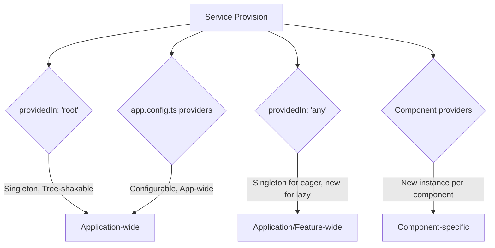

# Module 4.2: Creating & Providing Services

**Objective:** By the end of this module, you will be able to:
- **Generate** new services using the Angular CLI.
- **Understand** the `@Injectable()` decorator and its `providedIn` property for service scoping.
- **Differentiate** between various service provision mechanisms (root, platform, any, component-level).
- **Configure** application-wide services in `app.config.ts`.

---

### Generating Services with the Angular CLI

Just like components, services can be easily generated using the Angular CLI. This ensures a consistent structure and automatically adds the necessary `@Injectable()` decorator.

**The Command:**

```bash
# Long form
ng generate service user-data

# Short form
ng g s user-data
```

This command will create two files:

*   `src/app/user-data.service.ts`: The service class itself.
*   `src/app/user-data.service.spec.ts`: A test file for the service.

**Note on Naming Conventions:** It's a common practice to suffix service names with `Service` (e.g., `UserService`, `AuthService`) for clarity.

**Useful Flags for Service Generation:**

*   `--skip-tests=true`: Prevents the generation of the `.spec.ts` test file.
*   `--flat`: Creates the service file directly in the current directory, without a new folder.
*   `--project`: Specifies the project in a multi-project workspace where the service should be generated.

**Example `user-data.service.ts`:**

```typescript
import { Injectable } from '@angular/core';

@Injectable({
  providedIn: 'root'
})
export class UserDataService {

  constructor() { }

  getUsers(): string[] {
    return ['Alice', 'Bob', 'Charlie'];
  }

  addUser(name: string): void {
    // In a real app, this would interact with a backend API
    console.log(`Adding user: ${name}`);
  }
}
```

**Note on Testing:** The generated `.spec.ts` file provides a basic setup for unit testing your service. You can expand on this to test its methods and interactions with other services.

### The `@Injectable()` Decorator

Every service class in Angular must be decorated with `@Injectable()`. This decorator marks the class as a participant in the dependency injection system. Without it, Angular's injector won't know how to create an instance of your service. It's crucial even if your service doesn't have its own dependencies, as it signals to the Angular compiler that this class can be injected. The Angular CLI automatically adds this decorator when you generate a service.

#### The `providedIn` Property

The `providedIn` property within the `@Injectable()` decorator is crucial for determining where and how your service is made available (provided) in the application. It controls the **scope** of the service.

| `providedIn` Value | Description                                                                 | Use Case                                                                 |
| :----------------- | :-------------------------------------------------------------------------- | :----------------------------------------------------------------------- |
| `'root'`           | (Recommended) Service is a **singleton** available application-wide. Tree-shakable. | Global state, API interactions, utility functions.                       |
| `'platform'`       | Service is a singleton available at the platform level (rare).              | Services shared across multiple Angular apps on the same page.           |
| `'any'`            | Provides a unique instance for each lazy-loaded module that injects it. Behaves like `'root'` for eagerly loaded components. | Feature-specific state that should be isolated per lazy-loaded module.   |

**Warning:** Providing the same service in multiple places (e.g., in `app.config.ts` and a component's `providers` array) can lead to unexpected behavior and multiple instances of a service where only one is intended.

### Providing Services in `app.config.ts` (for Standalone Apps)

While `providedIn: 'root'` is the most common way to provide services, sometimes you need to provide services or features at the application level with more configuration. In standalone applications, this is done in the `providers` array of the `app.config.ts` file.

**Example: Providing `HttpClient` and a custom service with a factory:**

```typescript
// src/app/app.config.ts
import { ApplicationConfig } from '@angular/core';
import { provideRouter } from '@angular/router';
import { provideHttpClient } from '@angular/common/http';
import { MyCustomService } from './my-custom.service';

export const appConfig: ApplicationConfig = {
  providers: [
    provideHttpClient(), // Provides HttpClient for the entire app
    // Example of a custom provider using a factory
    { provide: MyCustomService, useFactory: () => new MyCustomService('config-value') }
  ]
};
```

**When to use `app.config.ts` `providers`:**

*   When you need to provide a service that doesn't use `providedIn: 'root'`.
*   When you need to provide a service with a custom configuration (e.g., using `useValue`, `useClass`, `useFactory`).
*   When providing Angular's built-in feature providers like `provideRouter()`, `provideHttpClient()`, `provideAnimations()`, etc. These `provide...` functions are tree-shakable and ensure proper setup of complex Angular features.

### Providing Services at the Component Level (Less Common)

You can also provide a service directly within a component's `providers` array in its `@Component` decorator. This creates a new instance of the service for *each instance* of that component.

**Use Case:** When you need a fresh, isolated instance of a service for every instance of a particular component. For example, a `FormStateService` that manages the state of a specific form, and you have multiple instances of that form component on the same page.

**Note on Memory Usage:** Be cautious when providing services at the component level, especially for large or frequently created components, as it can lead to increased memory consumption if not managed properly. Ensure the service's lifecycle aligns with the component's lifecycle.

```typescript
import { Component } from '@angular/core';
import { LocalStateService } from './local-state.service';

@Component({
  standalone: true,
  selector: 'app-my-component',
  template: `...`,
  providers: [LocalStateService] // New instance for each MyComponent
})
export class MyComponent {
  constructor(private localStateService: LocalStateService) { }
}
```

**Summary of Providing Mechanisms:**



**Text Summary of Providing Mechanisms:**

Angular offers several ways to provide services, each controlling the service's scope and lifecycle. `providedIn: 'root'` creates a single, application-wide, tree-shakable singleton. `providedIn: 'any'` provides a new instance per lazy-loaded module or a root singleton for eager loading. `app.config.ts` providers allow for configurable, application-wide services. Component-level providers create a new service instance for each component instance, useful for component-specific state.

Choosing the correct `providedIn` strategy or explicit provider location is key to managing the lifecycle and scope of your services effectively. If you need to refactor your provider scopes, carefully consider the impact on service instances and data sharing.

---

### Key Takeaways

*   Services are generated with `ng generate service` and marked with `@Injectable()`.
*   The `@Injectable()` decorator is essential for Angular's DI system.
*   `providedIn: 'root'` creates a single, application-wide, tree-shakable singleton service.
*   `providedIn: 'platform'` and `providedIn: 'any'` offer more specialized scoping.
*   In standalone apps, `app.config.ts` is used to provide application-wide services and features.
*   Component-level providers create isolated service instances per component instance.

---

**Previous:** [4.1 The Purpose of Services](./4.1-purpose-of-services.md)

**Next:** [4.3 Understanding Dependency Injection](./4.3-dependency-injection.md)
