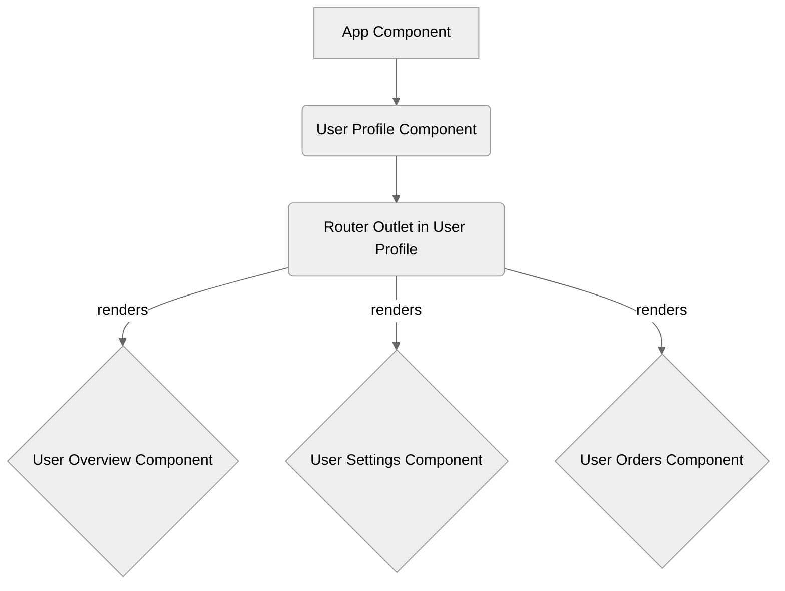
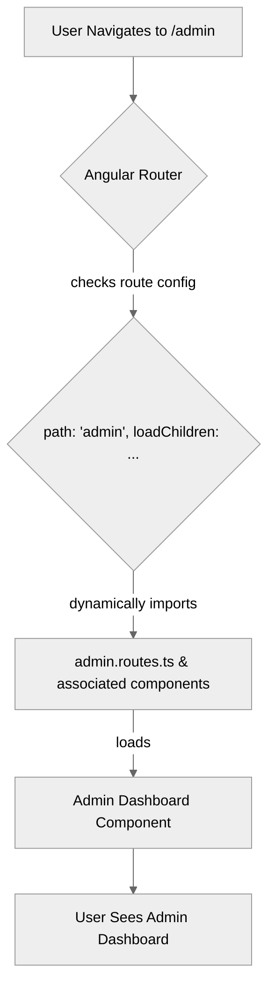

# Module 5.5: Child Routes & Lazy Loading

**Objective:** By the end of this module, you will be able to:
- **Define** and **implement** nested (child) routes for complex UI layouts.
- **Apply** lazy loading to improve application performance by loading feature code only when needed.
- **Understand** and **configure** preloading strategies for optimized user experience.

---

### 1. Child Routes: Nested Navigation

Many applications have UIs where a section of the screen has its own sub-navigation. For example, a user profile page might have tabs for "Overview," "Settings," and "Orders." Each tab represents a child route.

Child routes allow you to define routes relative to a parent route, creating a hierarchical routing structure.

#### a) Defining Child Routes

Child routes are defined within the `children` array of a parent route object.

```typescript
// src/app/app.routes.ts
import { Routes } from '@angular/router';
import { UserProfileComponent } from './user-profile/user-profile.component';
import { UserOverviewComponent } from './user-profile/user-overview/user-overview.component';
import { UserSettingsComponent } from './user-profile/user-settings/user-settings.component';
import { UserOrdersComponent } from './user-profile/user-orders/user-orders.component';

export const routes: Routes = [
  // ... other top-level routes
  {
    path: 'user-profile',
    component: UserProfileComponent, // Parent component
    children: [
      { path: '', redirectTo: 'overview', pathMatch: 'full' }, // Default child route
      { path: 'overview', component: UserOverviewComponent },
      { path: 'settings', component: UserSettingsComponent },
      { path: 'orders', component: UserOrdersComponent }
    ]
  }
];
```

#### b) `RouterOutlet` for Child Routes

Just as the main `AppComponent` has a `<router-outlet>` for top-level routes, the parent component of child routes (e.g., `UserProfileComponent`) must also have its own `<router-outlet>` to render its children.

**`src/app/user-profile/user-profile.component.html`:**

```html
<div class="user-profile-container">
  <h2>User Profile</h2>

  <nav class="profile-nav">
    <a routerLink="./overview" routerLinkActive="active">Overview</a>
    <a routerLink="./settings" routerLinkActive="active">Settings</a>
    <a routerLink="./orders" routerLinkActive="active">Orders</a>
  </nav>

  <div class="profile-content">
    <!-- Child routes will be rendered here -->
    <router-outlet></router-outlet>
  </div>
</div>
```

**Navigation with Child Routes:**

*   `routerLink="./overview"`: The `./` indicates a relative path, meaning relative to the current active route (`/user-profile`). This is generally preferred for child routes to make them more portable.
*   The full URLs would be `/user-profile/overview`, `/user-profile/settings`, etc.

**Tip on Deep Linking/Bookmarks:** Angular Router handles deep linking automatically. Users can bookmark or share URLs that include child routes, and the application will navigate directly to that nested view upon load.


**Alt text:** Diagram showing an App Component containing a User Profile Component, which in turn has a Router Outlet that renders child components like User Overview, User Settings, or User Orders based on the active child route.

**Text Summary of Child Routing:**

An `App Component` contains a `User Profile Component`, which in turn has its own `Router Outlet`. This nested `Router Outlet` is responsible for rendering the child components (e.g., `User Overview`, `User Settings`, `User Orders`) based on the active child route.

--- 

### 2. Lazy Loading: Performance Optimization

In a large application, loading all modules and components at startup can significantly increase the initial load time. **Lazy loading** is a technique that loads parts of your application only when they are actually needed (i.e., when a user navigates to a route that requires them).

**Benefits of Lazy Loading:**

*   **Faster Initial Load Times:** Users get to see the application faster because less code is downloaded upfront.
*   **Reduced Bundle Size:** The main application bundle becomes smaller.
*   **Improved User Experience:** A snappier application feels more responsive.

#### a) Implementing Lazy Loading with Standalone Components

With standalone components, lazy loading is incredibly straightforward. You use the `loadChildren` property in your route configuration, which takes a function that dynamically imports the routes for a feature.

**Example: Lazy Loading an Admin Feature:**

1.  **Create a separate routes file for the feature:**
    ```typescript
    // src/app/admin/admin.routes.ts
    import { Routes } from '@angular/router';
    import { AdminDashboardComponent } from './admin-dashboard/admin-dashboard.component';
    import { UserManagementComponent } from './user-management/user-management.component';

    export const ADMIN_ROUTES: Routes = [
      { path: '', component: AdminDashboardComponent },
      { path: 'users', component: UserManagementComponent }
    ];
    ```

2.  **Configure the lazy-loaded route in your main `app.routes.ts`:**
    ```typescript
    // src/app/app.routes.ts
    import { Routes } from '@angular/router';
    // ... other imports

    export const routes: Routes = [
      // ... other routes
      {
        path: 'admin',
        // This function uses dynamic import() to load the ADMIN_ROUTES
        loadChildren: () => import('./admin/admin.routes').then(m => m.ADMIN_ROUTES)
      }
    ];
    ```

**`loadChildren` vs. `component`:**

*   Use `component` when the component is eagerly loaded (part of the main bundle).
*   Use `loadChildren` when you want to lazy load a feature. The value is a function that returns a `Promise` to an array of `Routes` (for standalone components) or an `NgModule` (for module-based features).

**Note on Error Handling:** If a lazy-loaded module fails to load (e.g., due to network issues), the `loadChildren` promise will reject. You can catch this error and display a user-friendly message or redirect to an error page.


**Alt text:** Diagram illustrating the lazy loading process: User navigates to /admin, Angular Router checks route config, dynamically imports admin.routes.ts and associated components, loads the Admin Dashboard Component, and the user sees the Admin Dashboard.

#### b) Preloading Strategies (Advanced)

While lazy loading improves initial load, you might want to load some lazy modules in the background *after* the initial application has loaded. This is called **preloading**.

Angular provides two built-in preloading strategies:

*   **`NoPreloading` (Default):** No lazy-loaded modules are preloaded.
*   **`PreloadAllModules`:** All lazy-loaded modules are preloaded in the background.

You can configure a preloading strategy in your `app.config.ts`:`

```typescript
// src/app/app.config.ts
import { ApplicationConfig } from '@angular/core';
import { provideRouter, withPreloading, PreloadAllModules } from '@angular/router';
import { routes } from './app.routes';

export const appConfig: ApplicationConfig = {
  providers: [
    provideRouter(routes, withPreloading(PreloadAllModules)) // Add preloading strategy
  ]
};
```

**Summary of Preloading Strategies:**

| Strategy             | Description                                                                 | When to Use                                                 |
| :------------------- | :-------------------------------------------------------------------------- | :---------------------------------------------------------- |
| `NoPreloading`       | (Default) No lazy-loaded modules are preloaded.                             | For small apps or when bandwidth is a major concern.        |
| `PreloadAllModules`  | All lazy-loaded modules are preloaded in the background after initial load. | For medium to large apps where users frequently navigate between features. |
| **Custom Strategy**  | Implement your own logic to decide which modules to preload.                | For fine-grained control, e.g., preloading based on user behavior or network conditions. |

Child routes and lazy loading are essential techniques for building scalable, performant, and well-organized Angular applications. They allow you to manage complexity and optimize the user experience.

---

### Quick Quiz

1.  **What is the primary difference between a route parameter and a query parameter?**
    *   A) Route parameters are for optional data, while query parameters are for mandatory data.
    *   B) Route parameters are part of the URL path and identify a specific resource, while query parameters are optional key-value pairs used for filtering or sorting.
    *   C) There is no functional difference.

2.  **Which route guard would you use to prevent a user from leaving a page with unsaved changes?**
    *   A) `CanActivate`
    *   B) `CanLoad`
    *   C) `CanDeactivate`

3.  **What is the main benefit of lazy loading?**
    *   A) It makes the application more secure.
    *   B) It improves initial load time by only loading modules when they are needed.
    *   C) It simplifies the process of defining routes.

---

### Quiz Answers and Explanations

1.  **Answer: B)** Route parameters are part of the URL path and identify a specific resource (e.g., `/products/123`), while query parameters are optional key-value pairs used for filtering or sorting (e.g., `/products?category=electronics`).
2.  **Answer: C)** The `CanDeactivate` guard is specifically designed to control whether a user can navigate away from a route, making it ideal for scenarios with unsaved changes.
3.  **Answer: B)** Lazy loading improves initial load time by only loading modules when they are needed, reducing the initial bundle size and speeding up application startup.

---

### Key Takeaways

*   **Child routes** allow you to create nested navigation structures within a parent component.
*   Each parent component with child routes needs its own **`<router-outlet>`** to render its children.
*   **Lazy loading** significantly improves application performance by loading feature code only when it's needed, reducing initial bundle size.
*   Standalone components make lazy loading straightforward using the `loadChildren` property with dynamic `import()`."
*   **Preloading strategies** can further optimize perceived performance by loading lazy modules in the background.

---

**End of Module 5.**

**Previous:** [5.4 Route Guards](./5.4-route-guards.md)

**Next:** [06-angular-forms](../06-angular-forms/6.1-forms-overview.md)

