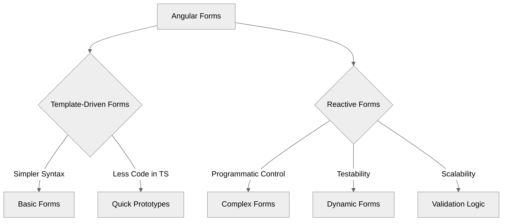

# Module 6.1: Angular Forms Overview

**Objective:** By the end of this module, you will be able to:
- **Differentiate** between Template-Driven and Reactive Forms in Angular.
- **Understand** their core features and how they handle user input and validation.
- **Identify** appropriate use cases for each approach based on form complexity and project needs.

---

### The Importance of Forms

Forms are a cornerstone of almost every web application. They are the primary way users interact with your application to input data, whether it's logging in, registering, submitting feedback, or creating new content.

**Note on Accessibility:** When building forms, always consider accessibility. Ensure proper labeling, clear error messages, and keyboard navigation support to make your forms usable by everyone. (See [Module 12.3: Accessibility (a11y)](../../12-security-i18n-a11y/12.3-accessibility.md) for more details).

Handling user input, validating it, and submitting it to a backend is a complex task. Angular provides powerful tools to simplify this process, offering two distinct approaches:

1.  **Template-Driven Forms:** Built primarily using directives in the template. Simpler for basic forms.
2.  **Reactive Forms:** Built programmatically in the component class. More robust and scalable for complex scenarios.


**Alt text:** Diagram illustrating the two main approaches to Angular Forms: Template-Driven Forms, which are simpler and suitable for basic forms and quick prototypes, and Reactive Forms, which offer programmatic control, testability, and scalability for complex, dynamic forms and validation logic.

### Common Features Shared by Both Approaches

Regardless of the approach you choose, Angular forms provide a rich set of features:

| Feature             | Description                                                                 |
| :------------------ | :-------------------------------------------------------------------------- |
| **Data Binding**    | Connecting form input values to your component's data model.                |
| **Validation**      | Ensuring user input meets specific criteria (e.g., required, email format). |
| **Form State Tracking** | Angular automatically tracks control states (`valid`, `invalid`, `touched`, `dirty`). |
| **Error Handling**  | Displaying validation messages to the user.                                 |
| **Submission**      | Handling the submission of form data.                                       |

--- 

### 1. Template-Driven Forms

Template-Driven Forms are ideal for simple forms where the logic is minimal and can be primarily handled within the HTML template.

#### How they work:

*   You define the form structure and validation rules directly in the template using Angular directives like `ngModel` and `ngForm`.
*   Angular automatically creates form control objects behind the scenes based on these directives.
*   The component interacts with the form through two-way data binding (`[(ngModel)]`).

#### Advantages:

*   **Simpler Syntax:** Less TypeScript code is required.
*   **Quick Setup:** Faster for very basic forms.
*   **Familiarity:** Feels more like traditional HTML form development.

#### Disadvantages:

*   **Less Testable:** Logic is spread across the template and component.
*   **Less Scalable:** Becomes cumbersome for complex forms.
*   **Limited Control:** Less programmatic control over form behavior.

#### When to use Template-Driven Forms:

*   Simple login/registration forms.
*   Contact forms.
*   Forms with static, predictable fields and basic validation.

#### Setup:

To use Template-Driven Forms, you must import the `FormsModule`.

```typescript
// In your standalone component's imports array:
import { FormsModule } from '@angular/forms';

@Component({
  standalone: true,
  // ...
  imports: [FormsModule]
})
export class MyFormComponent { /* ... */ }
```

**Note:** `FormsModule` is required in the `imports` array for all template-driven forms, whether in standalone components or NgModule-based applications.

--- 

### 2. Reactive Forms

Reactive Forms provide a more robust and scalable approach to handling forms. They are built programmatically in the component class, offering explicit control over form state and validation.

#### How they work:

*   You explicitly create `FormControl`, `FormGroup`, and `FormArray` instances in your component's TypeScript class.
*   You then bind these programmatic objects to your HTML form elements using directives like `formControlName` and `formGroupName`.
*   Changes flow from the UI to the model and vice-versa through these explicit bindings.

#### Advantages:

*   **Explicit and Predictable:** The form model is defined entirely in the component class.
*   **Highly Testable:** Since the form logic is in the TypeScript class, it's much easier to unit test.
*   **Scalable:** Handles complex scenarios, dynamic forms, and custom validation with ease.
*   **Reactive:** Leverages RxJS observables for change tracking.

#### Disadvantages:

*   **More Boilerplate:** Requires more code in the component class to set up the form model.
*   **Steeper Learning Curve:** The programmatic approach can be less intuitive for beginners.

#### When to use Reactive Forms:

*   Complex forms with many fields.
*   Forms with dynamic fields (e.g., adding/removing fields at runtime).
*   Forms with custom or asynchronous validation.
*   Forms where testability is a high priority.
*   Forms that require complex interactions or transformations of data.

#### Setup:

To use Reactive Forms, you must import the `ReactiveFormsModule`.

```typescript
// In your standalone component's imports array:
import { ReactiveFormsModule } from '@angular/forms';

@Component({
  standalone: true,
  // ...
  imports: [ReactiveFormsModule]
})
export class MyFormComponent { /* ... */ }
```

### Choosing the Right Approach

While both approaches are valid, **Reactive Forms are generally recommended for most real-world Angular applications** due to their scalability, testability, and explicit control. Template-Driven Forms are best reserved for very simple, static forms or quick prototypes.

**Comparison Table: Template-Driven vs. Reactive Forms**

| Feature           | Template-Driven Forms                               | Reactive Forms                                            |
| :---------------- | :-------------------------------------------------- | :-------------------------------------------------------- |
| **Setup**         | HTML-centric, uses `ngModel` and `ngForm` directives. | Code-centric, uses `FormControl`, `FormGroup`, `FormArray` classes. |
| **Control**       | Implicit, less programmatic control.                | Explicit, full programmatic control.                      |
| **Scalability**   | Less suitable for complex or dynamic forms.         | Highly scalable, handles complex scenarios well.          |
| **Testability**   | More challenging to unit test.                      | Easier to unit test due to isolated form model.           |
| **Data Flow**     | Two-way binding (`[(ngModel)]`).                    | Unidirectional data flow (model to view, view to model).  |
| **Use Case**      | Simple, static forms.                               | Complex, dynamic forms, forms with custom validation.     |

**Note on Hybrid Approaches:** It's possible to use both Template-Driven and Reactive Forms within the same Angular application, or even within the same component (though generally not recommended for a single form). This can be useful during migration or when integrating third-party libraries that rely on a specific forms approach.

In the following sections, we will dive deeper into both approaches, starting with Reactive Forms due to their prevalence in professional Angular development.

---

### Key Takeaways

*   Angular offers two main approaches for forms: **Template-Driven Forms** and **Reactive Forms**.
*   **Template-Driven Forms** are simpler, HTML-centric, and best for basic forms.
*   **Reactive Forms** are programmatic, offer explicit control, and are recommended for complex, dynamic, and testable forms.
*   Both approaches provide features for data binding, validation, state tracking, error handling, and submission.
*   Choose the form approach based on the **complexity, scalability, and testability** requirements of your form.

---

**Previous:** [5.5 Child Routes & Lazy Loading](../05-routing-and-navigation/5.5-child-routes-lazy-loading.md)

**Next:** [6.2 Reactive Forms: `FormControl` & `FormGroup`](./6.2-reactive-forms-basics.md)
