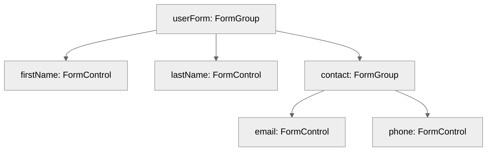

# Module 6.2: Reactive Forms: `FormControl` & `FormGroup`

**Objective:** By the end of this module, you will be able to:
- **Create** and **manage** individual form controls using `FormControl`.
- **Group** related controls with `FormGroup`.
- **Bind** these reactive form models to your HTML templates.
- **Access** and **interpret** the state and values of form controls and groups.

---

### The Reactive Forms Philosophy: Programmatic Control

Unlike Template-Driven Forms, Reactive Forms are built programmatically in your component's TypeScript class. This gives you explicit, direct control over the form's data model and validation logic. The template then binds to this programmatic model.

This approach makes Reactive Forms highly testable, scalable, and easier to manage for complex scenarios.

**Note on Accessibility:** When building reactive forms, ensure you implement proper ARIA attributes and focus management, especially for dynamic error messages or interactive elements, to make them accessible to users with disabilities.

```mermaid
%%{init: {'theme':'neutral'}}%%
graph TD
    A[Component Class] -- defines --> B[Form Model (FormControl, FormGroup, FormArray)];
    B -- binds to --> C[HTML Template];
    C -- user input updates --> B;
    B -- model changes update --> C;
```
**Alt text:** Diagram illustrating the Reactive Forms data flow: The Component Class defines the Form Model (FormControl, FormGroup, FormArray), which binds to the HTML Template. User input updates the Form Model, and model changes update the HTML Template.

### 1. `FormControl`: Managing Individual Input Fields

A `FormControl` is the most basic building block of Reactive Forms. It represents a single input field in your form (e.g., an `<input>`, `<select>`, or `<textarea>`).

#### a) Creating a `FormControl`

You create an instance of `FormControl` in your component's TypeScript class.

**Syntax:** `new FormControl(initialValue, validatorOrValidators, asyncValidatorOrValidators)`

*   `initialValue`: The default value for the input field.
*   `validatorOrValidators`: An optional `ValidatorFn` or an array of `ValidatorFn`s for synchronous validation (e.g., `Validators.required`).
*   `asyncValidatorOrValidators`: An optional `AsyncValidatorFn` or an array of `AsyncValidatorFn`s for asynchronous validation.

**Example:**

```typescript
import { FormControl, Validators } from '@angular/forms';

// In your component class
export class MyFormComponent {
  // A simple text input with an initial value
  nameControl = new FormControl('John Doe');

  // An email input that is required and must be a valid email format
  emailControl = new FormControl('', [Validators.required, Validators.email]);

  // A checkbox with a default value of true
  agreeTermsControl = new FormControl(true);
}
```

**Tip on Testing FormControls:** Since `FormControl`s are plain TypeScript classes, they are very easy to unit test in isolation. You can instantiate them directly in your tests and check their `value`, `valid`, `invalid`, and `errors` properties after applying values or running validation.

#### b) Binding `FormControl` to the Template

To connect your `FormControl` instance to an HTML input element, you use the `[formControl]` directive. This directive establishes the link between your programmatic `FormControl` object and the DOM element.

**Template (`.html`):**

```html
<input type="text" [formControl]="nameControl">
<input type="email" [formControl]="emailControl">
<input type="checkbox" [formControl]="agreeTermsControl">
```

#### c) Accessing `FormControl` Values and State

Once bound, you can access the value and various state properties of the `FormControl` directly from your component class.

**Common Properties:**

*   `value`: The current value of the control.
*   `valid`: `true` if the control's value passes all validation rules.
*   `invalid`: `true` if the control's value fails any validation rules.
*   `touched`: `true` if the user has interacted with the control (e.g., blurred out of it).
*   `untouched`: `true` if the user has not yet interacted with the control.
*   `dirty`: `true` if the user has changed the value of the control.
*   `pristine`: `true` if the user has not changed the value of the control.
*   `errors`: An object containing any validation errors.

**Observables for Reacting to Changes:**

*   `valueChanges`: An `Observable` that emits the new value whenever the control's value changes.
*   `statusChanges`: An `Observable` that emits the new status (`VALID`, `INVALID`, `PENDING`, `DISABLED`) whenever the control's validation status changes.

**Example:**

```typescript
// In your component class
submitForm(): void {
  if (this.emailControl.valid) {
    console.log('Email is valid:', this.emailControl.value);
  } else {
    console.log('Email is invalid. Errors:', this.emailControl.errors);
  }
}
```

**Template (`.html`):**

```html
<input type="email" [formControl]="emailControl">
@if (emailControl.invalid && emailControl.touched) {
  <div class="error-message">
    @if (emailControl.errors?.['required']) {
      Email is required.
    }
    @if (emailControl.errors?.['email']) {
      Please enter a valid email address.
    }
  </div>
}
```

--- 

### 2. `FormGroup`: Grouping Related Controls

A `FormGroup` is a collection of `FormControl` instances (or other `FormGroup`s or `FormArray`s). It allows you to manage the state of a group of related input fields as a single unit.

#### a) Creating a `FormGroup`

You create a `FormGroup` by passing an object where each key is the name of a control, and the value is its corresponding `FormControl` instance.

**Syntax:** `new FormGroup(controls, validatorOrValidators, asyncValidatorOrValidators)`

*   `controls`: An object where keys are control names and values are `FormControl`, `FormGroup`, or `FormArray` instances.
*   `validatorOrValidators`: Optional synchronous validators for the group.
*   `asyncValidatorOrValidators`: Optional asynchronous validators for the group.

**Example:**

```typescript
import { FormControl, FormGroup, Validators } from '@angular/forms';

export class UserRegistrationComponent {
  userForm = new FormGroup({
    firstName: new FormControl('', Validators.required),
    lastName: new FormControl('', Validators.required),
    contact: new FormGroup({
      email: new FormControl('', [Validators.required, Validators.email]),
      phone: new FormControl('')
    })
  });
}
```

This creates a nested structure:


**Alt text:** Diagram showing a nested FormGroup structure. 'userForm' is a FormGroup containing 'firstName' (FormControl), 'lastName' (FormControl), and 'contact' (another FormGroup). The 'contact' FormGroup further contains 'email' (FormControl) and 'phone' (FormControl).

**Note on Performance:** For very deeply nested or extremely large forms, consider optimizing change detection or breaking down forms into smaller, more manageable sub-forms to avoid potential performance bottlenecks.

#### b) Binding `FormGroup` to the Template

To bind a `FormGroup` to your HTML form, you use the `[formGroup]` directive on the `<form>` tag. Then, for each individual `FormControl` within that group, you use the `formControlName` directive. For nested `FormGroup`s, you use the `formGroupName` directive.

**Note on Accessibility:** When grouping related form controls, use `<fieldset>` and `<legend>` HTML elements in conjunction with `formGroupName` to improve accessibility for screen reader users. This provides a semantic grouping for the controls.

**Template (`.html`):**

```html
<form [formGroup]="userForm">
  <label>First Name:
    <input type="text" formControlName="firstName">
  </label>
  <label>Last Name:
    <input type="text" formControlName="lastName">
  </label>

  <!-- Nested FormGroup -->
  <fieldset formGroupName="contact">
    <legend>Contact Information</legend>
    <label>Email:
      <input type="email" formControlName="email">
    </label>
    <label>Phone:
      <input type="tel" formControlName="phone">
    </label>
  </fieldset>

  <button type="submit" [disabled]="userForm.invalid">Register</button>
</form>
```

#### c) Accessing `FormGroup` Values and State

Similar to `FormControl`, a `FormGroup` also has `value`, `valid`, `invalid`, `touched`, `dirty`, and `errors` properties. These properties reflect the aggregated state of all controls within the group.

**Accessing Nested Controls with `get()`:**

For nested controls, you can use the `get()` method with a dot-separated path to access them:

```typescript
// Accessing a nested FormControl
const emailControl = this.userForm.get('contact.email');

// Accessing a nested FormGroup
const contactGroup = this.userForm.get('contact');
```

**Tip on Resetting Forms:** You can reset the entire form or individual controls programmatically using the `reset()` method (e.g., `this.userForm.reset()` or `this.userForm.get('firstName')?.reset()`). You can also pass an object to `reset()` to set specific values.

**Example:**

```typescript
// In your component class
onSubmit(): void {
  if (this.userForm.valid) {
    console.log('Form Submitted!', this.userForm.value);
    // Output will be a nested object matching the FormGroup structure:
    // { firstName: 'John', lastName: 'Doe', contact: { email: 'john@example.com', phone: '123-456-7890' } }
  } else {
    console.log('Form is invalid.', this.userForm.errors);
    // You can also access individual control errors:
    console.log('First Name errors:', this.userForm.get('firstName')?.errors);
    console.log('Email errors:', this.userForm.get('contact.email')?.errors);
  }
}
```

### Importing `ReactiveFormsModule`

To use `FormControl`, `FormGroup`, and their associated directives (`[formControl]`, `formControlName`, `[formGroup]`, `formGroupName`), you must import `ReactiveFormsModule` into your standalone component's `imports` array.

```typescript
import { Component } from '@angular/core';
import { ReactiveFormsModule, FormControl, FormGroup, Validators } from '@angular/forms';

@Component({
  standalone: true,
  selector: 'app-user-registration',
  imports: [ReactiveFormsModule], // <--- Essential import
  templateUrl: './user-registration.component.html',
  styleUrls: ['./user-registration.component.css']
})
export class UserRegistrationComponent {
  userForm = new FormGroup({
    firstName: new FormControl('', Validators.required),
    lastName: new FormControl('', Validators.required),
    contact: new FormGroup({
      email: new FormControl('', [Validators.required, Validators.email]),
      phone: new FormControl('')
    })
  });

  onSubmit(): void {
    console.log(this.userForm.value);
  }
}
```

**Warning:** Forgetting to import `ReactiveFormsModule` is a common error that will lead to template errors like "Can't bind to 'formGroup' since it isn't a known property of 'form'". Always double-check this import when working with Reactive Forms.

`FormControl` and `FormGroup` are the foundational elements for building robust and testable forms in Angular. Understanding their roles and how they interact is key to mastering Reactive Forms.

---

### Key Takeaways

*   **Reactive Forms** are built programmatically in the component's TypeScript class, offering explicit control.
*   A **`FormControl`** manages the state of a single input field.
*   A **`FormGroup`** manages the state of a collection of `FormControl`s (or other `FormGroup`s/`FormArray`s).
*   Use `[formControl]` to bind a single control and `[formGroup]` with `formControlName` for groups.
*   `valueChanges` and `statusChanges` observables provide powerful ways to react to form changes.
*   Always import **`ReactiveFormsModule`** to enable Reactive Forms directives.

---

**Previous:** [6.1 Angular Forms Overview](./6.1-forms-overview.md)

**Next:** [6.3 Reactive Forms: `FormBuilder` & `FormArray`](./6.3-form-builder-form-array.md)
