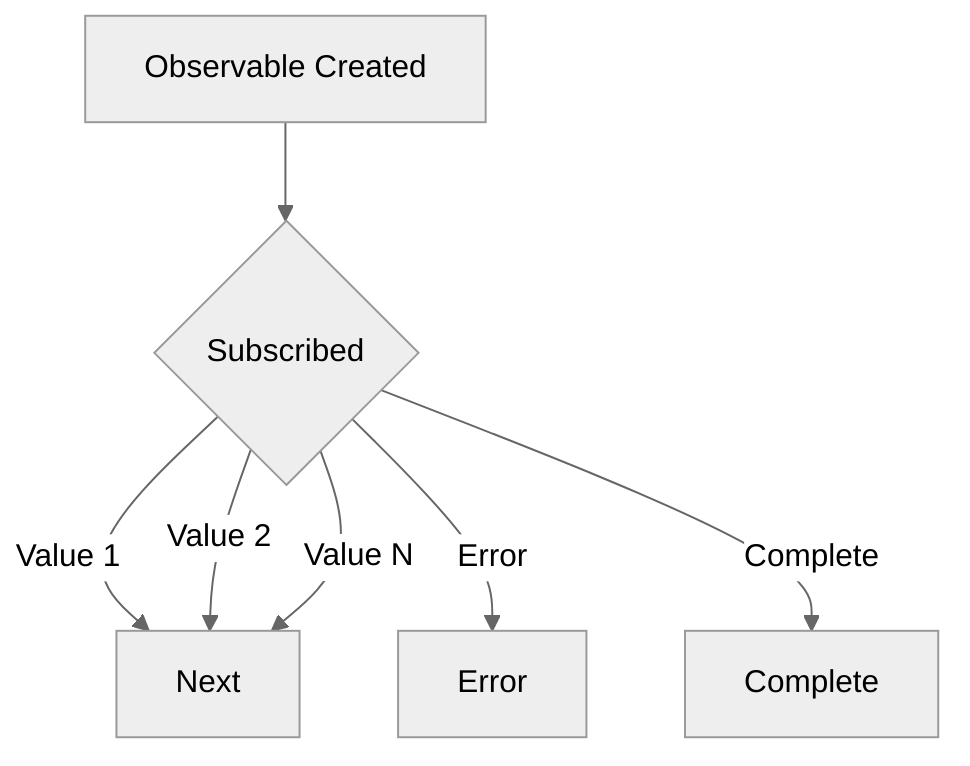

# Module 8.1: Observables vs. Promises

**Objective:** By the end of this module, you will be able to articulate the core differences between Promises and Observables, understand their respective use cases, and explain why Observables are the preferred mechanism for handling complex asynchronous operations in Angular.

---

### The Challenge of Asynchronous Operations

Modern web applications are inherently asynchronous. Data fetching from APIs, user interactions (clicks, typing), timers, and animations all happen over time and don't block the main execution thread. Managing these asynchronous events effectively is crucial for a responsive user experience.

JavaScript has evolved its patterns for handling asynchronicity:

*   **Callbacks:** The earliest approach, often leading to "callback hell" for complex sequences.
*   **Promises:** Introduced to improve readability and error handling for single asynchronous operations.
*   **Observables:** A more powerful solution for handling streams of multiple asynchronous events over time.

With **Promises** and **Observables** being two of the most prominent patterns today.

### 1. Promises: Single Asynchronous Events

A Promise is an object that represents the eventual completion (or failure) of an asynchronous operation and its resulting value. It's a good fit for single, one-off asynchronous events.

```mermaid
%%{init: {'theme':'neutral'}}%%
graph TD
    A[Promise Created] --> B{Pending};
    B -- Success --> C[Resolved (with value)];
    B -- Failure --> D[Rejected (with error)];
```
**Alt text:** Diagram illustrating the states of a Promise: A Promise is created, enters a Pending state, and then either transitions to a Resolved state with a value upon success or a Rejected state with an error upon failure.

#### Key Characteristics of Promises:

*   **Single Value:** A Promise can only emit a single value (or an error) and then it completes. It cannot emit multiple values over time.
*   **Eager Execution:** A Promise starts executing as soon as it's defined, even if no one is listening for its result.
*   **Not Cancellable:** Once a Promise is initiated, there's no built-in way to cancel its execution.
*   **Error Handling:** Errors are handled with `.catch()`.

**Promise Chaining and `async/await`:** Promises can be chained (`.then().then()`) to perform sequential asynchronous operations. The `async/await` syntax, built on top of Promises, provides a more synchronous-looking way to write asynchronous code, improving readability.

```typescript
async function fetchAndProcessData() {
  try {
    const data = await fetchDataPromise();
    console.log('Data processed with async/await:', data);
  } catch (error) {
    console.error('Error with async/await:', error);
  }
}
fetchAndProcessData();
```

#### Example (JavaScript Promise):

```typescript
function fetchDataPromise(): Promise<string> {
  return new Promise((resolve, reject) => {
    setTimeout(() => {
      const success = Math.random() > 0.5;
      if (success) {
        resolve('Data fetched successfully!');
      } else {
        reject('Failed to fetch data.');
      }
    }, 1000);
  });
}

// Consuming the Promise
fetchDataPromise()
  .then(data => console.log(data)) // Handles success
  .catch(error => console.error(error)); // Handles error

// Promise starts immediately, even if .then() is called later
console.log('Promise initiated.');
```

--- 

### 2. Observables: Streams of Asynchronous Events

An Observable is a powerful concept from the RxJS (Reactive Extensions for JavaScript) library. It represents a stream of values or events that can be emitted over time, either synchronously or asynchronously. Observables are ideal for handling multiple, ongoing asynchronous events.


**Alt text:** Diagram illustrating the lifecycle of an Observable: An Observable is created, and upon subscription, it can emit multiple values (Next), an Error, or a Complete notification.

#### Key Characteristics of Observables:

*   **Multiple Values:** An Observable can emit zero, one, or multiple values over time. It can also emit an error or a completion notification.
*   **Lazy Execution:** An Observable only starts executing when someone `subscribes` to it. If there are no subscribers, nothing happens.
*   **Cancellable:** Subscriptions to Observables can be easily cancelled, which is crucial for preventing memory leaks (e.g., when a component is destroyed).
*   **Rich Operators:** RxJS provides a vast collection of powerful operators (e.g., `map`, `filter`, `debounceTime`, `switchMap`) that allow you to transform, combine, and manipulate streams of data declaratively.
*   **Error Handling:** Errors are handled within the `subscribe` method's error callback or using RxJS operators like `catchError`.

#### Example (RxJS Observable):

```typescript
import { Observable, of, throwError } from 'rxjs';
import { delay, map, catchError } from 'rxjs/operators';

function fetchDataObservable(): Observable<string> {
  return new Observable(subscriber => {
    setTimeout(() => {
      const success = Math.random() > 0.5;
      if (success) {
        subscriber.next('Data fetched successfully!');
        subscriber.complete(); // Important: complete the observable
      } else {
        subscriber.error('Failed to fetch data.');
      }
    }, 1000);
  });
}

// Consuming the Observable
const subscription = fetchDataObservable()
  .pipe(
    map(data => `Processed: ${data}`), // Transform the data
    catchError(error => {
      console.error('Caught error:', error);
      return of('Fallback data'); // Recover from error
    })
  )
  .subscribe({
    next: data => console.log(data), // Handles next value
    error: err => console.error('Subscriber error:', err), // Handles error
    complete: () => console.log('Observable completed.') // Handles completion
  });

// Observable does NOT start until subscribed
console.log('Observable defined, but not yet subscribed.');

// To stop listening and prevent memory leaks
// subscription.unsubscribe();
```

--- 

### Why Angular Prefers Observables

Angular leverages Observables extensively for almost all asynchronous operations, including:

*   **`HttpClient`:** All HTTP requests return Observables.
*   **Router:** Route parameters, query parameters, and navigation events are Observables.
*   **Forms:** Value changes and status changes on `FormControl` and `FormGroup` are Observables.
*   **Events:** You can create Observables from DOM events.

**Key Reasons for Observable Preference:**

1.  **Handling Multiple Events Over Time:** Unlike Promises, Observables are designed to handle streams of data, which is perfect for user input, real-time updates, or multiple HTTP responses (e.g., from a WebSocket).
2.  **Cancellability:** Observables can be unsubscribed from, preventing memory leaks and unnecessary operations when a component is destroyed or a user navigates away.
3.  **Rich Operator Ecosystem (RxJS):** The vast array of RxJS operators allows for powerful, declarative data manipulation, transformation, and error handling. This leads to cleaner, more readable, and more maintainable asynchronous code.
4.  **Unified Asynchronous Pattern:** Using Observables consistently across the framework provides a single, coherent way to deal with all types of asynchronous operations.

While Promises are still useful for simple, one-off asynchronous tasks, Observables provide a more powerful and flexible solution for the complex asynchronous nature of modern Angular applications. Mastering Observables and RxJS is fundamental to becoming a proficient Angular developer.

---

**Previous:** [7.3 HTTP Interceptors](../07-http-client/7.3-http-interceptors.md)

**Next:** [8.2 Key RxJS Operators](./8.2-rxjs-operators.md)
