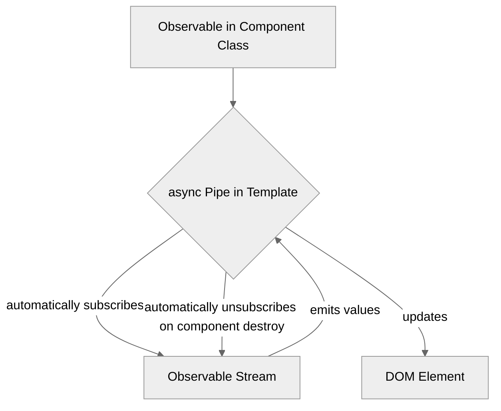

# Module 8.3: The `async` Pipe

**Objective:** To understand and effectively use Angular's `async` pipe to simplify the display of asynchronous data (Observables and Promises) in templates, while automatically managing subscriptions and preventing memory leaks.

---

### The Problem: Manual Subscriptions and Memory Leaks

When working with Observables in Angular components, a common pattern is to subscribe to them in `ngOnInit` and then manually unsubscribe in `ngOnDestroy` to prevent memory leaks.

**Example of Manual Subscription (and potential leak):**

```typescript
import { Component, OnInit, OnDestroy } from '@angular/core';
import { Observable, Subscription } from 'rxjs';
import { DataService } from '../data.service'; // Assume a data service

@Component({
  standalone: true,
  selector: 'app-data-display',
  template: `
    <p>Data: {{ data }}</p>
    <p>Loading: {{ isLoading }}</p>
  `
})
export class DataDisplayComponent implements OnInit, OnDestroy {
  data: string | null = null;
  isLoading: boolean = false;
  private dataSubscription: Subscription | undefined;

  constructor(private dataService: DataService) { }

  ngOnInit(): void {
    this.isLoading = true;
    this.dataSubscription = this.dataService.getData().subscribe({
      next: (value) => {
        this.data = value;
        this.isLoading = false;
      },
      error: (err) => {
        console.error('Error fetching data:', err);
        this.isLoading = false;
      },
      complete: () => {
        console.log('Data stream completed.');
      }
    });
  }

  ngOnDestroy(): void {
    // Crucial for preventing memory leaks!
    if (this.dataSubscription) {
      this.dataSubscription.unsubscribe();
    }
  }
}
```

While this approach works, it adds boilerplate code (`Subscription` variable, `ngOnDestroy` logic) and can be error-prone if you forget to unsubscribe.

### The Solution: The `async` Pipe

Angular's `async` pipe is a powerful tool that simplifies working with Observables (and Promises) directly in your templates. It automatically subscribes to the Observable when the component is initialized and automatically unsubscribes when the component is destroyed.

**Benefits of the `async` Pipe:**

*   **Automatic Subscription/Unsubscription:** Eliminates manual `subscribe()` and `unsubscribe()` calls, preventing memory leaks.
*   **Simplified Templates:** Makes your component code cleaner and more focused on business logic.
*   **Automatic Change Detection:** When the Observable emits a new value, the `async` pipe automatically triggers change detection, updating the view.


**Alt text:** Diagram illustrating the async pipe's functionality: An Observable in the Component Class is passed to the async Pipe in the Template. The async pipe automatically subscribes to the Observable Stream, which emits values back to the pipe. The pipe then updates the DOM Element. When the component is destroyed, the async pipe automatically unsubscribes from the Observable Stream.

--- 

### How to Use the `async` Pipe

#### 1. Basic Usage

Apply the `async` pipe to an Observable property in your template.

**Component (`.ts`):**

```typescript
import { Component, OnInit } from '@angular/core';
import { Observable, of } from 'rxjs';
import { delay } from 'rxjs/operators';

@Component({
  standalone: true,
  selector: 'app-async-demo',
  template: `
    <h2>Async Pipe Demo</h2>
    <p>Message: {{ message$ | async }}</p>
    <p>Number: {{ number$ | async }}</p>
  `
})
export class AsyncDemoComponent implements OnInit {
  message$: Observable<string> | undefined;
  number$: Observable<number> | undefined;

  ngOnInit(): void {
    this.message$ = of('Hello from Observable!').pipe(delay(1000));
    this.number$ = of(42).pipe(delay(2000));
  }
}
```

**Explanation:**

*   `message$` and `number$` are Observables.
*   `{{ message$ | async }}`: The `async` pipe subscribes to `message$`. When `message$` emits a value, that value is displayed. When the component is destroyed, the `async` pipe automatically unsubscribes.

#### 2. Handling Null Values and Initial State

Before an Observable emits its first value, the `async` pipe will return `null`. You might want to display a loading indicator or a default message.

```html
<p>
  @if (message$ | async; as msg) {
    Loaded Message: {{ msg }}
  } @else {
    Loading message...
  }
</p>
```

#### 3. Using with `*ngIf` (or `@if`)

This is a very common and powerful pattern. It allows you to unwrap the Observable's value and assign it to a local template variable, which can then be used multiple times without re-subscribing.

```html
<div class="user-profile">
  @if (user$ | async; as user) {
    <h2>Welcome, {{ user.name }}</h2>
    <p>Email: {{ user.email }}</p>
    <p>Role: {{ user.role }}</p>
  } @else {
    <p>Loading user profile...</p>
  }
</div>
```

**Benefits of `| async as ...`:**

*   **Single Subscription:** Ensures that the Observable is subscribed to only once, even if its value is used multiple times within the `if` block.
*   **Clearer Template:** Makes the template more readable by providing a local variable for the unwrapped value.

#### 4. Chaining Observables with `async` Pipe

You can chain Observables in your component and then use the `async` pipe on the final Observable.

```typescript
import { Component, OnInit } from '@angular/core';
import { Observable, combineLatest, of } from 'rxjs';
import { map, delay } from 'rxjs/operators';

@Component({
  standalone: true,
  selector: 'app-chained-async-demo',
  template: `
    <h2>Chained Async Demo</h2>
    <p>Combined Data: {{ combinedData$ | async }}</p>
  `
})
export class ChainedAsyncDemoComponent implements OnInit {
  data1$: Observable<string> = of('Data A').pipe(delay(1000));
  data2$: Observable<string> = of('Data B').pipe(delay(2000));

  combinedData$: Observable<string> | undefined;

  ngOnInit(): void {
    this.combinedData$ = combineLatest([this.data1$, this.data2$]).pipe(
      map(([data1, data2]) => `(${data1} and ${data2})`)
    );
  }
}
```

### When NOT to Use the `async` Pipe

While the `async` pipe is incredibly useful, there are scenarios where manual subscription might still be necessary:

*   **Side Effects:** If subscribing to the Observable causes a side effect (e.g., triggering an API call that you only want to happen once, or updating a service state), you might prefer to subscribe manually in your component and manage the side effect explicitly.
*   **Complex Logic:** If you need to perform complex transformations or error handling that is difficult to express purely in the template, it's better to handle it in the component's TypeScript and expose a simple property to the template.

For displaying data from Observables in your templates, the `async` pipe is almost always the best choice. It simplifies your code, improves readability, and most importantly, prevents common memory leaks associated with manual Observable subscriptions.

---

**Previous:** [8.2 Key RxJS Operators](./8.2-rxjs-operators.md)

**Next:** [8.4 Simple State Management with `BehaviorSubject`](./8.4-simple-state-management.md)
