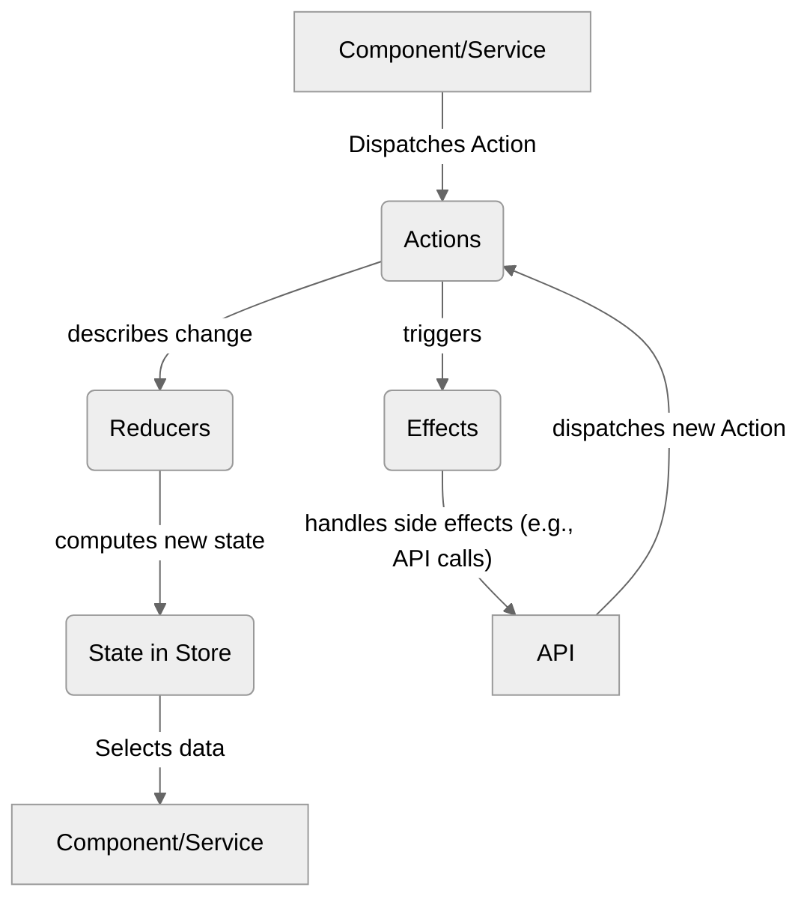

# Module 8.5: Introduction to NgRx (Briefly)

**Objective:** To gain a high-level understanding of NgRx, a popular state management library for Angular, and to identify scenarios where its structured approach is beneficial over simpler methods.

---

### The Need for Advanced State Management

While `BehaviorSubject` is excellent for simple state sharing, as applications grow in complexity, managing state can become challenging. You might encounter issues like:

*   **Unpredictable State Changes:** It becomes hard to track *when*, *where*, and *why* a piece of state changed.
*   **Debugging Difficulty:** Tracing the flow of data through multiple components and services can be a nightmare.
*   **Scalability Issues:** Maintaining consistency across a large application with many interconnected state pieces.
*   **Side Effect Management:** Handling asynchronous operations (like API calls) that trigger state changes.

This is where a dedicated state management library like **NgRx** comes into play.

### What is NgRx?

NgRx is a group of libraries inspired by the Redux pattern, designed for managing state in Angular applications. It provides a reactive, centralized, and predictable state container.

**Core Principles of NgRx (and Redux):**

1.  **Single Source of Truth:** The entire application state is stored in a single, immutable object tree within a single **Store**.
2.  **State is Read-Only:** The only way to change the state is by dispatching an **Action**.
3.  **Changes are Made with Pure Functions:** **Reducers** are pure functions that take the current state and an action, and return a *new* state. They never modify the original state.


**Alt text:** Diagram illustrating the NgRx data flow: A Component or Service dispatches an Action. Actions describe changes to Reducers, which compute a new State in the Store. Components or Services select data from the Store. Actions can also trigger Effects, which handle side effects like API calls. The API then dispatches new Actions.

### Key Concepts in NgRx

1.  **Store:** The single, immutable state tree of your application. Components `select` (read) data from the Store.

2.  **Actions:** Plain objects that describe unique events that happen in the application. They are the *only* way to initiate a state change. Actions are dispatched from components or services.

    ```typescript
    // Example Action
    export const loadProducts = createAction('[Products Page] Load Products');
    export const loadProductsSuccess = createAction(
      '[Products API] Load Products Success',
      props<{ products: Product[] }>()
    );
    ```

3.  **Reducers:** Pure functions that take the current state and an action, and return a *new*, immutable state. Reducers are responsible for handling state transitions.

    ```typescript
    // Example Reducer
    export const productReducer = createReducer(
      initialState,
      on(loadProductsSuccess, (state, { products }) => ({ ...state, products: products }))
    );
    ```

4.  **Selectors:** Pure functions used to query (select) specific slices of state from the Store. They provide a way to derive data from the state and ensure components only get the data they need.

    ```typescript
    // Example Selector
    export const selectAllProducts = createSelector(
      selectProductState,
      (state) => state.products
    );
    ```

5.  **Effects:** Handle side effects (e.g., asynchronous operations like API calls, logging, routing) that occur in response to actions. Effects listen for dispatched actions, perform an operation, and then dispatch new actions (e.g., a success or failure action).

    ```typescript
    // Example Effect
    @Injectable()
    export class ProductEffects {
      loadProducts$ = createEffect(() =>
        this.actions$.pipe(
          ofType(loadProducts),
          mergeMap(() => this.productService.getProducts().pipe(
            map(products => loadProductsSuccess({ products })),
            catchError(() => of(loadProductsFailure()))
          ))
        )
      );
      constructor(private actions$: Actions, private productService: ProductService) {}
    }
    ```

### When to Consider NgRx

NgRx introduces a significant amount of boilerplate and a steeper learning curve. It's not suitable for every application. Consider using NgRx when:

*   **Large and Complex Applications:** Your application has a large amount of shared state that needs to be managed consistently.
*   **Predictable State Changes:** You need a clear, auditable trail of every state change.
*   **Debugging:** You require powerful debugging tools (like Redux DevTools) for time-travel debugging.
*   **Scalability:** You have a large team and need a strict pattern to ensure consistency and prevent conflicts.
*   **Performance Optimization:** You need fine-grained control over change detection and data flow.

### Alternatives to NgRx

If NgRx seems too heavy for your needs, consider these alternatives:

*   **`BehaviorSubject` (as discussed in 8.4):** For simple, localized state management.
*   **`ngrx-component-store`:** A lighter-weight state management solution from the NgRx team, designed for component-level or feature-level state.
*   **`Akita` / `Elf`:** Other popular state management libraries that offer different paradigms.

NgRx is a powerful tool for managing complex application state, but it comes with a cost. Understand your application's needs before committing to a full-fledged state management solution. For many applications, simpler patterns like `BehaviorSubject` or `ngrx-component-store` might be sufficient.

---

**End of Module 8.**

**Previous:** [8.4 Simple State Management with `BehaviorSubject`](./8.4-simple-state-management.md)

**Next:** [09-angular-signals](../09-angular-signals)
