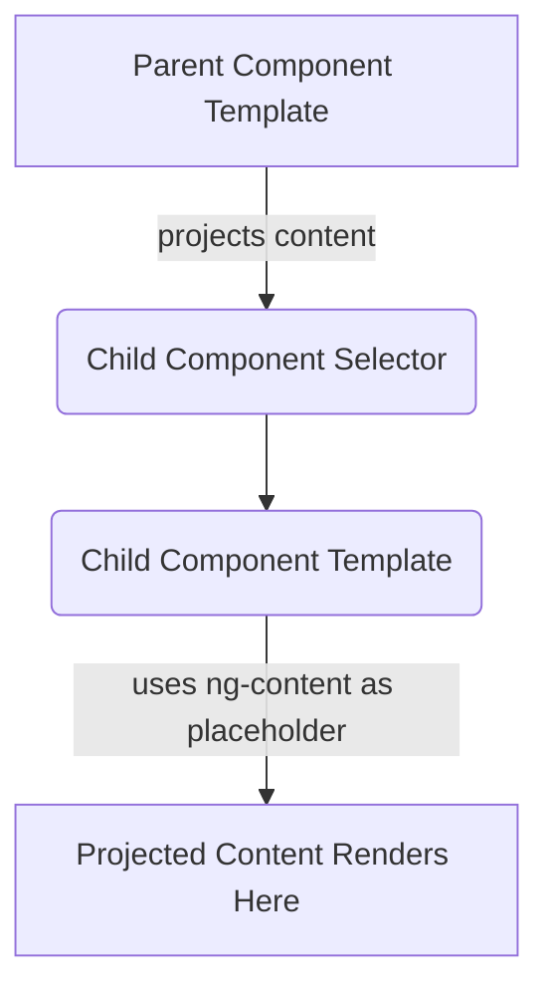

# Module 10.2: Content Projection with `ng-content`

**Objective:** To understand and effectively use Angular's content projection mechanism (`ng-content`) to create highly flexible, reusable, and customizable components.

---

### The Problem: Fixed Component Templates

Imagine you're building a `CardComponent` that displays a title and some content. Initially, you might hardcode the content:

```html
<!-- card.component.html -->
<div class="card">
  <div class="card-header">{{ title }}</div>
  <div class="card-body">
    <p>This is some fixed content for the card.</p>
  </div>
</div>
```

This works, but it's not very flexible. What if you want to put a button, an image, or a different paragraph structure inside the card body? You'd have to create a new component for each variation, which is inefficient and leads to code duplication.

### The Solution: Content Projection

**Content projection** (also known as transclusion in other frameworks) is a powerful Angular feature that allows you to insert content from the parent component's template directly into a designated spot within a child component's template. The child component then acts as a container or wrapper for that projected content.

Angular uses the `<ng-content>` element as a placeholder for projected content.


**Alt text:** Diagram illustrating the flow of content projection in Angular, where content from a Parent Component Template is projected into a Child Component's selector, and then rendered at the `ng-content` placeholder within the Child Component Template.

#### Key Benefits:

*   **Reusability:** Create generic container components (e.g., `Card`, `Modal`, `Panel`) that can wrap any content.
*   **Flexibility:** The parent component dictates what content goes inside the child, making the child highly customizable.
*   **Separation of Concerns:** The child component focuses on its layout and styling, while the parent provides the specific content.

--- 

### 1. Single Slot Content Projection

This is the simplest form, where all projected content goes into a single `<ng-content>` slot.

#### a) Child Component Setup

**`card.component.ts`:**

```typescript
import { Component, Input } from '@angular/core';

@Component({
  standalone: true,
  selector: 'app-card',
  template: `
    <div class="card">
      <div class="card-header">{{ title }}</div>
      <div class="card-body">
        <ng-content></ng-content> <!-- This is the projection slot -->
      </div>
    </div>
  `,
  styles: [`
    .card { border: 1px solid #ccc; border-radius: 8px; margin: 10px; width: 300px; }
    .card-header { background-color: #f0f0f0; padding: 10px; font-weight: bold; }
    .card-body { padding: 15px; }
  `]
})
export class CardComponent {
  @Input() title: string = 'Default Card Title';
}
```

#### b) Parent Component Usage

**`app.component.html`:**

```html
<app-card title="My First Card">
  <!-- This content will be projected into the <ng-content> slot -->
  <p>This is the main content of the first card.</p>
  <button>Click Me</button>
</app-card>

<app-card title="Another Card">
  <!-- Different content for the second card -->
  <h3>A Subheading</h3>
  <ul>
    <li>Item 1</li>
    <li>Item 2</li>
  </ul>
</app-card>
```

**Result:** The content placed between `<app-card>` and `</app-card>` in the parent's template is rendered where `<ng-content>` is located in the `CardComponent`'s template.

--- 

### 2. Multi-Slot Content Projection (Selective Projection)

Sometimes you need to project different pieces of content into different designated slots within the child component. This is achieved using the `select` attribute on `<ng-content>`.

#### a) Child Component Setup

**`modal.component.ts`:**

```typescript
import { Component, Input } from '@angular/core';

@Component({
  standalone: true,
  selector: 'app-modal',
  template: `
    <div class="modal-backdrop" (click)="close()"></div>
    <div class="modal-content">
      <div class="modal-header">
        <ng-content select="[modal-header]"></ng-content> <!-- Selects elements with modal-header attribute -->
        <button class="close-button" (click)="close()">X</button>
      </div>
      <div class="modal-body">
        <ng-content select=".modal-body-content"></ng-content> <!-- Selects elements with modal-body-content class -->
      </div>
      <div class="modal-footer">
        <ng-content select="[modal-footer]"></ng-content>
      </div>
    </div>
  `,
  styles: [`
    .modal-backdrop { position: fixed; top: 0; left: 0; width: 100%; height: 100%; background: rgba(0,0,0,0.5); z-index: 999; }
    .modal-content { position: fixed; top: 50%; left: 50%; transform: translate(-50%, -50%); background: white; padding: 20px; border-radius: 8px; z-index: 1000; min-width: 400px; }
    .modal-header { display: flex; justify-content: space-between; align-items: center; border-bottom: 1px solid #eee; padding-bottom: 10px; margin-bottom: 15px; }
    .modal-body { margin-bottom: 15px; }
    .modal-footer { border-top: 1px solid #eee; padding-top: 10px; text-align: right; }
    .close-button { background: none; border: none; font-size: 1.2em; cursor: pointer; }
  `]
})
export class ModalComponent {
  // In a real app, you'd have @Output() to emit close event
  close(): void {
    console.log('Modal closed');
  }
}
```

#### b) Parent Component Usage

**`app.component.html`:**

```html
<app-modal>
  <!-- Content for the header slot -->
  <h2 modal-header>Confirm Action</h2>

  <!-- Content for the body slot -->
  <div class="modal-body-content">
    <p>Are you sure you want to proceed with this action?</p>
    <p>This cannot be undone.</p>
  </div>

  <!-- Content for the footer slot -->
  <div modal-footer>
    <button>Cancel</button>
    <button style="background-color: red; color: white;">Confirm</button>
  </div>
</app-modal>
```

**Explanation:**

*   `<ng-content select="[modal-header]">`: This slot will only project elements from the parent that have the `modal-header` attribute.
*   `<ng-content select=".modal-body-content">`: This slot will only project elements from the parent that have the `modal-body-content` CSS class.
*   Any content that doesn't match a `select` attribute will be projected into the first `<ng-content>` without a `select` attribute. If there's no such `<ng-content>`, the unselected content is not projected.

### Best Practices for Content Projection

*   **Design for Reusability:** Think about which parts of your component's template are fixed and which parts need to be flexible.
*   **Clear Selectors:** Use descriptive attribute names or class names for `select` attributes to make the projection slots clear.
*   **Avoid Over-Projection:** Don't project content if a simple `@Input()` property would suffice. Content projection is for structural flexibility, not just passing simple data.
*   **Accessibility:** Ensure that projected content maintains proper accessibility (e.g., correct heading levels, ARIA attributes).

Content projection is a powerful technique for building highly flexible and reusable UI components in Angular. It allows you to create generic wrappers that can adapt to various content needs, leading to cleaner code and a more maintainable application.

---

**Previous:** [10.1 Component Lifecycle Hooks](./10.1-component-lifecycle-hooks.md)

**Next:** [10.3 Custom Directives and Pipes](./10.3-custom-directives-pipes.md)
