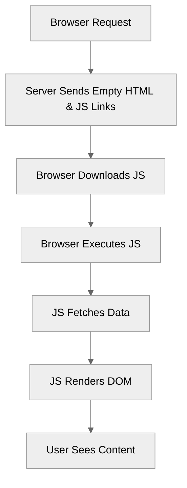

# Module 11.3: Server-Side Rendering (SSR) & Hydration

**Objective:** To understand the concepts of Server-Side Rendering (SSR) and Hydration in Angular, their benefits for performance and SEO, and how to implement them using Angular Universal.

---

### The Problem: Client-Side Rendering (CSR) Limitations

By default, Angular applications are **Client-Side Rendered (CSR)**. This means:

1.  The browser downloads a minimal `index.html` file.
2.  It then downloads the JavaScript bundles for the Angular application.
3.  The JavaScript executes in the browser, fetches data, and dynamically builds the DOM.

**Drawbacks of CSR:**

*   **Slow Initial Load (Perceived Performance):** Users see a blank page or a loading spinner until the JavaScript is downloaded, parsed, and executed.
*   **SEO Challenges:** Search engine crawlers (especially older ones) might struggle to index content that is dynamically generated by JavaScript, as they might not execute JavaScript fully.


**Alt text:** Diagram illustrating the Client-Side Rendering (CSR) process. A browser requests a page, the server sends empty HTML and JS links, the browser downloads and executes JS, which then fetches data, renders the DOM, and finally the user sees content.

### The Solution: Server-Side Rendering (SSR)

**Server-Side Rendering (SSR)** is a technique where the Angular application is rendered on the server (Node.js environment) into static HTML. This pre-rendered HTML is then sent to the browser.

#### Benefits of SSR:

*   **Improved Perceived Performance:** Users see content much faster because the HTML is immediately available. This is crucial for a good First Contentful Paint (FCP).
*   **Better SEO:** Search engine crawlers can easily read the fully rendered HTML content, improving indexing and search rankings.
*   **Enhanced User Experience:** Provides a more robust experience for users with slower internet connections or less powerful devices.

### Hydration: Making SSR Apps Interactive

SSR delivers static HTML, but an Angular application needs to be interactive. This is where **Hydration** comes in.

**Hydration** is the process where the client-side Angular application takes over the pre-rendered HTML from the server. Instead of re-rendering the entire application from scratch, Angular reuses the existing DOM structure and attaches event listeners and application state to it, making it interactive.

```mermaid
%%{init: {'theme':'neutral'}}%%
graph TD
    A[Browser Request] --> B[Server Renders & Sends Full HTML];
    B --> C[Browser Displays HTML (Fast FCP)];
    C --> D[Browser Downloads JS];
    D --> E[Angular Hydrates (Attaches Listeners, Reuses DOM)];
    E --> F[User Interacts with App (Fully Interactive)];
```
**Alt text:** Diagram illustrating the Server-Side Rendering (SSR) and Hydration process. A browser requests a page, the server renders and sends full HTML (fast FCP), the browser downloads JS, Angular hydrates (attaches listeners, reuses DOM), and then the user can interact with the fully interactive app.

### Angular Universal: Enabling SSR

Angular Universal is the official solution for Server-Side Rendering Angular applications. It allows you to run your Angular application on a Node.js server.

#### Setting up Angular Universal

1.  **Add Universal to your project:**
    ```bash
    ng add @angular/ssr
    ```
    This command will:
    *   Add necessary dependencies.
    *   Create a `server.ts` file (or similar) for your Node.js server.
    *   Update `angular.json` with SSR build configurations.
    *   Add `main.server.ts` and `app.config.server.ts` for the server-side application.

2.  **Build for SSR:**
    ```bash
    ng build
    ```
    This will produce both client-side and server-side bundles.

3.  **Serve the SSR application:**
    ```bash
    npm run serve:ssr
    ```
    This command typically starts the Node.js server that serves the pre-rendered HTML.

#### Key Files for SSR

*   **`server.ts`**: The Node.js Express server file. It uses `ngExpressEngine` to render your Angular application.
    ```typescript
    // server.ts (simplified)
    import { APP_BASE_HREF } from '@angular/common';
    import { CommonEngine } from '@angular/ssr';
    import express from 'express';
    import { fileURLToPath } from 'url';
    import { dirname, join, resolve } from 'path';
    import bootstrap from './src/main.server'; // Your server-side app entry

    export function app(): express.Express {
      const server = express();
      const distFolder = dirname(fileURLToPath(import.meta.url));
      const browserBuild = resolve(distFolder, 'browser');
      const indexHtml = join(distFolder, 'browser', 'index.html');

      const commonEngine = new CommonEngine();

      server.set('view engine', 'html');
      server.set('views', browserBuild);

      // Serve static files from the browser build directory
      server.get('*.*', express.static(browserBuild, {
        maxAge: '1y'
      }));

      // All regular routes use the Angular engine
      server.get('*', (req, res, next) => {
        const { protocol, originalUrl, baseUrl, headers } = req;

        commonEngine
          .render({
            bootstrap,
            document: indexHtml,
            url: `${protocol}://${headers.host}${originalUrl}`,
            publicPath: browserBuild,
            providers: [{ provide: APP_BASE_HREF, useValue: baseUrl }],
          })
          .then((html) => res.send(html))
          .catch((err) => next(err));
      });

      return server;
    }

    function run(): void {
      const port = process.env['PORT'] || 4000;
      const server = app();
      server.listen(port, () => {
        console.log(`Node Express server listening on http://localhost:${port}`);
      });
    }

    run();
    ```

*   **`src/main.server.ts`**: The entry point for your server-side Angular application. It exports the `bootstrap` function that Angular Universal uses to render the app.

*   **`src/app/app.config.server.ts`**: Contains providers specific to the server-side rendering environment (e.g., `provideServerRendering()`).

#### Considerations for SSR

*   **Platform-Specific Code:** Code that relies on browser-specific APIs (like `window`, `document`) will fail on the server. You need to guard such code (e.g., `if (isPlatformBrowser(platformId)) { ... }`).
*   **State Transfer:** Data fetched during SSR needs to be transferred to the client-side application so it doesn't re-fetch the same data during hydration. Angular Universal handles this automatically for `HttpClient` requests.
*   **Third-Party Libraries:** Ensure any third-party libraries you use are compatible with SSR and can run in a Node.js environment.
*   **Build Complexity:** SSR adds complexity to the build and deployment process.

### When to Use SSR

*   **SEO is Critical:** For public-facing websites where search engine visibility is paramount.
*   **Improved Initial Load Performance:** For applications where a fast First Contentful Paint (FCP) is essential for user experience.
*   **Social Media Sharing:** Ensures that rich previews are generated correctly when links are shared.

SSR and Hydration are advanced techniques that can significantly boost the performance and SEO of your Angular applications. While they add some complexity, the benefits for user experience and discoverability are often well worth the effort for public-facing applications.

---

### Hands-on Exercise: Add SSR to an Existing Angular App

1.  **Create a new, basic Angular application** (if you don't have one already) using `ng new my-ssr-app --standalone`.
2.  **Add Angular Universal** to your project: `ng add @angular/ssr`.
3.  **Explore the generated files:** Look at `server.ts`, `src/main.server.ts`, and `src/app/app.config.server.ts` to understand how SSR is configured.
4.  **Build the application for SSR:** `ng build`.
5.  **Serve the SSR application:** `npm run serve:ssr`.
6.  **Verify SSR:** Open your browser's developer tools, go to the "Network" tab, and refresh the page. Observe that the initial HTML response contains the full content of your Angular application, not just an empty `<app-root>` tag. You can also view the page source (Ctrl+U or Cmd+Option+U) to confirm the pre-rendered content.
7.  **Test Hydration:** Interact with your application (e.g., click buttons, navigate). The application should become interactive without a full page reload, demonstrating successful hydration.

---

**Previous:** [11.2 Micro Frontends](./11.2-micro-frontends.md)

**Next:** [11.4 Progressive Web Apps (PWAs)](./11.4-progressive-web-apps.md)
