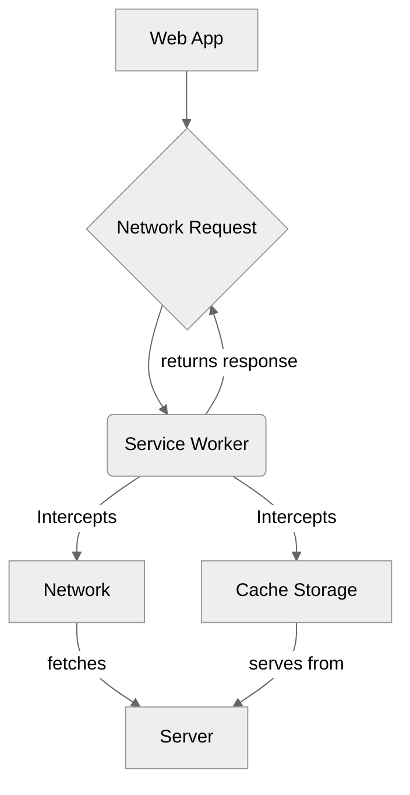

# Module 11.4: Progressive Web Apps (PWAs)

**Objective:** To understand what Progressive Web Apps (PWAs) are, their key characteristics, and how to transform an Angular application into a PWA to provide an enhanced, app-like user experience.

---

### The Gap Between Web and Native Apps

Traditional web applications, while universally accessible, often lack the rich features and seamless experience of native mobile applications. Native apps offer:

*   Offline access
*   Push notifications
*   Home screen installation
*   Fast loading times

However, native apps require app store distribution and platform-specific development. Progressive Web Apps aim to bridge this gap, offering the best of both worlds.

### What are Progressive Web Apps (PWAs)?

A **Progressive Web App (PWA)** is a web application that uses modern web capabilities to deliver an app-like experience to users. They are regular websites that are progressively enhanced to function like native applications, offering reliability, speed, and engagement.

```mermaid
%%{init: {'theme':'neutral'}}%%
graph TD
    A[Progressive Web App] --> B{Reliable (Offline Access)};
    A --> C{Fast (Instant Loading)};
    A --> D{Engaging (Push Notifications, Home Screen)};

    B --> B1[Service Workers];
    C --> C1[Caching Strategies];
    D --> D1[Web App Manifest];
    D --> D2[Push API];
```
**Alt text:** Diagram illustrating the key characteristics of a Progressive Web App (PWA): Reliable (offline access via Service Workers), Fast (instant loading via caching strategies), and Engaging (push notifications and home screen installation via Web App Manifest and Push API).

#### Key Characteristics of PWAs (The PWA Checklist):

1.  **Progressive:** Works for every user, regardless of browser choice, because it's built with progressive enhancement as a core tenet.
2.  **Responsive:** Fits any form factor: desktop, mobile, tablet, or whatever comes next.
3.  **Connectivity Independent:** Enhanced with Service Workers to work offline or on low-quality networks.
4.  **App-like:** Uses the app-shell model to provide native-app-like navigations and interactions.
5.  **Fresh:** Always up-to-date thanks to the Service Worker update process.
6.  **Safe:** Served over HTTPS to prevent snooping and ensure content hasn't been tampered with.
7.  **Discoverable:** Identifiable by manifest and Service Worker registration, and are searchable by search engines.
8.  **Re-engageable:** With features like Push Notifications.
9.  **Installable:** Allows users to "keep" apps they find most useful on their home screen without the hassle of an app store.
10. **Linkable:** Easily shareable via URL, doesn't require complex installation.

--- 

### Core PWA Technologies

Two main technologies underpin PWAs:

#### 1. Service Workers

*   **What they are:** A Service Worker is a JavaScript file that runs in the background, separate from the main browser thread. It acts as a programmable proxy between the web application and the network.
*   **Capabilities:**
    *   **Intercept Network Requests:** Service Workers can intercept network requests made by the application and decide whether to serve content from the network, from a cache, or generate it programmatically.
    *   **Offline Caching:** They enable robust offline capabilities by caching assets (HTML, CSS, JS, images) and data.
    *   **Push Notifications:** They can receive push messages from a server even when the application is not active.
    *   **Background Sync:** They can defer actions until the user has stable connectivity.


**Alt text:** Diagram illustrating the role of a Service Worker in a Web App. A network request from the Web App is intercepted by the Service Worker, which can then decide to fetch from the Network (Server) or serve from Cache Storage, returning the response to the Web App.

#### 2. Web App Manifest

*   **What it is:** A JSON file (`manifest.webmanifest` or `manifest.json`) that provides information about your web application to the browser. It tells the browser how your PWA should appear to the user and how it should behave when installed on the user's home screen.
*   **Information it provides:**
    *   `name` and `short_name`: The name of the app.
    *   `start_url`: The URL that loads when the app is launched.
    *   `display`: How the app should be displayed (e.g., `standalone`, `fullscreen`).
    *   `icons`: Paths to various app icons.
    *   `theme_color`: The default theme color for the application.
    *   `background_color`: The background color for the splash screen.

### Transforming an Angular App into a PWA

Angular provides excellent built-in support for PWAs through the `@angular/pwa` package.

1.  **Add PWA Capabilities to your project:**
    ```bash
    ng add @angular/pwa --project my-angular-app
    ```
    This command will:
    *   Add the `@angular/service-worker` package.
    *   Enable service worker build support in `angular.json`.
    *   Create a `ngsw-config.json` file for service worker configuration.
    *   Create a `manifest.webmanifest` file.
    *   Add a link to the `manifest.webmanifest` in `index.html`.
    *   Add meta tags for theme color in `index.html`.

2.  **Configure `ngsw-config.json`:**
    This file allows you to configure how the Angular Service Worker caches your application's assets and data. You can define different caching strategies (e.g., `prefetch`, `lazy`, `freshness`, `performance`).

    ```json
    {
      "$schema": "./node_modules/@angular/service-worker/config/schema.json",
      "index": "/index.html",
      "assetGroups": [
        {
          "name": "app",
          "installMode": "prefetch",
          "resources": {
            "files": [
              "/favicon.ico",
              "/index.html",
              "/*.css",
              "/*.js"
            ]
          }
        },
        {
          "name": "assets",
          "installMode": "lazy",
          "updateMode": "prefetch",
          "resources": {
            "files": [
              "/assets/**",
              "/manifest.webmanifest"
            ]
          }
        }
      ],
      "dataGroups": [
        {
          "name": "api-performance",
          "urls": [
            "https://api.example.com/products",
            "https://api.example.com/users"
          ],
          "cacheConfig": {
            "maxSize": 100,
            "maxAge": "3d",
            "strategy": "performance"
          }
        }
      ]
    }
    ```

3.  **Build for Production:**
    PWAs are designed for production environments. You need to build your application with the production configuration.
    ```bash
    ng build --configuration production
    ```

4.  **Serve the Application:**
    You need a static file server to serve the `dist/` folder. The Angular CLI's `ng serve` does not support service workers. You can use a simple `http-server` npm package.
    ```bash
    npm install -g http-server
    http-server -p 8080 -c-1 dist/my-angular-app
    ```

### Testing Your PWA

*   **Lighthouse:** Use Google Lighthouse (built into Chrome DevTools) to audit your PWA and get scores for performance, accessibility, best practices, and PWA compliance.
*   **Offline Mode:** Test your application by going offline in your browser's developer tools.
*   **Installation Prompt:** Verify that the browser prompts you to install the app to the home screen.

PWAs offer a compelling way to deliver high-quality, app-like experiences directly from the web. By leveraging Service Workers and Web App Manifests, Angular makes it straightforward to build reliable, fast, and engaging web applications that can compete with native apps.

---

**Previous:** [11.3 Server-Side Rendering (SSR) & Hydration](./11.3-ssr-hydration.md)

**Next:** [11.5 Web Workers](./11.5-web-workers.md)
