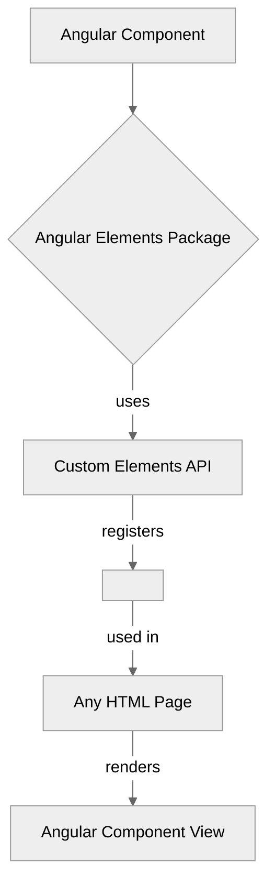

# Module 15.2: Angular Elements

**Objective:** To understand what Angular Elements are, how they relate to Web Components, and how to use them to package Angular components as custom elements for use in any web environment.

---

### The Challenge of Framework Interoperability

In a world with multiple JavaScript frameworks (Angular, React, Vue, Svelte), integrating components built in one framework into an application built in another can be challenging. For example, if you have a highly specialized Angular component (like a complex data grid or a custom chart) and you want to reuse it in a React application, it's not straightforward.

This often leads to:

*   **Duplication of Effort:** Rebuilding the same component in different frameworks.
*   **Inconsistent UI/UX:** Difficulty in maintaining a consistent look and feel across different parts of a larger application built with mixed technologies.
*   **Vendor Lock-in:** Being tied to a single framework for all development.

### The Solution: Web Components

**Web Components** are a set of W3C standards that allow you to create reusable custom elements with encapsulated functionality from the rest of your code. They are framework-agnostic, meaning a Web Component can be used in any HTML page, regardless of whether it's built with Angular, React, Vue, or plain JavaScript.

**Key Web Component Standards:**

1.  **Custom Elements:** Allows you to define your own HTML tags (e.g., `<my-custom-button>`).
2.  **Shadow DOM:** Provides encapsulation for the component's internal DOM and CSS, preventing styles and scripts from leaking in or out.
3.  **HTML Templates:** Defines reusable HTML markup.
4.  **ES Modules:** The standard way to import and export JavaScript modules.

```mermaid
%%{init: {'theme':'neutral'}}%%
graph TD
    A[Web Components] --> B{Custom Elements};
    A --> C{Shadow DOM};
    A --> D{HTML Templates};
    A --> E{ES Modules};

    B -- defines --> F[<my-custom-element>];
    C -- encapsulates --> G[Internal DOM & Styles];
    F -- used in --> H[Any HTML Page (Angular, React, Vue, Plain JS)];
```
**Alt text:** Diagram illustrating the four key Web Component standards: Custom Elements, Shadow DOM, HTML Templates, and ES Modules. Custom Elements define custom HTML tags, Shadow DOM encapsulates internal DOM and styles, and these custom elements can be used in any HTML page.

### Angular Elements: Bridging Angular and Web Components

**Angular Elements** is a feature that allows you to package an Angular component and its dependencies as a custom element (a Web Component). This means you can take any Angular component and make it usable in any HTML environment, even outside of an Angular application.

#### How Angular Elements Work:

Angular Elements uses the browser's Custom Elements API to register an Angular component as a custom element. When the browser encounters this custom element in the DOM, it instantiates the Angular component and attaches it to the element.


**Alt text:** Diagram illustrating how Angular Elements work. An Angular Component is processed by the Angular Elements Package, which uses the Custom Elements API to register it as a custom HTML element (e.g., `<my-angular-element>`). This custom element can then be used in any HTML page, where it renders the Angular Component View.

--- 

### Creating an Angular Element

1.  **Add `@angular/elements` to your project:**
    ```bash
    ng add @angular/elements
    ```

2.  **Create an Angular Component:**
    Let's create a simple `PopupComponent` that we want to expose as a Web Component.

    ```typescript
    // src/app/popup/popup.component.ts
    import { Component, Input, Output, EventEmitter } from '@angular/core';
    import { CommonModule } from '@angular/common';

    @Component({
      standalone: true,
      selector: 'app-popup',
      imports: [CommonModule],
      template: `
        @if (isVisible) {
          <div class="popup-container">
            <div class="popup-header">
              <h3>{{ title }}</h3>
              <button (click)="close.emit()">X</button>
            </div>
            <div class="popup-body">
              <ng-content></ng-content> <!-- Content projection -->
            </div>
          </div>
        }
      `,
      styles: [`
        .popup-container { border: 1px solid #ccc; padding: 15px; background: white; box-shadow: 2px 2px 5px rgba(0,0,0,0.2); }
        .popup-header { display: flex; justify-content: space-between; align-items: center; margin-bottom: 10px; }
      `]
    })
    export class PopupComponent {
      @Input() title: string = 'Default Popup';
      @Input() isVisible: boolean = false;
      @Output() close = new EventEmitter<void>();
    }
    ```

3.  **Convert the Component to a Custom Element:**
    This is typically done in your `main.ts` file or a dedicated entry point for your custom elements.

    ```typescript
    // src/main.ts (or a separate entry file like src/app/elements.ts)
    import { createApplication } from '@angular/platform-browser';
    import { createCustomElement } from '@angular/elements';
    import { PopupComponent } from './app/popup/popup.component';

    (async () => {
      // Create an Angular application context
      const app = await createApplication();

      // Convert the Angular component to a custom element class
      const PopupElement = createCustomElement(PopupComponent, { injector: app.injector });

      // Define the custom element with a tag name
      customElements.define('my-popup', PopupElement);
    })();
    ```

    *   `createApplication()`: Creates an Angular application context. This is necessary because the custom element still needs Angular's dependency injection system.
    *   `createCustomElement()`: This function takes an Angular component and an injector, and returns a class that can be registered as a custom element.
    *   `customElements.define('my-popup', PopupElement)`: This is the standard Web Components API call that registers your custom element with the browser. The first argument is the tag name (must contain a hyphen), and the second is the custom element class.

4.  **Build the Custom Element:**
    You'll need to configure your build process to output a single JavaScript file for your custom element. This often involves modifying `angular.json` or using a custom Webpack configuration.

    For a simple setup, you might build your app and then concatenate the necessary JS files.

    ```bash
    # Example build command (might need custom webpack config for single file output)
    ng build --output-hashing none --named-chunks false --build-optimizer false
    ```

### Using the Angular Element

Once built, you can include the generated JavaScript file in any HTML page.

```html
<!DOCTYPE html>
<html lang="en">
<head>
  <meta charset="UTF-8">
  <meta name="viewport" content="width=device-width, initial-scale=1.0">
  <title>Using Angular Element</title>
  <!-- Include the bundled Angular Element JavaScript file -->
  <script src="./my-popup-element.js" defer></script>
  <style>
    body { font-family: sans-serif; }
    .host-container { border: 2px dashed blue; padding: 20px; margin: 20px; }
  </style>
</head>
<body>
  <h1>My Host Application</h1>

  <div class="host-container">
    <h2>Here is my Angular Element:</h2>
    <!-- Use your custom element like any other HTML tag -->
    <my-popup title="Important Message" isVisible="true">
      <p>This content is projected from the host HTML into the Angular Element.</p>
      <p>It works!</p>
    </my-popup>
  </div>

  <script>
    // You can interact with the custom element's properties and events
    const popupElement = document.querySelector('my-popup');
    if (popupElement) {
      popupElement.addEventListener('close', () => {
        console.log('Popup closed from host application!');
        popupElement.setAttribute('isVisible', 'false');
      });
    }
  </script>
</body>
</html>
```

**Key Points:**

*   **Properties as Attributes:** Inputs (`@Input()`) on your Angular component become attributes on the custom element. You pass data as string attributes.
*   **Events as Custom Events:** Outputs (`@Output()`) on your Angular component become standard Custom Events that you can listen to using `addEventListener`.
*   **Content Projection:** `ng-content` works as expected, allowing you to project content into the custom element.

### Use Cases for Angular Elements

*   **Micro Frontends:** Embedding small, self-contained Angular features into a larger application that might be built with a different framework.
*   **Design Systems:** Creating a library of reusable UI components that can be consumed by any web project.
*   **CMS Integration:** Embedding dynamic Angular components into static HTML pages or Content Management Systems.
*   **Legacy Application Modernization:** Gradually replacing parts of an old application with new Angular components.

Angular Elements provide a powerful bridge between the Angular ecosystem and the broader web platform. They enable true component reusability and framework interoperability, making them a valuable tool for complex and heterogeneous web projects.

---

**Previous:** [15.1 Angular Material](./15.1-angular-material.md)

**Next:** [15.3 Angular DevTools](./15.3-angular-devtools.md)
