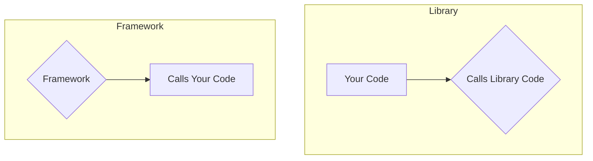
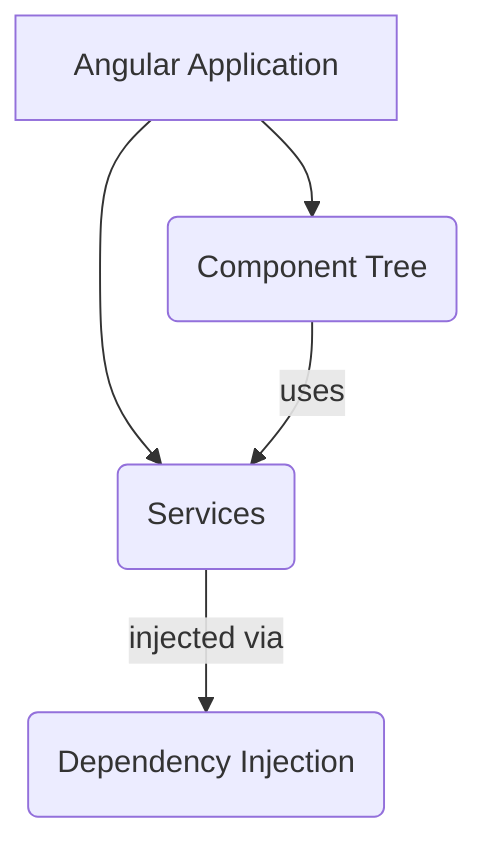
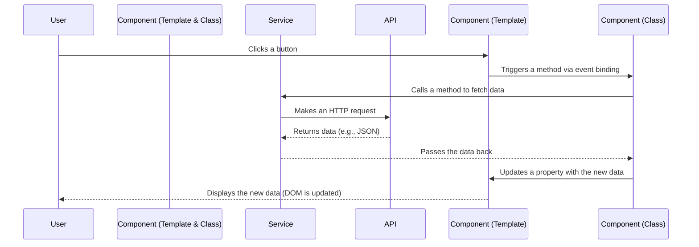

# Module 1.1: Introduction to Modern Angular

**Objective:** By the end of this module, you will be able to:
- **Define** what Angular is and its role as a web framework.
- **Explain** its core architectural concepts, including components, services, and dependency injection.
- **Differentiate** between a framework and a library, using real-world examples.
- **Summarize** the key advantages of using the latest version of Angular.

---

### What is Angular?

Angular is a comprehensive, open-source web application framework developed and maintained by Google. It is built with TypeScript and is designed to build **Single Page Applications (SPAs)**.

#### A Brief History of Angular

Angular has undergone significant evolution:
*   **AngularJS (Version 1.x):** Released in 2010, it introduced concepts like two-way data binding and dependency injection.
*   **Angular (Version 2+):** A complete rewrite in 2016, faster and more modular, using TypeScript. This broke compatibility with AngularJS.
*   **Angular 2 to 19:** Followed a predictable release schedule with incremental improvements (e.g., Ivy renderer).
*   **Angular 20:** Continues modernization with **Signals** and **Standalone Components** as defaults, simplifying development and boosting performance.

*   **Single Page Application (SPA):** An SPA is a web application that interacts with the user by dynamically rewriting the current web page with new data from the web server, instead of the default method of the browser loading entire new pages. This approach provides a more fluid, responsive, and faster user experience, much like a native desktop or mobile application. **Examples include Gmail, Google Maps, and social media feeds.**

*   **Framework vs. Library:** It's crucial to understand that Angular is a **framework**. 

| Feature       | Framework (e.g., Angular, NestJS)                          | Library (e.g., React, Lodash, Axios)                        |
| :------------ | :--------------------------------------------------------- | :---------------------------------------------------------- |
| **Control**   | Dictates architecture; calls your code when needed.        | You call the library's code when needed.                    |
| **Scope**     | Provides a complete structure for building an application. | Provides tools for specific tasks.                          |
| **Flexibility** | Less flexible, but offers consistency and scalability.     | More flexible, but requires more architectural decisions.   |
| **Learning Curve** | Steeper initially due to opinionated nature.               | Often shallower initially, but requires more integration.    |



    *   A **library** provides a set of tools to perform a specific task (e.g., React for UI, or Lodash for utility functions). You are in control and decide when and where to call the library.
    *   A **framework** provides a complete structure for your application. It is opinionated and dictates the overall architecture. The framework calls your code at the appropriate time. This inversion of control provides consistency and scalability, which is invaluable for large, enterprise-grade applications.

### The Angular Ecosystem: A High-Level View

Angular is not just a rendering engine; it's a complete platform with a rich ecosystem of tools that work together seamlessly.

```mermaid
graph TD
    subgraph Core Framework
        A[Components & Templates]
        B[Services & Dependency Injection]
        C[Routing]
        D[Forms]
        E[HTTP Client]
    end

    subgraph Tooling
        F[Angular CLI]
        G[Language Service]
        H[DevTools]
    end

    subgraph Testing
        I[Jest for Unit Tests]
        J[Cypress for E2E Tests]
    end

    Core Framework --> Tooling
    Core Framework --> Testing
```

**Text Summary of the Ecosystem:**
- **Core Framework:** Includes foundational building blocks like Components, Services, Routing, Forms, and an HTTP Client.
- **Tooling:** Consists of the Angular CLI for project management, a Language Service for editor support, and DevTools for debugging.
- **Testing:** Relies on Jest for unit testing and Cypress for end-to-end (E2E) testing.

### Key Advantages of Angular 20

1.  **Standalone Components:** The default since Angular 17, this feature drastically simplifies application architecture by making `NgModules` optional. This reduces boilerplate code and makes Angular easier to learn and use. (See [Module 3: Standalone Components](../03-standalone-components) for more details).

    ```typescript
    // Example: A standalone component
    import { Component } from '@angular/core';

    @Component({
      standalone: true,
      selector: 'app-my-component',
      template: `<h1>Hello Standalone!</h1>`,
      styles: [`h1 { color: blue; }`]
    })
    export class MyComponent { }
    ```

2.  **Signals for Fine-Grained Reactivity:** A new reactivity model that offers a more efficient and predictable way to manage state changes, leading to significant performance improvements. (See [Module 9: Angular Signals](../09-angular-signals) for more details).

3.  **TypeScript-First:** Full integration with TypeScript provides compile-time error checking, strong typing, and modern language features, resulting in more maintainable and scalable code. (See [Module 1.5: TypeScript Fundamentals](./1.5-typescript-fundamentals.md) for more details).

4.  **Powerful, Unified Tooling:** The Angular CLI is a best-in-class command-line tool that scaffolds projects, generates code, runs tests, and handles builds, providing a consistent development experience. (See [Module 15.4: Angular CLI Beyond Basics](../15-ecosystem/15.4-angular-cli-beyond-basics.md) for more details).

5.  **Proven & Scalable:** Backed by Google, Angular is used to build some of the world's largest and most complex web applications. Its opinionated nature ensures that large teams can work together effectively.

| Feature                 | Benefit                                                              |
| :---------------------- | :------------------------------------------------------------------- |
| **Standalone by Default** | Reduces boilerplate, simplifies learning, and improves architecture. |
| **Signals**               | Provides fine-grained, efficient reactivity for better performance.  |
| **TypeScript-First**      | Ensures type safety, scalability, and maintainable code.             |
| **Unified Tooling (CLI)** | Streamlines development, testing, and deployment workflows.          |
| **Proven & Scalable**     | Trusted by Google for large-scale enterprise applications.           |

### Core Architectural Concepts

At its core, an Angular application is a tree of components.

*   **Components:** The fundamental building blocks of the UI. Each component consists of:
    *   A **TypeScript Class** that contains the application logic and state.
    *   An **HTML Template** that defines the view.
    *   **CSS Styles** that are scoped to the component.
*   **Services & Dependency Injection (DI):** Services are classes that encapsulate reusable business logic. **Dependency Injection (DI)** is the design pattern Angular uses to provide components with the services they need. This promotes modularity and separation of concerns.
    *   **Analogy:** Think of a restaurant. The **Component** is the `Chef`, the **Service** is the `Waiter`, and the **Dependency** is the `Food`. The `Chef` doesn't go to the farm to get ingredients; they simply declare what they need. The `Waiter` (Angular's DI system) delivers the `Food` (the service instance) to the `Chef` when requested.



**Text Summary of Application Structure:**
An Angular application is composed of a tree of components that use services to handle shared logic. The Dependency Injection system is responsible for creating and providing these services to the components that need them.

#### How It Works: A Simplified Flow

This diagram illustrates the basic interaction between the user, components, and services.



**Text Summary of Simplified Flow:**

1.  **User Interaction:** A user clicks a button in the Component's template.
2.  **Event Binding:** This triggers a method in the Component's class via event binding.
3.  **Service Call:** The Component's class calls a method in a Service to fetch data.
4.  **API Request:** The Service makes an HTTP request to a Backend API.
5.  **API Response:** The API returns data (e.g., JSON) to the Service.
6.  **Data to Component:** The Service passes the data back to the Component's class.
7.  **UI Update:** The Component's class updates a property with the new data, which in turn updates the Component's template.
8.  **User Sees Update:** The DOM is updated, and the user sees the new data.

---

### Key Takeaways

*   Angular is a powerful, TypeScript-based **framework** for building **Single Page Applications (SPAs)**.
*   It provides a structured approach to development, emphasizing **components** and **services**.
*   **Standalone Components** and **Signals** are key modern features simplifying development.
*   The **Angular CLI** is an essential tool for managing your projects.

### Self-Assessment Checklist
- [ ] I can define what a Single Page Application (SPA) is.
- [ ] I can explain the difference between a framework and a library.
- [ ] I can list the three main parts of an Angular component.
- [ ] I understand the purpose of a service in Angular.
- [ ] I know what "Standalone Components" and "Signals" refer to in modern Angular.

---

**Next:** [1.2 Environment Setup](./1.2-environment-setup.md)
