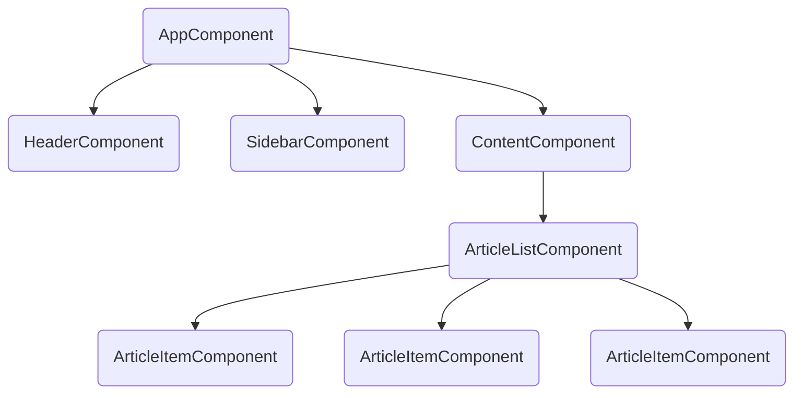

# Module 2.1: Components Deep Dive

**Objective:** By the end of this module, you will be able to:
- **Explain** the philosophy of component-based architecture.
- **Describe** the anatomy of an Angular component, including its four key parts.
- **Implement** parent-child communication using `@Input()` and `@Output()`.
- **Generate** new components using the Angular CLI.

---

### The Philosophy of Components

At the highest level, an Angular application is a tree of components. This approach is known as **Component-Based Architecture**.

**Analogy:** Think of building a user interface with Lego blocks. Each block is a self-contained component. You can combine them to build complex structures, and you can reuse the same type of block in multiple places.

**Why it matters:** Breaking a complex UI into small, manageable, and reusable pieces provides several key advantages:

*   **Modularity:** Each component is a self-contained unit with its own logic, view, and styles.
*   **Reusability:** Design a component once (e.g., a custom date picker) and reuse it throughout your application.
*   **Maintainability:** When a piece of the UI needs to be updated, you can go directly to the relevant component.



**Text Summary of Component Tree:**
An Angular application starts with a root `AppComponent`. This component can contain other major components like a `HeaderComponent` and `ContentComponent`. The `ContentComponent` might then contain an `ArticleListComponent`, which in turn renders multiple `ArticleItemComponent`s. This hierarchical structure allows for modular and organized UI development.

### The Anatomy of a Component

An Angular component is a TypeScript class decorated with `@Component`. This decorator provides metadata that tells Angular how to use the class.

```mermaid
graph LR
    subgraph Component
        A[@Component Decorator] -- provides metadata for --> B(TypeScript Class);
        B -- contains logic for --> C(HTML Template);
        C -- is styled by --> D(CSS Styles);
    end
```

**Text Summary of Component Anatomy:**
An Angular component is composed of four main parts: the `@Component` Decorator (metadata), a TypeScript Class (logic), an HTML Template (view), and CSS Styles (appearance). The decorator links the class to its template and styles. A fifth file, the `.spec.ts` file, is generated for testing.

### Component Communication: @Input and @Output

Components rarely live in isolation. Parent components pass data to children, and children send information back to parents.

**Analogy:** Think of a parent asking a child to do something (`@Input`) and the child reporting back when it's done (`@Output`).

```mermaid
graph TD
    subgraph ParentComponent
        A[Data Property]
        B[Handler Method]
    end
    subgraph ChildComponent
        C[@Input() Property]
        D[@Output() EventEmitter]
    end

    A -- Property Binding --> C;
    D -- Event Binding --> B;
```

**Text Summary of Component Communication:**
Parents pass data to children using property binding to `@Input()` properties. Children send data up by emitting events from `@Output()` `EventEmitter`s, which the parent listens to via event binding.

#### Full Example: Parent/Child Communication

Let's create a `UserListComponent` (parent) that passes a user object to a `UserProfileCardComponent` (child). When a user is selected in the child, it will notify the parent.

**Note on Testing:** This parent-child interaction can be tested by creating a test host component that simulates the parent's behavior and allows you to verify that the `@Input` and `@Output` bindings work as expected.

**Child: `user-profile-card.component.ts`**
```typescript
import { Component, Input, Output, EventEmitter } from '@angular/core';
import { User } from '../user.model';

@Component({
  standalone: true,
  selector: 'app-user-profile-card',
  template: `
    <div (click)="selectUser()" class="card" role="button" [attr.aria-pressed]="isSelected">
      <h3>{{ user.name }}</h3>
      <p>Email: {{ user.email }}</p>
    </div>
  `
})
export class UserProfileCardComponent {
  @Input() user!: User;
  @Input() isSelected: boolean = false;
  @Output() userSelected = new EventEmitter<User>();

  selectUser() {
    this.userSelected.emit(this.user);
  }
}
```

**Parent: `user-list.component.ts`**
```typescript
import { Component } from '@angular/core';
import { UserProfileCardComponent } from './user-profile-card.component';
import { User } from '../user.model';

@Component({
  standalone: true,
  selector: 'app-user-list',
  imports: [UserProfileCardComponent],
  template: `
    <h2>User List</h2>
    <app-user-profile-card
      *ngFor="let u of users"
      [user]="u"
      [isSelected]="u.id === selectedUser?.id"
      (userSelected)="onUserSelected($event)">
    </app-user-profile-card>

    @if (selectedUser) {
      <p>You selected: {{ selectedUser.name }}</p>
    }
  `
})
export class UserListComponent {
  selectedUser: User | null = null;
  users: User[] = [
    { id: 1, name: 'Alice', email: 'alice@example.com' },
    { id: 2, name: 'Bob', email: 'bob@example.com' }
  ];

  onUserSelected(user: User) {
    this.selectedUser = user;
  }
}
```

### The `@Component` Decorator Deep Dive

| Property          | Description                                                                 |
| :---------------- | :-------------------------------------------------------------------------- |
| `standalone`      | If `true`, component manages its own dependencies. **Always set to `true` for new components.** |
| `selector`        | CSS selector for the component's host element. Use a custom prefix (e.g., `app-`). |
| `templateUrl`     | Path to an external HTML template file. Use for templates > 3 lines.         |
| `template`        | Inline HTML template string. Use for very simple templates.                 |
| `styleUrls`       | Array of paths to external CSS files.                                       |
| `styles`          | Array of inline CSS strings.                                                |
| `imports`         | In standalone components, declares dependencies (other components, directives, pipes). |
| `encapsulation`   | Defines the style encapsulation strategy (`Emulated`, `None`, `ShadowDom`). |

### The TypeScript Class Deep Dive

The class contains the component's logic. Key lifecycle hooks like `ngOnInit` (for initialization logic) and `ngOnDestroy` (for cleanup) are implemented here.

```typescript
import { Component, OnInit, OnDestroy } from '@angular/core';

@Component({ ... })
export class MyComponent implements OnInit, OnDestroy {
  // Properties hold state
  userName: string = 'Jane Doe';

  constructor() { 
    // Use for dependency injection, not complex logic
  }

  ngOnInit() {
    // Use for initialization logic (e.g., fetching data)
    console.log('Component initialized!');
  }

  ngOnDestroy() {
    // Use for cleanup (e.g., unsubscribing from observables)
    console.log('Component destroyed!');
  }
}
```

### Generating Components with the CLI

The Angular CLI automates component creation.

```bash
# Generate a new standalone component
ng generate component user-list --standalone

# Short form
ng g c user-list --standalone
```

This command creates a folder with the four essential component files (`.ts`, `.html`, `.css`, `.spec.ts`).

---

### Key Takeaways

*   Angular apps use **component-based architecture** for modularity and reusability.
*   Components have four parts: a **class**, a **template**, **styles**, and a **decorator**.
*   `@Input()` and `@Output()` are used for **parent-child communication**.
*   The **Angular CLI** (`ng g c`) is the best way to generate new components.

---

**Previous:** [1.5 TypeScript Fundamentals](../01-introduction-and-setup/1.5-typescript-fundamentals.md)

**Next:** [2.2 Data Binding Deep Dive](./2.2-data-binding-deep-dive.md)
