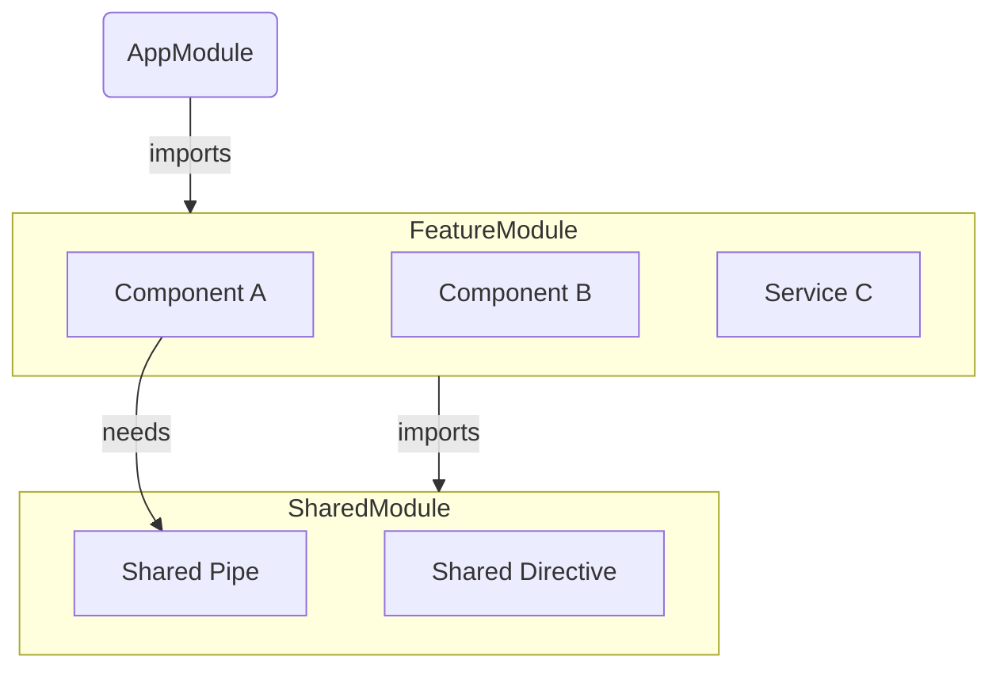
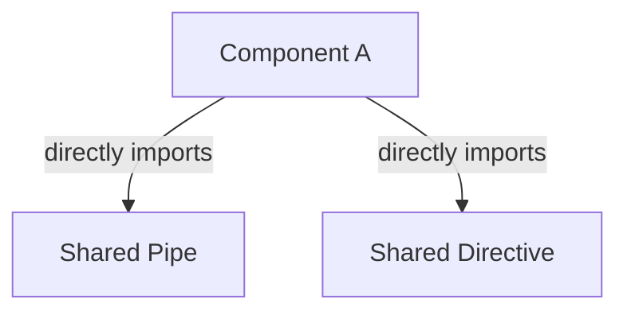

# Module 3.1: The "Why" of Standalone Components

**Objective:** By the end of this module, you will be able to explain the historical context and complexities of `NgModule`, and articulate how the standalone architecture simplifies Angular development.

---

### The World Before Standalone: `NgModule`

To appreciate the significance of standalone components, it's essential to first understand the system they replaced: `NgModule`. `NgModule` was introduced to help organize large applications by grouping related pieces together.

For many years (from Angular 2 to Angular 13), `NgModule` was a fundamental and mandatory part of every Angular application. It was a class decorated with `@NgModule` that served as a **compilation context** for a group of related components, directives, and pipes.

**An `NgModule` was responsible for:**

1.  **Declarations:** Listing all the components, directives, and pipes that belonged to this module.
2.  **Imports:** Listing other modules whose components or directives were needed in this module's templates.
3.  **Exports:** Listing components, directives, and pipes from this module that should be made available to other modules.
4.  **Providers:** Listing the dependency injection providers (services) for this module.

#### The Problem with `NgModule`

While powerful, the `NgModule` system introduced significant complexity and boilerplate, especially for new developers:

*   **High Boilerplate:** Every new component had to be declared in an `NgModule`. If you forgot, you'd get a cryptic error message like `Component is not part of any NgModule`.
*   **Complex Mental Model:** Developers had to constantly think about which module to import, what to declare, and what to export.
*   **Tight Coupling:** Components were tightly coupled to their `NgModule`.
*   **Hidden Dependencies:** A component's true dependencies were not immediately obvious.



**Text Summary of `NgModule`-centric World:**
In the `NgModule`-based architecture, `AppModule` imports `FeatureModule`, which in turn imports `SharedModule`. Components within `FeatureModule` (like `Component A`) can then use elements from `SharedModule` (like `Shared Pipe`) indirectly through these module imports. This creates a layer of indirection where dependencies are managed at the module level rather than directly by the components.

--- 

### The Solution: Standalone Architecture

Introduced in Angular 14 and made the default in Angular 17, the standalone architecture fundamentally simplifies this model. 

**A standalone component is a component that manages its own dependencies directly.**

It is no longer tightly coupled to a parent `NgModule`. Instead, it explicitly lists what it needs in its own `@Component` decorator.



**Text Summary of Standalone World:**
In the standalone architecture, `Component A` directly imports its dependencies, such as `Shared Pipe` and `Shared Directive`. This removes the intermediate `NgModule` layer, making the dependency chain explicit and easier to understand.

```typescript
// A standalone component directly imports its dependencies.
@Component({
  standalone: true, // This flag marks the component as standalone.
  selector: 'app-my-component',
  imports: [CommonModule, MatButtonModule], // Directly import what you need.
  template: `<button mat-button>Click Me</button>`
})
export class MyComponent {}
```

### Key Benefits of Standalone Components

| Benefit                    | Description                                                                 |
| :------------------------- | :-------------------------------------------------------------------------- |
| **Reduced Boilerplate**    | No need for `NgModule` files in most cases, fewer files and lines of code.  |
| **Simplified Mental Model**| Component is the primary unit; dependencies are explicit and easy to trace. |
| **Improved Tree-Shaking**  | More accurate dead code elimination leads to smaller bundle sizes.          |
| **Easier Lazy Loading**    | Straightforward lazy loading of single components.                          |
| **Lower Barrier to Entry** | Simpler for newcomers to learn Angular.                                     |

For teams with existing `NgModule`-based applications, Angular provides schematics and guides to help with migration. See the [official Angular documentation](https://angular.io/guide/standalone-components) for migration resources.

---

**Previous:** [2.4 View Encapsulation & Component Styles](../02-components-and-templates/2.4-view-encapsulation.md)

**Next:** [3.2 Creating & Bootstrapping a Standalone App](./3.2-bootstrapping.md)
