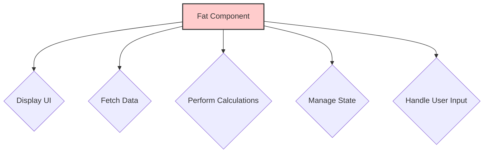
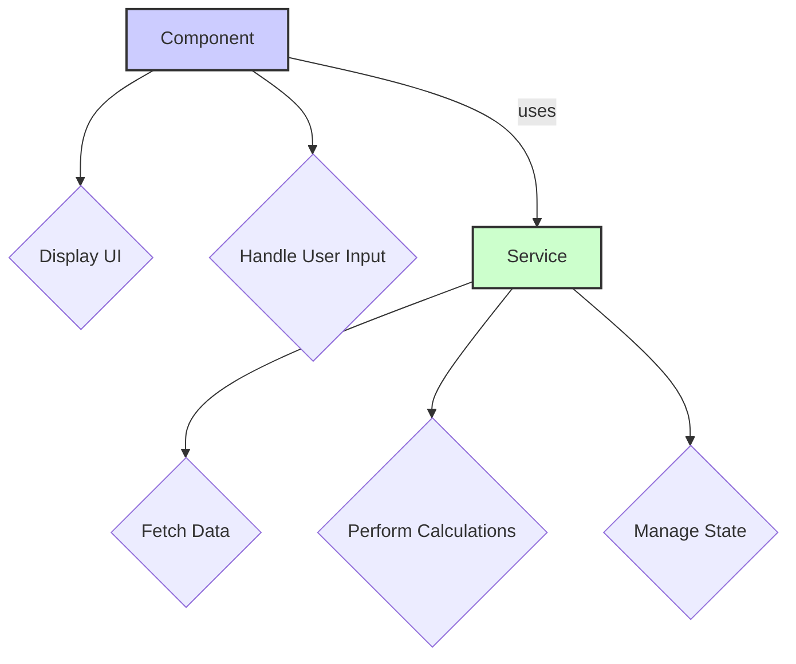

# Module 4.1: The Purpose of Services

**Objective:** By the end of this module, you will be able to explain the fundamental role of services in Angular applications, articulate how they promote reusability and separation of concerns, and understand their role in state management.

---

### The Problem: Fat Components

Imagine a component that not only handles user interaction and displays data but also fetches data from an API, performs complex calculations, and manages application-wide state. This is what we call a "fat component."

**Analogy:** A fat component is like a Swiss Army knife that has too many tools. It's bulky, hard to handle, and you can easily cut yourself on one tool while trying to use another.

**Issues with Fat Components:**

*   **Hard to Read:** A single file with hundreds of lines of code becomes difficult to understand.
*   **Hard to Test:** Testing a component that does too many things is complex.
*   **Hard to Reuse:** If another part of your application needs the same logic, you have to duplicate the code.



### The Solution: Services and Separation of Concerns

Angular services are plain TypeScript classes that encapsulate specific functionalities. They are designed to be injected into components or other services, promoting a design principle called **Separation of Concerns (SoC)**.

**SoC Principle:**

*   **Components:** Responsible for **UI logic** and **user interaction**.
*   **Services:** Responsible for **business logic**, **data access**, and **state management**.



### Key Purposes of Services

| Purpose                          | Description                                                                 | Example                                     |
| :------------------------------- | :-------------------------------------------------------------------------- | :------------------------------------------ |
| **Shared Logic & Reusability**   | Centralize common functions used across multiple components.                | `LoggerService`, `ValidatorService`         |
| **Data Access & Persistence**    | Handle communication with backend APIs, databases, or local storage.        | `UserService`, `ProductService`             |
| **Application-Wide State Management** | Manage shared data accessible throughout the application.                   | `ShoppingCartService`, `AuthService`        |

Services can also be injected into other services, allowing for a clean, layered architecture.

### The `providedIn: 'root'` Advantage

Modern Angular services are typically marked with `@Injectable({ providedIn: 'root' })`. This makes the service a **singleton** (only one instance exists) and available throughout the entire application. This is the most common and recommended way to provide services.

```typescript
import { Injectable } from '@angular/core';

@Injectable({ providedIn: 'root' })
export class DataService {
  // ...
}
```

**Note on other provider scopes:** While `providedIn: 'root'` is most common, you can also provide services at the component level or within specific routes for more granular control over service instances.

### Example: Sharing State with a Service

Let's illustrate the power of a singleton service for state management. Imagine a `ShoppingCartService` that needs to be accessed by both a `ProductListComponent` and a `NavbarComponent`.

**Note on testing:** This service can be easily unit tested by mocking its dependencies (if any). Components that use this service can also be tested by providing a mock version of the service.

**`shopping-cart.service.ts`**
```typescript
import { Injectable } from '@angular/core';
import { BehaviorSubject } from 'rxjs';

@Injectable({ providedIn: 'root' })
export class ShoppingCartService {
  private items: string[] = [];
  public cartCount = new BehaviorSubject<number>(0);

  addItem(item: string) {
    this.items.push(item);
    this.cartCount.next(this.items.length);
  }
}
```

**`product-list.component.ts`**
```typescript
import { Component } from '@angular/core';
import { ShoppingCartService } from './shopping-cart.service';

@Component({ ... })
export class ProductListComponent {
  constructor(private cartService: ShoppingCartService) {}

  addToCart(product: string) {
    this.cartService.addItem(product);
  }
}
```

**`navbar.component.ts`**
```typescript
import { Component } from '@angular/core';
import { ShoppingCartService } from './shopping-cart.service';

@Component({ ... })
export class NavbarComponent {
  constructor(public cartService: ShoppingCartService) {}
}
```

Because `ShoppingCartService` is a singleton, both components are working with the exact same instance. When the `ProductListComponent` calls `addItem()`, the state within the service is updated, and the `NavbarComponent` automatically reflects that change.

**Note on subscriptions:** In a real application, you would need to handle the subscription to `cartCount` carefully to avoid memory leaks, typically by using the `async` pipe or unsubscribing in `ngOnDestroy`.

---

### Key Takeaways

*   **Services** encapsulate business logic, data access, and state management.
*   They promote **Separation of Concerns (SoC)**, making code more modular, testable, and reusable.
*   Services provided with `providedIn: 'root'` are **singletons**.
*   Services are ideal for **sharing state** and logic between components.

---

**Previous:** [3.3 Standalone Component Dependencies](../03-standalone-components/3.3-component-dependencies.md)

**Next:** [4.2 Creating & Providing Services](./4.2-creating-providing-services.md)
