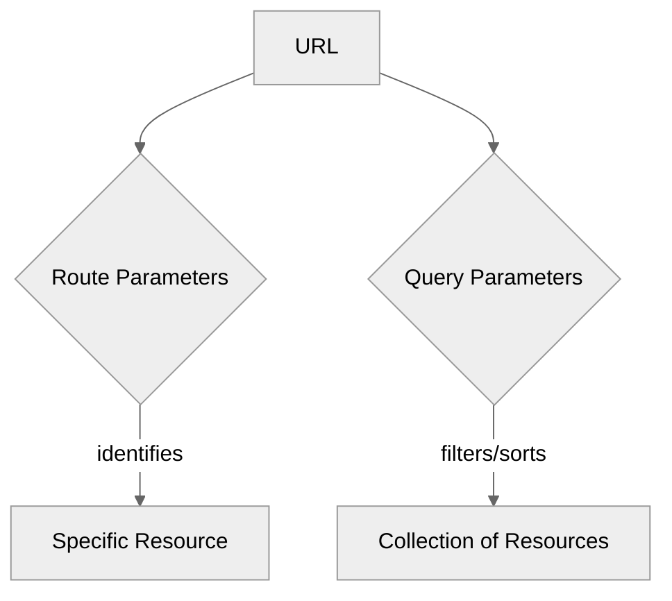

# Module 5.3: Route Parameters & Query Parameters

**Objective:** By the end of this module, you will be able to effectively pass and retrieve dynamic data in URLs using route parameters and query parameters, and understand when to use each for optimal application design.

---

### Dynamic Data in URLs

Many applications need to display dynamic content based on the URL. For example, a product detail page needs to know *which* product to display, or a search results page might need to know *what* the user searched for.

Angular provides two primary mechanisms for passing dynamic data through the URL:

1.  **Route Parameters:** For mandatory, hierarchical data that identifies a specific resource (e.g., `/products/123` where `123` is the product ID).
2.  **Query Parameters:** For optional, non-hierarchical data that filters or sorts a resource (e.g., `/products?category=electronics&sort=price`).

```mermaid
%%{init: {'theme':'neutral'}}%%
graph TD
    A[Full URL] --> B[Path Segments (Route Parameters)];
    A --> C[Query String (Query Parameters)];

    B -- identifies specific resource --> D[e.g., /products/123];
    C -- filters/sorts collection --> E[e.g., ?category=electronics&sort=price];
```
**Alt text:** Diagram showing a full URL splitting into path segments (route parameters) for specific resources and a query string (query parameters) for filtering/sorting collections.


**Alt text:** Diagram illustrating that a URL can contain both route parameters, which identify a specific resource, and query parameters, which filter or sort a collection of resources.

**Text Summary of Route vs. Query Parameters:**

Route parameters are integral parts of the URL path, used to identify specific resources (e.g., `/products/123`). Query parameters are appended to the URL after a question mark, providing optional data for filtering or sorting collections (e.g., `/products?category=electronics`).

### 1. Route Parameters

Route parameters are segments of the URL that represent dynamic values. They are defined in the `Routes` configuration using a colon (`:`) prefix.

#### a) Defining Route Parameters

```typescript
// src/app/app.routes.ts
import { Routes } from '@angular/router';
import { ProductDetailComponent } from './product-detail/product-detail.component';

export const routes: Routes = [
  // ... other routes
  {
    path: 'products/:id', // :id is a route parameter
    component: ProductDetailComponent
  },
  {
    path: 'users/:userId/posts/:postId', // Multiple parameters
    component: UserPostComponent
  }
];
```

#### b) Navigating with Route Parameters

**Declarative (`routerLink`):**

```html
<!-- Navigates to /products/123 -->
<a [routerLink]="['/products', 123]">View Product 123</a>

<!-- Navigates to /users/456/posts/789 -->
<a [routerLink]="['/users', 456, 'posts', 789]">View User 456's Post 789</a>
```

**Programmatic (`Router` service):**

```typescript
import { Router } from '@angular/router';

// ... inside a component or service
constructor(private router: Router) { }

viewProduct(productId: number): void {
  this.router.navigate(['/products', productId]);
}

viewUserPost(userId: number, postId: number): void {
  this.router.navigate(['/users', userId, 'posts', postId]);
}
```

#### c) Retrieving Route Parameters in a Component

To access route parameters, you inject the `ActivatedRoute` service into your component.

```typescript
// src/app/product-detail/product-detail.component.ts
import { Component, OnInit } from '@angular/core';
import { ActivatedRoute, Router } from '@angular/router'; // Import Router for redirection
import { switchMap } from 'rxjs/operators';
import { of } from 'rxjs';

@Component({
  standalone: true,
  selector: 'app-product-detail',
  template: `
    <h2>Product Detail</h2>
    <p>Product ID: {{ productId }}</p>
    <p>Product Name: {{ productName }}</p>
    @if (!productId) {
      <p class="error">Product not found. Please provide a valid ID.</p>
    }
  `
})
export class ProductDetailComponent implements OnInit {
  productId: string | null = null;
  productName: string = '';

  constructor(private route: ActivatedRoute, private router: Router) { }

  ngOnInit(): void {
    // Method 1: Using snapshot (for routes that don't change parameters within the same component instance)
    this.productId = this.route.snapshot.paramMap.get('id');
    if (!this.productId) {
      // Handle missing ID: e.g., redirect to a 404 page or product list
      console.warn('Product ID missing from route. Redirecting...');
      this.router.navigate(['/products']); // Redirect to product list
      return;
    }
    // In a real app, you'd fetch product details using this ID
    this.productName = `Product ${this.productId}`;

    // Method 2: Using Observable (for routes where parameters can change without re-instantiating the component)
    this.route.paramMap.pipe(
      switchMap(params => {
        const id = params.get('id');
        if (!id) {
          console.warn('Product ID missing from route observable. Redirecting...');
          this.router.navigate(['/products']);
          return of(null); // Return an observable that emits null
        }
        return of(id); // In a real app, this would be a service call: this.productService.getProduct(id)
      })
    ).subscribe(id => {
      if (id) {
        this.productId = id;
        this.productName = `Updated Product ${this.productId}`;
      }
    });
  }
}
```

**`snapshot` vs. `Observable`:**

*   **`snapshot`:** Use `this.route.snapshot.paramMap.get('id')` when you are sure the route parameters will not change while the component is active (e.g., navigating from `/products/1` to `/products/2` will destroy and re-create the component). This is simpler for one-off reads.
*   **`Observable` (`paramMap.subscribe`):** Use `this.route.paramMap.subscribe(...)` when the component might be reused for different route parameters (e.g., navigating from `/products/1` to `/products/2` *without* destroying the component, which can happen with child routes or certain routing strategies). This is generally the safer and more robust approach for dynamic scenarios.

### 2. Query Parameters

Query parameters are key-value pairs appended to the URL after a question mark (`?`). They are typically used for optional data like filtering, sorting, or pagination.

#### a) Defining Query Parameters

Query parameters are *not* defined in the `Routes` configuration. They are dynamic and can be added to any route.

**Example URL:** `http://localhost:4200/products?category=electronics&sort=price`

#### b) Navigating with Query Parameters

**Declarative (`routerLink`):**

```html
<!-- Navigates to /products?category=electronics -->
<a [routerLink]="['/products']" [queryParams]="{ category: 'electronics' }">Electronics</a>

<!-- Navigates to /products?category=electronics&sort=price -->
<a [routerLink]="['/products']" [queryParams]="{ category: 'electronics', sort: 'price' }">Sorted Electronics</a>

<!-- Preserve existing query parameters -->
<a [routerLink]="['/products']" [queryParams]="{ page: 2 }" queryParamsHandling="preserve">Next Page</a>
```

**Programmatic (`Router` service):**

```typescript
import { Router } from '@angular/router';

// ... inside a component or service
constructor(private router: Router) { }

searchProducts(category: string, sort: string): void {
  this.router.navigate(['/products'], {
    queryParams: { category: category, sort: sort }
  });
}

// Preserve existing query parameters
this.router.navigate([], { queryParams: { page: 2 }, queryParamsHandling: 'preserve' });
```

**Handling Multiple/Complex Query Parameters:** For more complex scenarios, you can pass an object with multiple key-value pairs to `queryParams`. You can also use `queryParamsHandling: 'merge'` to combine new query parameters with existing ones, or `queryParamsHandling: 'preserve'` to keep all existing query parameters.

#### c) Retrieving Query Parameters in a Component

Similar to route parameters, you use the `ActivatedRoute` service, but you access the `queryParamMap` observable.

```typescript
// src/app/product-list/product-list.component.ts
import { Component, OnInit } from '@angular/core';
import { ActivatedRoute } from '@angular/router';
import { Subscription } from 'rxjs'; // Import Subscription

@Component({
  standalone: true,
  selector: 'app-product-list',
  template: `
    <h2>Product List</h2>
    <p>Category: {{ category }}</p>
    <p>Sort By: {{ sortBy }}</p>
  `
})
export class ProductListComponent implements OnInit {
  category: string | null = null;
  sortBy: string | null = null;
  private queryParamsSubscription: Subscription | undefined; // Declare subscription

  constructor(private route: ActivatedRoute) { }

  ngOnInit(): void {
    this.queryParamsSubscription = this.route.queryParamMap.subscribe(params => {
      this.category = params.get('category');
      this.sortBy = params.get('sort');
      // Fetch products based on these parameters
    });
  }

  ngOnDestroy(): void {
    // Unsubscribe to prevent memory leaks
    if (this.queryParamsSubscription) {
      this.queryParamsSubscription.unsubscribe();
    }
  }
}
```

### Route Parameters vs. Query Parameters: When to Use Which?

| Feature           | Route Parameters (`/users/:id`)                               | Query Parameters (`/users?filter=active`)                               |
| :---------------- | :------------------------------------------------------------ | :------------------------------------------------------------------------ |
| **Purpose**       | Identify a specific resource or a hierarchical part of the URL. | Filter, sort, or provide optional data to a resource or collection.       |
| **Mandatory?**    | Yes, if the route is defined with it.                         | No, they are always optional.                                             |
| **URL Structure** | Part of the path segment.                                     | Appended after `?` at the end of the URL.                               |
| **Example**       | `/products/123`, `/users/john-doe`                            | `/products?category=electronics`, `/search?q=angular&page=2`              |

Choosing the correct method for passing data is crucial for building clean, semantic, and functional URLs in your Angular application.

**Example Use Cases:**

*   **Route Parameters:**
    *   `/users/123`: Display details for user with ID 123.
    *   `/books/fiction/harry-potter`: Navigate to a specific book within a category.
    *   `/orders/ABC-123/track`: Track a specific order.

*   **Query Parameters:**
    *   `/products?category=electronics&sort=price`: Filter products by category and sort them by price.
    *   `/search?q=angular&page=2`: Display search results for "angular" on the second page.
    *   `/dashboard?view=charts&period=monthly`: Change the view and time period of a dashboard.

---

### Key Takeaways

*   **Route parameters** (`:id`) are used for mandatory, hierarchical data that identifies a specific resource within the URL path.
*   **Query parameters** (`?key=value`) are used for optional, non-hierarchical data like filtering, sorting, or pagination.
*   The `ActivatedRoute` service is used to retrieve both types of parameters within a component.
*   Use `snapshot` for static parameters and `paramMap` (Observable) for dynamic parameters that might change without component re-instantiation.
*   Always unsubscribe from `paramMap` and `queryParamMap` observables in `ngOnDestroy` to prevent memory leaks.

---

**Previous:** [5.2 Configuring Routes](./5.2-configuring-routes.md)

**Next:** [5.4 Route Guards](./5.4-route-guards.md)
