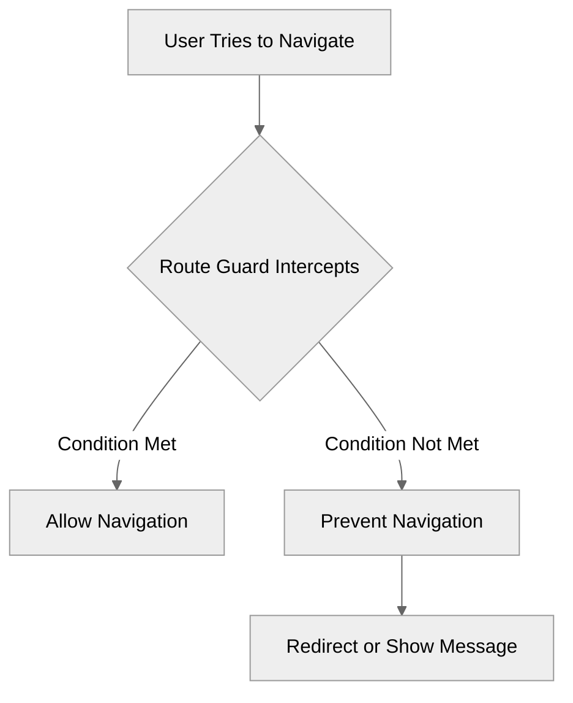

# Module 5.4: Route Guards

**Objective:** By the end of this module, you will be able to understand the concept of route guards, implement various types of guards (`CanActivate`, `CanDeactivate`, `CanLoad`), and apply them to control navigation flow in your Angular application.

---

### Protecting Your Routes

In real-world applications, you often need to control access to certain routes. For example:

*   A user must be authenticated to access their profile page.
*   A user must have an 'admin' role to access the administration dashboard.
*   A user should be prompted to save changes before leaving a form.

Angular's **Route Guards** provide a powerful mechanism to implement such access control. They are interfaces that you implement to decide if the router should activate a route, deactivate a route, or load a lazy-loaded module.


**Alt text:** Diagram showing a user attempting to navigate, which is intercepted by a route guard. Depending on whether a condition is met, the guard either allows or prevents navigation, potentially redirecting the user or showing a message.

### Types of Route Guards

Angular provides several types of route guards, each designed for a specific navigation scenario:

| Guard Type         | Purpose                                                                 | Use Case Example                                            |
| :----------------- | :---------------------------------------------------------------------- | :---------------------------------------------------------- |
| `CanActivate`      | Controls if a route can be activated (navigated *to*).                  | Authentication, authorization (e.g., user must be logged in). |
| `CanActivateChild` | Controls if a child route can be activated.                             | Applying a guard to all child routes of a feature.          |
| `CanDeactivate`    | Controls if a user can navigate *away from* a route.                    | Preventing loss of unsaved form data.                       |
| `CanLoad`          | Controls if a lazy-loaded module can be loaded (downloaded).            | Preventing unauthorized download of feature code.           |
| `CanMatch`         | Controls if a route can be matched (useful for dynamic routing).        | Dynamically choosing a component based on user role.        |

All guards return an `Observable<boolean | UrlTree>`, `Promise<boolean | UrlTree>`, or `boolean | UrlTree`.

*   `true`: Navigation is allowed.
*   `false`: Navigation is prevented.
*   `UrlTree`: Navigation is cancelled, and the router navigates to the URL specified by the `UrlTree` (e.g., redirect to a login page).

--- 

### 1. `CanActivate` Guard (Authentication Example)

This is the most common guard, used to prevent unauthorized access to routes.

#### a) Create the Guard

Use the Angular CLI to generate a guard. Choose `CanActivate` when prompted.

```bash
ng g guard auth
```

**`src/app/auth.guard.ts`:**

```typescript
import { Injectable } from '@angular/core';
import { CanActivate, ActivatedRouteSnapshot, RouterStateSnapshot, Router, UrlTree } from '@angular/router';
import { Observable } from 'rxjs';
import { AuthService } from './auth.service'; // Assume you have an AuthService

@Injectable({
  providedIn: 'root'
})
export class AuthGuard implements CanActivate {

  constructor(private authService: AuthService, private router: Router) { }

  canActivate(
    route: ActivatedRouteSnapshot,
    state: RouterStateSnapshot): Observable<boolean | UrlTree> | Promise<boolean | UrlTree> | boolean | UrlTree {

    if (this.authService.isAuthenticated()) { // Check if user is logged in
      return true; // Allow navigation
    } else {
      // Redirect to login page and return a UrlTree
      return this.router.createUrlTree(['/login'], { queryParams: { returnUrl: state.url } });
    }
  }
}
```

#### b) Apply the Guard to a Route

Add the `canActivate` property to your route configuration.

```typescript
// src/app/app.routes.ts
import { Routes } from '@angular/router';
import { ProfileComponent } from './profile/profile.component';
import { LoginComponent } from './login/login.component';
import { AuthGuard } from './auth.guard'; // Import your guard

export const routes: Routes = [
  // ... other routes
  {
    path: 'profile',
    component: ProfileComponent,
    canActivate: [AuthGuard] // Apply the guard here
  },
  {
    path: 'login',
    component: LoginComponent
  }
];
```

**Guard Execution Order:** If you apply multiple guards to a single route (e.g., `canActivate: [AuthGuard, RoleGuard]`), Angular executes them in the order they are listed. If any guard returns `false` or a `UrlTree`, the navigation is cancelled, and subsequent guards are not executed.

**Testing Guards and Asynchronous Logic:** When testing guards, you often need to mock the services they depend on (e.g., `AuthService`). For guards that return `Observable`s or `Promise`s, ensure your tests handle the asynchronous nature correctly (e.g., using `async/await` or `fakeAsync` with `tick()`). (See [Module 13: Testing](../13-testing) for more on testing asynchronous code).

--- 

### 2. `CanDeactivate` Guard (Unsaved Changes Example)

This guard is useful for preventing users from accidentally losing unsaved data.

#### a) Create the Guard

```bash
ng g guard unsaved-changes
```

**`src/app/unsaved-changes.guard.ts`:**

```typescript
import { Injectable } from '@angular/core';
import { CanDeactivate } from '@angular/router';
import { Observable } from 'rxjs';

// Define an interface that components using this guard must implement
export interface CanComponentDeactivate {
  canDeactivate: () => Observable<boolean | UrlTree> | Promise<boolean | UrlTree> | boolean | UrlTree;
}

@Injectable({
  providedIn: 'root'
})
export class UnsavedChangesGuard implements CanDeactivate<CanComponentDeactivate> {
  canDeactivate(
    component: CanComponentDeactivate,
    currentRoute: ActivatedRouteSnapshot,
    currentState: RouterStateSnapshot,
    nextState?: RouterStateSnapshot): Observable<boolean | UrlTree> | Promise<boolean | UrlTree> | boolean | UrlTree {

    // Check if the component has a canDeactivate method and call it
    return component.canDeactivate ? component.canDeactivate() : true;
  }
}
```

#### b) Implement `CanComponentDeactivate` in your Component

Your component must implement the `CanComponentDeactivate` interface and provide the `canDeactivate` method.

```typescript
// src/app/edit-product/edit-product.component.ts
import { Component } from '@angular/core';
import { CanComponentDeactivate } from '../unsaved-changes.guard';
import { Observable, of } from 'rxjs';

@Component({
  standalone: true,
  selector: 'app-edit-product',
  template: `
    <h2>Edit Product</h2>
    <input type="text" [(ngModel)]="productName">
    <button (click)="saveChanges()">Save</button>
  `,
  // imports: [FormsModule] // Don't forget FormsModule for ngModel
})
export class EditProductComponent implements CanComponentDeactivate {
  productName: string = 'Initial Product';
  hasUnsavedChanges: boolean = false;

  // Simulate saving changes
  saveChanges(): void {
    this.hasUnsavedChanges = false;
    alert('Changes saved!');
  }

  // This method is called by the guard
  canDeactivate(): Observable<boolean> | Promise<boolean> | boolean {
    if (this.hasUnsavedChanges) {
      const confirm = window.confirm('You have unsaved changes. Do you really want to leave?');
      return of(confirm); // Return an Observable of the user's choice
    }
    return true; // No unsaved changes, allow deactivation
  }

  // Simulate a change in the input field
  onInputChange(): void {
    this.hasUnsavedChanges = true;
  }
}
```

**Tip for User-Friendly Dialogs:** Instead of a simple `window.confirm()`, consider using a custom modal dialog component for a more integrated and visually appealing user experience. This allows for richer content and better styling.

#### c) Apply the Guard to a Route

```typescript
// src/app/app.routes.ts
import { Routes } from '@angular/router';
import { EditProductComponent } from './edit-product/edit-product.component';
import { UnsavedChangesGuard } from './unsaved-changes.guard';

export const routes: Routes = [
  // ... other routes
  {
    path: 'edit-product',
    component: EditProductComponent,
    canDeactivate: [UnsavedChangesGuard] // Apply the guard here
  }
];
```

### 3. `CanLoad` Guard (Lazy Loading Protection)

`CanLoad` prevents a lazy-loaded module from being loaded (downloaded) at all if the condition is not met. This is more efficient than `CanActivate` for lazy modules, as it avoids downloading unnecessary code.

**`CanLoad` vs. `CanActivate` for Lazy Modules:**

*   Use `CanLoad` when you want to prevent the *download* of a lazy-loaded module's code if the user doesn't have permission. This saves bandwidth and improves performance.
*   Use `CanActivate` when the module's code can be downloaded, but you want to prevent *activation* of specific routes within that module based on runtime conditions.

#### a) Create the Guard

```bash
ng g guard admin-load
```

**`src/app/admin-load.guard.ts`:**

```typescript
import { Injectable } from '@angular/core';
import { CanLoad, Route, UrlSegment, Router, UrlTree } from '@angular/router';
import { Observable } from 'rxjs';
import { AuthService } from './auth.service';

@Injectable({
  providedIn: 'root'
})
export class AdminLoadGuard implements CanLoad {

  constructor(private authService: AuthService, private router: Router) { }

  canLoad(
    route: Route,
    segments: UrlSegment[]): Observable<boolean | UrlTree> | Promise<boolean | UrlTree> | boolean | UrlTree {

    // Example: Only load admin module if user is an admin
    if (this.authService.isAdmin()) {
      return true;
    } else {
      console.warn('Access denied: User is not an admin.');
      return this.router.createUrlTree(['/access-denied']); // Redirect
    }
  }
}
```

#### b) Apply the Guard to a Lazy-Loaded Route

```typescript
// src/app/app.routes.ts
import { Routes } from '@angular/router';
import { AdminLoadGuard } from './admin-load.guard';

export const routes: Routes = [
  // ... other routes
  {
    path: 'admin',
    loadChildren: () => import('./admin/admin.routes').then(m => m.ADMIN_ROUTES), // Lazy-loaded module
    canLoad: [AdminLoadGuard] // Apply the guard here
  }
];
```

Route guards are a powerful feature for building secure and user-friendly navigation flows in your Angular applications. Choose the right guard for the right scenario to ensure optimal performance and user experience.

---

### Key Takeaways

*   **Route Guards** control navigation based on specific conditions, enhancing security and user experience.
*   Common guard types include `CanActivate` (to prevent navigation *to* a route), `CanDeactivate` (to prevent navigation *away from* a route), and `CanLoad` (to prevent lazy-loaded modules from being downloaded).
*   Guards return `boolean`, `Observable<boolean>`, `Promise<boolean>`, or `UrlTree`.
*   Multiple guards are executed in order, and navigation is cancelled if any guard returns `false` or a `UrlTree`.
*   Testing guards is crucial to ensure proper access control.

---

### Hands-on Exercise: Protect a Profile Page

1.  **Create a simple `AuthService`** with an `isAuthenticated()` method that returns `false` by default.
2.  **Create a `LoginComponent`** with a button that, when clicked, calls a `login()` method in your `AuthService` to set the authenticated status to `true`.
3.  **Create a `ProfileComponent`** that should only be accessible to logged-in users.
4.  **Generate an `AuthGuard`** using the CLI (`ng g guard auth`).
5.  **Implement the `canActivate`** logic in the guard. If `authService.isAuthenticated()` is `false`, it should redirect the user to the `/login` page.
6.  **Apply the `AuthGuard`** to the `/profile` route in your `app.routes.ts`.
7.  **Test the flow:**
    *   Try to navigate directly to `/profile`. You should be redirected to `/login`.
    *   Click the login button on the `/login` page.
    *   Now, try to navigate to `/profile` again. You should be able to access it.

**Testing Route Guards:**

*   **Unit Tests:** You can unit test your guards in isolation by mocking their dependencies (e.g., `AuthService`, `Router`). This ensures the guard's logic is correct.
*   **E2E Tests:** For critical navigation flows, write end-to-end tests (e.g., with Cypress) to verify that the guards prevent/allow navigation as expected in a real browser environment.

---

**Previous:** [5.3 Route Parameters & Query Parameters](./5.3-route-parameters.md)

**Next:** [5.5 Child Routes & Lazy Loading](./5.5-child-routes-lazy-loading.md)
