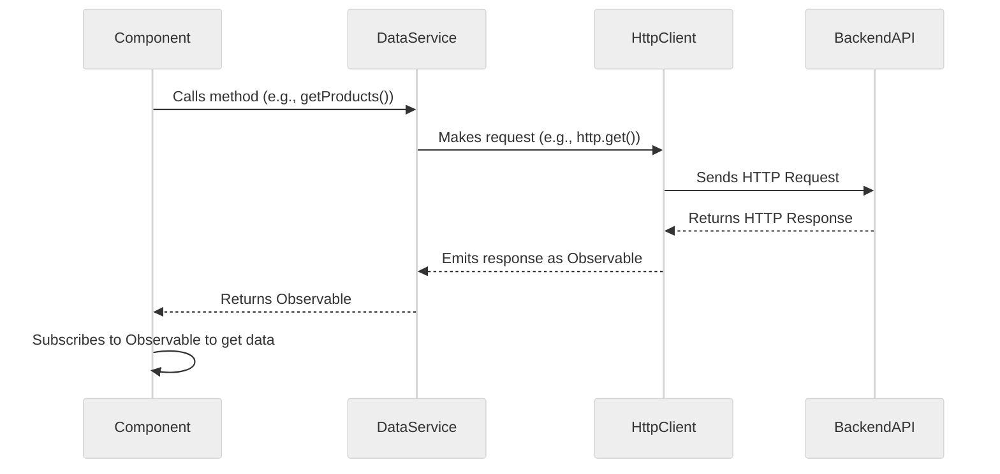
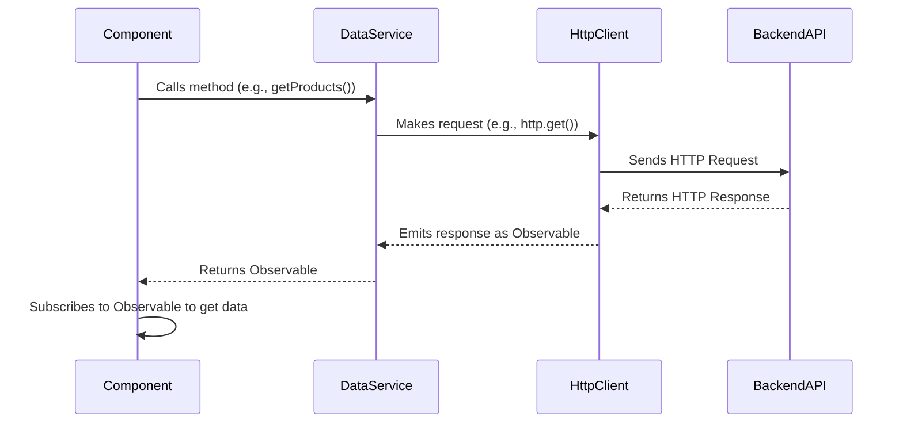

# Module 7.1: Making HTTP Requests with `HttpClient`

**Objective:** By the end of this module, you will be able to:
- **Use** Angular's `HttpClient` to make various types of HTTP requests (GET, POST, PUT, DELETE) to a backend API.
- **Understand** the role of services in managing data access and promoting separation of concerns.
- **Configure** request options such as headers and response types.

---

### The Need for HTTP Communication

Most real-world web applications are not entirely self-contained. They need to communicate with a backend server to:

*   **Fetch data:** Retrieve lists of items, user profiles, configuration settings.
*   **Send data:** Submit forms, create new resources.
*   **Update data:** Modify existing resources.
*   **Delete data:** Remove resources.

Angular provides the `HttpClient` service, a simplified client-side HTTP API built on top of the browser's `XMLHttpRequest` interface. It offers a more modern, RxJS-based approach to handling HTTP requests.

**Note on API Paradigms:** This module focuses on interacting with RESTful APIs, which are the most common type of web service. However, Angular can also integrate with other API paradigms like GraphQL or WebSockets, often requiring additional libraries.


**Alt text:** Sequence diagram illustrating the flow of an HTTP request in an Angular application: A Component calls a method on a DataService, which uses HttpClient to send a request to the BackendAPI. The BackendAPI returns a response to HttpClient, which emits it as an Observable to the DataService. The DataService then returns the Observable to the Component, which subscribes to it to receive data.

**Text Summary of HTTP Request Flow:**

A component calls a method on a `DataService` to fetch data. The `DataService` uses `HttpClient` to send an HTTP request to the `BackendAPI`. The `BackendAPI` returns an HTTP response, which `HttpClient` then emits as an `Observable`. The `DataService` returns this `Observable` to the `Component`, which subscribes to it to receive and display the data.

### Setup: Providing `HttpClient`

Before you can use `HttpClient`, you need to make it available in your application. In a standalone Angular application, you do this in your `app.config.ts` file.

```typescript
// src/app/app.config.ts
import { ApplicationConfig } from '@angular/core';
import { provideHttpClient } from '@angular/common/http';

export const appConfig: ApplicationConfig = {
  providers: [
    provideHttpClient() // Add the provider
  ]
};
```

**Note for NgModule-based applications:** In traditional Angular applications using `NgModule`s, you would import `HttpClientModule` into your `AppModule` or a feature module's `imports` array.

### Making HTTP Requests

To make HTTP requests, you inject the `HttpClient` service into your component or, more commonly, into a service dedicated to data access. This approach promotes **separation of concerns**, making your components focused on UI and your data logic centralized and reusable. It also significantly improves **testability**, as you can easily mock the data service when testing components.

#### 1. GET Requests (Fetching Data)

Used to retrieve data from a server. `GET` requests should not have side effects (i.e., they should not change data on the server).

**Example: Fetching a list of products**

```typescript
// src/app/product.service.ts
import { Injectable } from '@angular/core';
import { HttpClient } from '@angular/common/http';
import { Observable } from 'rxjs';
import { catchError, throwError } from 'rxjs/operators';

// Define an interface for your data structure (good practice)
interface Product {
  id: number;
  name: string;
  price: number;
}

@Injectable({
  providedIn: 'root'
})
export class ProductService {
  private apiUrl = 'https://api.example.com/products'; // Replace with your actual API URL

  constructor(private http: HttpClient) { }

  getProducts(): Observable<Product[]> {
    return this.http.get<Product[]>(this.apiUrl).pipe(
      catchError(error => {
        console.error('Error fetching products from service:', error); // Log the error
        return throwError(() => new Error('Something went wrong fetching products.')); // Re-throw for component to handle
      })
    );
  }

  getProductById(id: number): Observable<Product> {
    return this.http.get<Product>(`${this.apiUrl}/${id}`).pipe(
      catchError(error => {
        console.error(`Error fetching product ${id} from service:`, error);
        return throwError(() => new Error(`Product ${id} not found.`));
      })
    );
  }
}
```

**Consuming the Service in a Component:**

```typescript
// src/app/product-list/product-list.component.ts
import { Component, OnInit, OnDestroy } from '@angular/core';
import { ProductService } from '../product.service';
import { CommonModule } from '@angular/common';
import { Subject } from 'rxjs';
import { takeUntil } from 'rxjs/operators';

interface Product {
  id: number;
  name: string;
  price: number;
}

@Component({
  standalone: true,
  selector: 'app-product-list',
  imports: [CommonModule],
  template: `
    <h2>Products</h2>
    <ul>
      @for (product of products; track product.id) {
        <li>{{ product.name }} - ${{ product.price | number:'1.2-2' }}</li>
      }
    </ul>
  `
})
export class ProductListComponent implements OnInit, OnDestroy {
  products: Product[] = [];
  private destroy$ = new Subject<void>();

  constructor(private productService: ProductService) { }

  ngOnInit(): void {
    this.productService.getProducts().pipe(
      takeUntil(this.destroy$) // Automatically unsubscribe when component is destroyed
    ).subscribe({
      next: (data) => {
        this.products = data;
        console.log('Products fetched:', data);
      },
      error: (err) => console.error('Error fetching products:', err),
      complete: () => console.log('Product fetching complete.')
    });
  }

  ngOnDestroy(): void {
    this.destroy$.next();
    this.destroy$.complete();
  }
}
```

**Tip on Memory Leak Prevention:** It's crucial to unsubscribe from Observables when a component is destroyed to prevent memory leaks. The `takeUntil` operator (as shown above) is a common and clean way to achieve this. Alternatively, for displaying data directly in the template, the `async` pipe automatically handles subscription and unsubscription (see [Module 8.3: The `async` Pipe](../08-rxjs-and-state-management/8.3-async-pipe.md)).

#### 2. POST Requests (Creating Data)

Used to send data to the server to create a new resource.

**Example: Adding a new product**

```typescript
// src/app/product.service.ts (continued)

interface NewProduct {
  name: string;
  price: number;
}

// ... inside ProductService
addProduct(product: NewProduct): Observable<Product> {
  return this.http.post<Product>(this.apiUrl, product);
}
```

**Consuming in a Component:**

```typescript
// src/app/product-add/product-add.component.ts
import { Component } from '@angular/core';
import { ProductService } from '../product.service';
import { FormsModule } from '@angular/forms';

@Component({
  standalone: true,
  selector: 'app-product-add',
  imports: [FormsModule],
  template: `
    <h2>Add New Product</h2>
    <input type="text" [(ngModel)]="newProductName" placeholder="Product Name">
    <input type="number" [(ngModel)]="newProductPrice" placeholder="Price">
    <button (click)="onAddProduct()">Add Product</button>
  `
})
export class ProductAddComponent {
  newProductName: string = '';
  newProductPrice: number = 0;

  constructor(private productService: ProductService) { }

  onAddProduct(): void {
    const newProduct = { name: this.newProductName, price: this.newProductPrice };
    this.productService.addProduct(newProduct).subscribe({
      next: (product) => {
        console.log('Product added:', product);
        this.newProductName = ''; // Clear form
        this.newProductPrice = 0;
      },
      error: (err) => {
        console.error('Error adding product:', err);
        // Handle server-side validation errors (e.g., display specific messages to user)
        if (err.status === 400 && err.error && err.error.message) {
          alert(`Validation Error: ${err.error.message}`);
        } else {
          alert('Failed to add product. Please try again.');
        }
      }
    });
  }
}
```

#### 3. PUT Requests (Updating Data)

Used to send data to the server to update an existing resource. Typically, the entire resource is sent.

**Example: Updating an existing product**

```typescript
// src/app/product.service.ts (continued)

// ... inside ProductService
updateProduct(product: Product): Observable<Product> {
  return this.http.put<Product>(`${this.apiUrl}/${product.id}`, product);
}
```

**Note on PATCH vs. PUT:**

*   **PUT:** Used to update an entire resource. The request body should contain the complete, updated resource.
*   **PATCH:** Used to apply partial modifications to a resource. The request body should contain only the changes to be applied. `HttpClient` also supports `patch()` method.

#### 4. DELETE Requests (Deleting Data)

Used to remove a resource from the server.

**Example: Deleting a product**

```typescript
// src/app/product.service.ts (continued)

// ... inside ProductService
deleteProduct(id: number): Observable<void> {
  return this.http.delete<void>(`${this.apiUrl}/${id}`);
}
```

### Handling Headers and Options

You can pass an optional `options` object to `HttpClient` methods to configure headers, observe response types, or report progress.

```typescript
import { HttpHeaders } from '@angular/common/http';

// ... inside ProductService
getProductsWithHeaders(): Observable<Product[]> {
  const headers = new HttpHeaders({
    'Authorization': 'Bearer my-auth-token',
    'Content-Type': 'application/json'
  });
  return this.http.get<Product[]>(this.apiUrl, { headers: headers });
}

// Observing the full HTTP response (not just the body)
addProductFullResponse(product: NewProduct): Observable<HttpResponse<Product>> {
  return this.http.post<Product>(this.apiUrl, product, { observe: 'response' });
}
```

**Security Tip:** Never log sensitive information (like authentication tokens or API keys) directly to the console or store them in insecure locations. Use HTTP Interceptors (Module 7.3) to add authentication headers, as they provide a centralized and more secure way to manage tokens.

`HttpClient` provides a robust and flexible way to interact with backend services. By using it within dedicated services, you maintain a clean separation of concerns, making your components focused on UI and your data logic centralized and reusable.

**Tip on Testing HttpClient Services:** When unit testing services that use `HttpClient`, you should mock the HTTP backend using `HttpClientTestingModule` and `HttpTestingController`. This allows you to simulate API responses without making actual network requests. (See [Module 13.3: Unit Testing Services and Pipes](../13-testing/13.3-unit-testing-services-pipes.md) for more details).

---

### Key Takeaways

*   **`HttpClient`** is Angular's service for making HTTP requests to backend APIs.
*   It supports all common HTTP methods: GET, POST, PUT, PATCH, and DELETE.
*   All `HttpClient` methods return **RxJS `Observable`s**, which are powerful for handling asynchronous data streams.
*   HTTP requests should typically be encapsulated within **services** to promote separation of concerns and reusability.
*   You can configure **headers and options** for fine-grained control over requests.
*   Properly **unsubscribing** from HTTP observables is crucial to prevent memory leaks.

---

**Previous:** [6.5 Template-Driven Forms](../06-angular-forms/6.5-template-driven-forms.md)

**Next:** [7.2 Handling Responses and Errors](./7.2-handling-responses-errors.md)


**Objective:** By the end of this module, you will be able to use Angular's `HttpClient` to make various types of HTTP requests (GET, POST, PUT, DELETE) to a backend API, and understand the role of services in managing data access.

---

### The Need for HTTP Communication

Most real-world web applications are not entirely self-contained. They need to communicate with a backend server to:

*   **Fetch data:** Retrieve lists of items, user profiles, configuration settings.
*   **Send data:** Submit forms, create new resources.
*   **Update data:** Modify existing resources.
*   **Delete data:** Remove resources.

Angular provides the `HttpClient` service, a simplified client-side HTTP API built on top of the browser's `XMLHttpRequest` interface. It offers a more modern, RxJS-based approach to handling HTTP requests.

**RESTful APIs and Alternatives:** This module focuses on interacting with RESTful APIs, which are the most common type of web service. However, Angular can also integrate with other API paradigms like GraphQL or WebSockets, often requiring additional libraries.



### Setup: Providing `HttpClient`

Before you can use `HttpClient`, you need to make it available in your application. In a standalone Angular application, you do this in your `app.config.ts` file.

```typescript
// src/app/app.config.ts
import { ApplicationConfig } from '@angular/core';
import { provideHttpClient } from '@angular/common/http'; // 1. Import

export const appConfig: ApplicationConfig = {
  providers: [
    provideHttpClient() // 2. Add the provider
  ]
};
```

**Note for NgModule-based applications:** In traditional Angular applications using `NgModule`s, you would import `HttpClientModule` into your `AppModule` or a feature module's `imports` array.

### Making HTTP Requests

To make HTTP requests, you inject the `HttpClient` service into your component or, more commonly, into a service dedicated to data access. This approach promotes **separation of concerns**, making your components focused on UI and your data logic centralized and reusable. It also significantly improves **testability**, as you can easily mock the data service when testing components.

#### 1. GET Requests (Fetching Data)

Used to retrieve data from a server. `GET` requests should not have side effects (i.e., they should not change data on the server).

**Example: Fetching a list of products**

```typescript
// src/app/product.service.ts
import { Injectable } from '@angular/core';
import { HttpClient } from '@angular/common/http';
import { Observable } from 'rxjs';
import { catchError, throwError } from 'rxjs/operators'; // Import RxJS operators

// Define an interface for your data structure (good practice)
interface Product {
  id: number;
  name: string;
  price: number;
}

@Injectable({
  providedIn: 'root'
})
export class ProductService {
  private apiUrl = 'https://api.example.com/products'; // Replace with your actual API URL

  constructor(private http: HttpClient) { }

  getProducts(): Observable<Product[]> {
    return this.http.get<Product[]>(this.apiUrl).pipe(
      catchError(error => {
        console.error('Error fetching products from service:', error); // Log the error
        return throwError(() => new Error('Something went wrong fetching products.')); // Re-throw for component to handle
      })
    );
  }

  getProductById(id: number): Observable<Product> {
    return this.http.get<Product>(`${this.apiUrl}/${id}`).pipe(
      catchError(error => {
        console.error(`Error fetching product ${id} from service:`, error);
        return throwError(() => new Error(`Product ${id} not found.`));
      })
    );
  }
}
```

**Consuming the Service in a Component:**

```typescript
// src/app/product-list/product-list.component.ts
import { Component, OnInit, OnDestroy } from '@angular/core'; // Import OnDestroy
import { ProductService } from '../product.service';
import { CommonModule } from '@angular/common'; // For *ngFor
import { Subject } from 'rxjs'; // Import Subject
import { takeUntil } from 'rxjs/operators'; // Import takeUntil

interface Product {
  id: number;
  name: string;
  price: number;
}

@Component({
  standalone: true,
  selector: 'app-product-list',
  imports: [CommonModule],
  template: `
    <h2>Products</h2>
    <ul>
      @for (product of products; track product.id) {
        <li>{{ product.name }} - ${{ product.price | number:'1.2-2' }}</li>
      }
    </ul>
  `
})
export class ProductListComponent implements OnInit, OnDestroy {
  products: Product[] = [];
  private destroy$ = new Subject<void>(); // Subject to signal completion

  constructor(private productService: ProductService) { }

  ngOnInit(): void {
    this.productService.getProducts().pipe(
      takeUntil(this.destroy$) // Automatically unsubscribe when component is destroyed
    ).subscribe({
      next: (data) => {
        this.products = data;
        console.log('Products fetched:', data);
      },
      error: (err) => console.error('Error fetching products:', err),
      complete: () => console.log('Product fetching complete.')
    });
  }

  ngOnDestroy(): void {
    this.destroy$.next(); // Emit a value to complete the observable
    this.destroy$.complete(); // Complete the Subject
  }
}
```

**Memory Leak Prevention:** It's crucial to unsubscribe from Observables when a component is destroyed to prevent memory leaks. The `takeUntil` operator (as shown above) is a common and clean way to achieve this. Alternatively, for displaying data directly in the template, the `async` pipe automatically handles subscription and unsubscription (see [Module 8.3: The `async` Pipe](./8.3-async-pipe.md)).

#### 2. POST Requests (Creating Data)

Used to send data to the server to create a new resource.

**Example: Adding a new product**

```typescript
// src/app/product.service.ts (continued)

interface NewProduct {
  name: string;
  price: number;
}

// ... inside ProductService
addProduct(product: NewProduct): Observable<Product> {
  return this.http.post<Product>(this.apiUrl, product);
}
```

**Consuming in a Component:**

```typescript
// src/app/product-add/product-add.component.ts
import { Component } from '@angular/core';
import { ProductService } from '../product.service';
import { FormsModule } from '@angular/forms'; // For ngModel

@Component({
  standalone: true,
  selector: 'app-product-add',
  imports: [FormsModule],
  template: `
    <h2>Add New Product</h2>
    <input type="text" [(ngModel)]="newProductName" placeholder="Product Name">
    <input type="number" [(ngModel)]="newProductPrice" placeholder="Price">
    <button (click)="onAddProduct()">Add Product</button>
  `
})
export class ProductAddComponent {
  newProductName: string = '';
  newProductPrice: number = 0;

  constructor(private productService: ProductService) { }

  onAddProduct(): void {
    const newProduct = { name: this.newProductName, price: this.newProductPrice };
    this.productService.addProduct(newProduct).subscribe({
      next: (product) => {
        console.log('Product added:', product);
        this.newProductName = ''; // Clear form
        this.newProductPrice = 0;
      },
      error: (err) => {
        console.error('Error adding product:', err);
        // Handle server-side validation errors (e.g., display specific messages to user)
        if (err.status === 400 && err.error && err.error.message) {
          alert(`Validation Error: ${err.error.message}`);
        } else {
          alert('Failed to add product. Please try again.');
        }
      }
    });
  }
}
```

#### 3. PUT Requests (Updating Data)

Used to send data to the server to update an existing resource. Typically, the entire resource is sent.

**Example: Updating an existing product**

```typescript
// src/app/product.service.ts (continued)

// ... inside ProductService
updateProduct(product: Product): Observable<Product> {
  return this.http.put<Product>(`${this.apiUrl}/${product.id}`, product);
}
```

**Note on PATCH vs. PUT:**

*   **PUT:** Used to update an entire resource. The request body should contain the complete, updated resource.
*   **PATCH:** Used to apply partial modifications to a resource. The request body should contain only the changes to be applied. `HttpClient` also supports `patch()` method.

#### 4. DELETE Requests (Deleting Data)

Used to remove a resource from the server.

**Example: Deleting a product**

```typescript
// src/app/product.service.ts (continued)

// ... inside ProductService
deleteProduct(id: number): Observable<void> {
  return this.http.delete<void>(`${this.apiUrl}/${id}`);
}
```

### Handling Headers and Options

You can pass an optional `options` object to `HttpClient` methods to configure headers, observe response types, or report progress.

```typescript
import { HttpHeaders } from '@angular/common/http';

// ... inside ProductService
getProductsWithHeaders(): Observable<Product[]> {
  const headers = new HttpHeaders({
    'Authorization': 'Bearer my-auth-token',
    'Content-Type': 'application/json'
  });
  return this.http.get<Product[]>(this.apiUrl, { headers: headers });
}

// Observing the full HTTP response (not just the body)
addProductFullResponse(product: NewProduct): Observable<HttpResponse<Product>> {
  return this.http.post<Product>(this.apiUrl, product, { observe: 'response' });
}
```

**Security Tip:** Never log sensitive information (like authentication tokens or API keys) directly to the console or store them in insecure locations. Use HTTP Interceptors (Module 7.3) to add authentication headers, as they provide a centralized and more secure way to manage tokens.

`HttpClient` provides a robust and flexible way to interact with backend services. By using it within dedicated services, you maintain a clean separation of concerns, making your components focused on UI and your data logic centralized and reusable.

**Testing HttpClient Services:** When unit testing services that use `HttpClient`, you should mock the HTTP backend using `HttpClientTestingModule` and `HttpTestingController`. This allows you to simulate API responses without making actual network requests. (See [Module 13.3: Unit Testing Services and Pipes](../13-testing/13.3-unit-testing-services-pipes.md) for more details).

---

### Key Takeaways

*   **`HttpClient`** is Angular's service for making HTTP requests to backend APIs.
*   It supports all common HTTP methods: GET, POST, PUT, PATCH, and DELETE.
*   All `HttpClient` methods return **RxJS `Observable`s**, which are powerful for handling asynchronous data streams.
*   HTTP requests should typically be encapsulated within **services** to promote separation of concerns and reusability.
*   You can configure **headers and options** for fine-grained control over requests.
*   Properly **unsubscribing** from HTTP observables is crucial to prevent memory leaks.

---

**Previous:** [6.5 Template-Driven Forms](../06-angular-forms/6.5-template-driven-forms.md)

**Next:** [7.2 Handling Responses and Errors](./7.2-handling-responses-errors.md)
