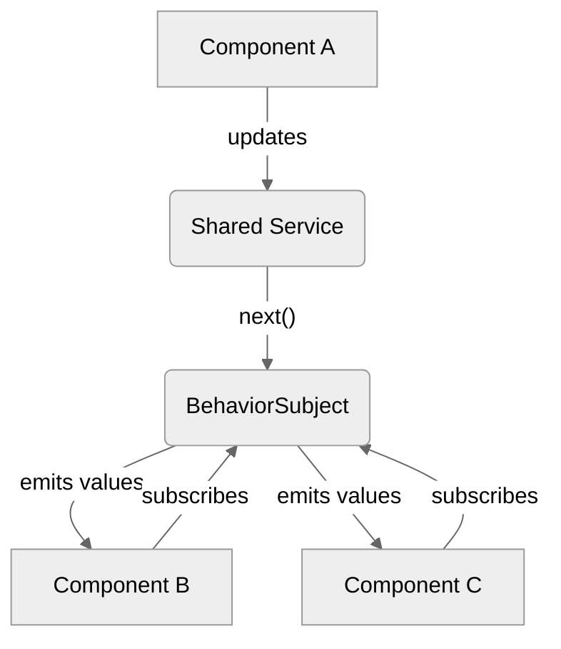

# Module 8.4: Simple State Management with `BehaviorSubject`

**Objective:** To learn how to implement basic, reactive state management in Angular applications using RxJS `BehaviorSubject` for sharing data between components.

---

### The Challenge of State Management

As applications grow, managing shared data (or "state") across multiple components becomes complex. Consider these scenarios:

*   A user logs in, and multiple components (e.g., header, sidebar, profile page) need to know the user's authentication status and details.
*   A shopping cart component updates, and a mini-cart icon in the header needs to reflect the new item count.
*   A filter is applied in one component, and a list in another component needs to update accordingly.

Passing data down through `@Input()` properties and emitting events up through `@Output()` can become cumbersome and lead to "prop drilling" (passing props through many layers) or complex event chains.

### The Solution: Centralized State with `BehaviorSubject`

For simple to medium complexity state management, RxJS `BehaviorSubject` is an excellent tool. It allows you to:

1.  **Store a current value:** It always holds a value.
2.  **Emit new values:** You can push new values to it.
3.  **Act as an Observable:** Components can subscribe to it to receive the current value and all subsequent values.

This makes `BehaviorSubject` ideal for creating a centralized data store within a service, which components can then interact with.


**Alt text:** Diagram illustrating simple state management with BehaviorSubject. Component A updates a Shared Service, which uses next() to emit new values to a BehaviorSubject. The BehaviorSubject then emits these values to Component B and Component C, which are subscribed to it.

--- 

### Implementing a Shared State Service

Let's create a `ShoppingCartService` that manages the number of items in a user's cart.

#### 1. Create the Service

```typescript
// src/app/shopping-cart.service.ts
import { Injectable } from '@angular/core';
import { BehaviorSubject, Observable } from 'rxjs';

@Injectable({
  providedIn: 'root'
})
export class ShoppingCartService {
  // 1. Create a BehaviorSubject to hold the current cart item count
  // It needs an initial value (e.g., 0)
  private _cartItemCount = new BehaviorSubject<number>(0);

  // 2. Expose it as an Observable (conventionally with a $ suffix)
  // Components will subscribe to this Observable
  cartItemCount$: Observable<number> = this._cartItemCount.asObservable();

  constructor() { }

  // 3. Method to update the state
  addItem(): void {
    const currentCount = this._cartItemCount.getValue(); // Get current value
    this._cartItemCount.next(currentCount + 1); // Emit new value
  }

  removeItem(): void {
    const currentCount = this._cartItemCount.getValue();
    if (currentCount > 0) {
      this._cartItemCount.next(currentCount - 1);
    }
  }

  // Method to get the current value synchronously (use sparingly)
  getCurrentItemCount(): number {
    return this._cartItemCount.getValue();
  }
}
```

**Explanation:**

*   `_cartItemCount = new BehaviorSubject<number>(0);`: We create a private `BehaviorSubject` instance. The `<number>` specifies the type of data it will hold, and `0` is its initial value.
*   `cartItemCount$: Observable<number> = this._cartItemCount.asObservable();`: We expose the `BehaviorSubject` as a public `Observable`. This is a best practice to prevent components from directly calling `next()` on the `BehaviorSubject`, ensuring that state changes are controlled by the service's methods.
*   `addItem()` and `removeItem()`: These methods are the only way to modify the `_cartItemCount`. They use `getValue()` to read the current state and `next()` to push a new state.

#### 2. Consuming the State in Components

Components can inject the `ShoppingCartService` and subscribe to `cartItemCount$` to react to state changes.

**Example: Header Component (displays cart count)**

```typescript
// src/app/header/header.component.ts
import { Component } from '@angular/core';
import { ShoppingCartService } from '../shopping-cart.service';
import { Observable } from 'rxjs';
import { CommonModule } from '@angular/common'; // For async pipe

@Component({
  standalone: true,
  selector: 'app-header',
  imports: [CommonModule],
  template: `
    <header>
      <h1>My App</h1>
      <nav>
        <span>Cart Items: {{ cartItemCount$ | async }}</span>
      </nav>
    </header>
  `
})
export class HeaderComponent {
  cartItemCount$: Observable<number>;

  constructor(private cartService: ShoppingCartService) {
    this.cartItemCount$ = this.cartService.cartItemCount$;
  }
}
```

**Example: Product Component (adds items to cart)**

```typescript
// src/app/product/product.component.ts
import { Component } from '@angular/core';
import { ShoppingCartService } from '../shopping-cart.service';

@Component({
  standalone: true,
  selector: 'app-product',
  template: `
    <div>
      <h3>Awesome Gadget</h3>
      <p>Price: $19.99</p>
      <button (click)="addToCart()">Add to Cart</button>
    </div>
  `
})
export class ProductComponent {
  constructor(private cartService: ShoppingCartService) { }

  addToCart(): void {
    this.cartService.addItem();
    console.log('Item added. Current count:', this.cartService.getCurrentItemCount());
  }
}
```

### When to Use `BehaviorSubject` for State Management

*   **Simple Global State:** When you have a few pieces of application-wide state that need to be shared and updated reactively.
*   **Parent-Child Communication (alternative to `@Input`/`@Output`):** For deeply nested components where prop drilling becomes cumbersome.
*   **Sibling Component Communication:** When components that don't have a direct parent-child relationship need to communicate.

### Limitations of `BehaviorSubject` for Complex State

While powerful for simple cases, `BehaviorSubject` can become difficult to manage for very complex state, especially when:

*   State involves multiple, interconnected pieces.
*   State changes are triggered by many different actions.
*   You need to track state history (time-travel debugging).
*   You need to manage side effects (e.g., API calls) that result from state changes.

For such scenarios, dedicated state management libraries like **NgRx** (based on Redux principles) or **NGXS** are more appropriate. These libraries provide a more structured and opinionated way to manage complex application state, which we will briefly touch upon in the next section.

However, for many common use cases, `BehaviorSubject` provides a lightweight, effective, and reactive solution for state management in Angular.

---

### Hands-on Exercise: Create a Theme Toggler

1.  **Create a `ThemeService`** using the CLI.
2.  **Inside the service,** create a private `BehaviorSubject` called `_isDarkMode` initialized to `false`.
3.  **Expose a public observable** `isDarkMode# Module 8.4: Simple State Management with `BehaviorSubject`

**Objective:** To learn how to implement basic, reactive state management in Angular applications using RxJS `BehaviorSubject` for sharing data between components.

---

### The Challenge of State Management

As applications grow, managing shared data (or "state") across multiple components becomes complex. Consider these scenarios:

*   A user logs in, and multiple components (e.g., header, sidebar, profile page) need to know the user's authentication status and details.
*   A shopping cart component updates, and a mini-cart icon in the header needs to reflect the new item count.
*   A filter is applied in one component, and a list in another component needs to update accordingly.

Passing data down through `@Input()` properties and emitting events up through `@Output()` can become cumbersome and lead to "prop drilling" (passing props through many layers) or complex event chains.

### The Solution: Centralized State with `BehaviorSubject`

For simple to medium complexity state management, RxJS `BehaviorSubject` is an excellent tool. It allows you to:

1.  **Store a current value:** It always holds a value.
2.  **Emit new values:** You can push new values to it.
3.  **Act as an Observable:** Components can subscribe to it to receive the current value and all subsequent values.

This makes `BehaviorSubject` ideal for creating a centralized data store within a service, which components can then interact with.


**Alt text:** Diagram illustrating simple state management with BehaviorSubject. Component A updates a Shared Service, which uses next() to emit new values to a BehaviorSubject. The BehaviorSubject then emits these values to Component B and Component C, which are subscribed to it.

--- 

### Implementing a Shared State Service

Let's create a `ShoppingCartService` that manages the number of items in a user's cart.

#### 1. Create the Service

```typescript
// src/app/shopping-cart.service.ts
import { Injectable } from '@angular/core';
import { BehaviorSubject, Observable } from 'rxjs';

@Injectable({
  providedIn: 'root'
})
export class ShoppingCartService {
  // 1. Create a BehaviorSubject to hold the current cart item count
  // It needs an initial value (e.g., 0)
  private _cartItemCount = new BehaviorSubject<number>(0);

  // 2. Expose it as an Observable (conventionally with a $ suffix)
  // Components will subscribe to this Observable
  cartItemCount$: Observable<number> = this._cartItemCount.asObservable();

  constructor() { }

  // 3. Method to update the state
  addItem(): void {
    const currentCount = this._cartItemCount.getValue(); // Get current value
    this._cartItemCount.next(currentCount + 1); // Emit new value
  }

  removeItem(): void {
    const currentCount = this._cartItemCount.getValue();
    if (currentCount > 0) {
      this._cartItemCount.next(currentCount - 1);
    }
  }

  // Method to get the current value synchronously (use sparingly)
  getCurrentItemCount(): number {
    return this._cartItemCount.getValue();
  }
}
```

**Explanation:**

*   `_cartItemCount = new BehaviorSubject<number>(0);`: We create a private `BehaviorSubject` instance. The `<number>` specifies the type of data it will hold, and `0` is its initial value.
*   `cartItemCount$: Observable<number> = this._cartItemCount.asObservable();`: We expose the `BehaviorSubject` as a public `Observable`. This is a best practice to prevent components from directly calling `next()` on the `BehaviorSubject`, ensuring that state changes are controlled by the service's methods.
*   `addItem()` and `removeItem()`: These methods are the only way to modify the `_cartItemCount`. They use `getValue()` to read the current state and `next()` to push a new state.

#### 2. Consuming the State in Components

Components can inject the `ShoppingCartService` and subscribe to `cartItemCount$` to react to state changes.

**Example: Header Component (displays cart count)**

```typescript
// src/app/header/header.component.ts
import { Component } from '@angular/core';
import { ShoppingCartService } from '../shopping-cart.service';
import { Observable } from 'rxjs';
import { CommonModule } from '@angular/common'; // For async pipe

@Component({
  standalone: true,
  selector: 'app-header',
  imports: [CommonModule],
  template: `
    <header>
      <h1>My App</h1>
      <nav>
        <span>Cart Items: {{ cartItemCount$ | async }}</span>
      </nav>
    </header>
  `
})
export class HeaderComponent {
  cartItemCount$: Observable<number>;

  constructor(private cartService: ShoppingCartService) {
    this.cartItemCount$ = this.cartService.cartItemCount$;
  }
}
```

**Example: Product Component (adds items to cart)**

```typescript
// src/app/product/product.component.ts
import { Component } from '@angular/core';
import { ShoppingCartService } from '../shopping-cart.service';

@Component({
  standalone: true,
  selector: 'app-product',
  template: `
    <div>
      <h3>Awesome Gadget</h3>
      <p>Price: $19.99</p>
      <button (click)="addToCart()">Add to Cart</button>
    </div>
  `
})
export class ProductComponent {
  constructor(private cartService: ShoppingCartService) { }

  addToCart(): void {
    this.cartService.addItem();
    console.log('Item added. Current count:', this.cartService.getCurrentItemCount());
  }
}
```

### When to Use `BehaviorSubject` for State Management

*   **Simple Global State:** When you have a few pieces of application-wide state that need to be shared and updated reactively.
*   **Parent-Child Communication (alternative to `@Input`/`@Output`):** For deeply nested components where prop drilling becomes cumbersome.
*   **Sibling Component Communication:** When components that don't have a direct parent-child relationship need to communicate.

### Limitations of `BehaviorSubject` for Complex State

While powerful for simple cases, `BehaviorSubject` can become difficult to manage for very complex state, especially when:

*   State involves multiple, interconnected pieces.
*   State changes are triggered by many different actions.
*   You need to track state history (time-travel debugging).
*   You need to manage side effects (e.g., API calls) that result from state changes.

For such scenarios, dedicated state management libraries like **NgRx** (based on Redux principles) or **NGXS** are more appropriate. These libraries provide a more structured and opinionated way to manage complex application state, which we will briefly touch upon in the next section.

 from the `BehaviorSubject`.
4.  **Create a `toggleTheme()` method** in the service that gets the current value of the `BehaviorSubject` and emits the opposite value using `next()`.
5.  **Create a `ThemeToggleButtonComponent`**.
    *   Inject the `ThemeService`.
    *   Create a button in the template that, when clicked, calls the `toggleTheme()` method on the service.
6.  **In your `AppComponent`:**
    *   Inject the `ThemeService`.
    *   Use the `async` pipe to subscribe to the `isDarkMode# Module 8.4: Simple State Management with `BehaviorSubject`

**Objective:** To learn how to implement basic, reactive state management in Angular applications using RxJS `BehaviorSubject` for sharing data between components.

---

### The Challenge of State Management

As applications grow, managing shared data (or "state") across multiple components becomes complex. Consider these scenarios:

*   A user logs in, and multiple components (e.g., header, sidebar, profile page) need to know the user's authentication status and details.
*   A shopping cart component updates, and a mini-cart icon in the header needs to reflect the new item count.
*   A filter is applied in one component, and a list in another component needs to update accordingly.

Passing data down through `@Input()` properties and emitting events up through `@Output()` can become cumbersome and lead to "prop drilling" (passing props through many layers) or complex event chains.

### The Solution: Centralized State with `BehaviorSubject`

For simple to medium complexity state management, RxJS `BehaviorSubject` is an excellent tool. It allows you to:

1.  **Store a current value:** It always holds a value.
2.  **Emit new values:** You can push new values to it.
3.  **Act as an Observable:** Components can subscribe to it to receive the current value and all subsequent values.

This makes `BehaviorSubject` ideal for creating a centralized data store within a service, which components can then interact with.


**Alt text:** Diagram illustrating simple state management with BehaviorSubject. Component A updates a Shared Service, which uses next() to emit new values to a BehaviorSubject. The BehaviorSubject then emits these values to Component B and Component C, which are subscribed to it.

--- 

### Implementing a Shared State Service

Let's create a `ShoppingCartService` that manages the number of items in a user's cart.

#### 1. Create the Service

```typescript
// src/app/shopping-cart.service.ts
import { Injectable } from '@angular/core';
import { BehaviorSubject, Observable } from 'rxjs';

@Injectable({
  providedIn: 'root'
})
export class ShoppingCartService {
  // 1. Create a BehaviorSubject to hold the current cart item count
  // It needs an initial value (e.g., 0)
  private _cartItemCount = new BehaviorSubject<number>(0);

  // 2. Expose it as an Observable (conventionally with a $ suffix)
  // Components will subscribe to this Observable
  cartItemCount$: Observable<number> = this._cartItemCount.asObservable();

  constructor() { }

  // 3. Method to update the state
  addItem(): void {
    const currentCount = this._cartItemCount.getValue(); // Get current value
    this._cartItemCount.next(currentCount + 1); // Emit new value
  }

  removeItem(): void {
    const currentCount = this._cartItemCount.getValue();
    if (currentCount > 0) {
      this._cartItemCount.next(currentCount - 1);
    }
  }

  // Method to get the current value synchronously (use sparingly)
  getCurrentItemCount(): number {
    return this._cartItemCount.getValue();
  }
}
```

**Explanation:**

*   `_cartItemCount = new BehaviorSubject<number>(0);`: We create a private `BehaviorSubject` instance. The `<number>` specifies the type of data it will hold, and `0` is its initial value.
*   `cartItemCount$: Observable<number> = this._cartItemCount.asObservable();`: We expose the `BehaviorSubject` as a public `Observable`. This is a best practice to prevent components from directly calling `next()` on the `BehaviorSubject`, ensuring that state changes are controlled by the service's methods.
*   `addItem()` and `removeItem()`: These methods are the only way to modify the `_cartItemCount`. They use `getValue()` to read the current state and `next()` to push a new state.

#### 2. Consuming the State in Components

Components can inject the `ShoppingCartService` and subscribe to `cartItemCount$` to react to state changes.

**Example: Header Component (displays cart count)**

```typescript
// src/app/header/header.component.ts
import { Component } from '@angular/core';
import { ShoppingCartService } from '../shopping-cart.service';
import { Observable } from 'rxjs';
import { CommonModule } from '@angular/common'; // For async pipe

@Component({
  standalone: true,
  selector: 'app-header',
  imports: [CommonModule],
  template: `
    <header>
      <h1>My App</h1>
      <nav>
        <span>Cart Items: {{ cartItemCount$ | async }}</span>
      </nav>
    </header>
  `
})
export class HeaderComponent {
  cartItemCount$: Observable<number>;

  constructor(private cartService: ShoppingCartService) {
    this.cartItemCount$ = this.cartService.cartItemCount$;
  }
}
```

**Example: Product Component (adds items to cart)**

```typescript
// src/app/product/product.component.ts
import { Component } from '@angular/core';
import { ShoppingCartService } from '../shopping-cart.service';

@Component({
  standalone: true,
  selector: 'app-product',
  template: `
    <div>
      <h3>Awesome Gadget</h3>
      <p>Price: $19.99</p>
      <button (click)="addToCart()">Add to Cart</button>
    </div>
  `
})
export class ProductComponent {
  constructor(private cartService: ShoppingCartService) { }

  addToCart(): void {
    this.cartService.addItem();
    console.log('Item added. Current count:', this.cartService.getCurrentItemCount());
  }
}
```

### When to Use `BehaviorSubject` for State Management

*   **Simple Global State:** When you have a few pieces of application-wide state that need to be shared and updated reactively.
*   **Parent-Child Communication (alternative to `@Input`/`@Output`):** For deeply nested components where prop drilling becomes cumbersome.
*   **Sibling Component Communication:** When components that don't have a direct parent-child relationship need to communicate.

### Limitations of `BehaviorSubject` for Complex State

While powerful for simple cases, `BehaviorSubject` can become difficult to manage for very complex state, especially when:

*   State involves multiple, interconnected pieces.
*   State changes are triggered by many different actions.
*   You need to track state history (time-travel debugging).
*   You need to manage side effects (e.g., API calls) that result from state changes.

For such scenarios, dedicated state management libraries like **NgRx** (based on Redux principles) or **NGXS** are more appropriate. These libraries provide a more structured and opinionated way to manage complex application state, which we will briefly touch upon in the next section.

 observable.
    *   Use `[ngClass]` on a main container element to apply a `dark-theme` class when `isDarkMode# Module 8.4: Simple State Management with `BehaviorSubject`

**Objective:** To learn how to implement basic, reactive state management in Angular applications using RxJS `BehaviorSubject` for sharing data between components.

---

### The Challenge of State Management

As applications grow, managing shared data (or "state") across multiple components becomes complex. Consider these scenarios:

*   A user logs in, and multiple components (e.g., header, sidebar, profile page) need to know the user's authentication status and details.
*   A shopping cart component updates, and a mini-cart icon in the header needs to reflect the new item count.
*   A filter is applied in one component, and a list in another component needs to update accordingly.

Passing data down through `@Input()` properties and emitting events up through `@Output()` can become cumbersome and lead to "prop drilling" (passing props through many layers) or complex event chains.

### The Solution: Centralized State with `BehaviorSubject`

For simple to medium complexity state management, RxJS `BehaviorSubject` is an excellent tool. It allows you to:

1.  **Store a current value:** It always holds a value.
2.  **Emit new values:** You can push new values to it.
3.  **Act as an Observable:** Components can subscribe to it to receive the current value and all subsequent values.

This makes `BehaviorSubject` ideal for creating a centralized data store within a service, which components can then interact with.


**Alt text:** Diagram illustrating simple state management with BehaviorSubject. Component A updates a Shared Service, which uses next() to emit new values to a BehaviorSubject. The BehaviorSubject then emits these values to Component B and Component C, which are subscribed to it.

--- 

### Implementing a Shared State Service

Let's create a `ShoppingCartService` that manages the number of items in a user's cart.

#### 1. Create the Service

```typescript
// src/app/shopping-cart.service.ts
import { Injectable } from '@angular/core';
import { BehaviorSubject, Observable } from 'rxjs';

@Injectable({
  providedIn: 'root'
})
export class ShoppingCartService {
  // 1. Create a BehaviorSubject to hold the current cart item count
  // It needs an initial value (e.g., 0)
  private _cartItemCount = new BehaviorSubject<number>(0);

  // 2. Expose it as an Observable (conventionally with a $ suffix)
  // Components will subscribe to this Observable
  cartItemCount$: Observable<number> = this._cartItemCount.asObservable();

  constructor() { }

  // 3. Method to update the state
  addItem(): void {
    const currentCount = this._cartItemCount.getValue(); // Get current value
    this._cartItemCount.next(currentCount + 1); // Emit new value
  }

  removeItem(): void {
    const currentCount = this._cartItemCount.getValue();
    if (currentCount > 0) {
      this._cartItemCount.next(currentCount - 1);
    }
  }

  // Method to get the current value synchronously (use sparingly)
  getCurrentItemCount(): number {
    return this._cartItemCount.getValue();
  }
}
```

**Explanation:**

*   `_cartItemCount = new BehaviorSubject<number>(0);`: We create a private `BehaviorSubject` instance. The `<number>` specifies the type of data it will hold, and `0` is its initial value.
*   `cartItemCount$: Observable<number> = this._cartItemCount.asObservable();`: We expose the `BehaviorSubject` as a public `Observable`. This is a best practice to prevent components from directly calling `next()` on the `BehaviorSubject`, ensuring that state changes are controlled by the service's methods.
*   `addItem()` and `removeItem()`: These methods are the only way to modify the `_cartItemCount`. They use `getValue()` to read the current state and `next()` to push a new state.

#### 2. Consuming the State in Components

Components can inject the `ShoppingCartService` and subscribe to `cartItemCount$` to react to state changes.

**Example: Header Component (displays cart count)**

```typescript
// src/app/header/header.component.ts
import { Component } from '@angular/core';
import { ShoppingCartService } from '../shopping-cart.service';
import { Observable } from 'rxjs';
import { CommonModule } from '@angular/common'; // For async pipe

@Component({
  standalone: true,
  selector: 'app-header',
  imports: [CommonModule],
  template: `
    <header>
      <h1>My App</h1>
      <nav>
        <span>Cart Items: {{ cartItemCount$ | async }}</span>
      </nav>
    </header>
  `
})
export class HeaderComponent {
  cartItemCount$: Observable<number>;

  constructor(private cartService: ShoppingCartService) {
    this.cartItemCount$ = this.cartService.cartItemCount$;
  }
}
```

**Example: Product Component (adds items to cart)**

```typescript
// src/app/product/product.component.ts
import { Component } from '@angular/core';
import { ShoppingCartService } from '../shopping-cart.service';

@Component({
  standalone: true,
  selector: 'app-product',
  template: `
    <div>
      <h3>Awesome Gadget</h3>
      <p>Price: $19.99</p>
      <button (click)="addToCart()">Add to Cart</button>
    </div>
  `
})
export class ProductComponent {
  constructor(private cartService: ShoppingCartService) { }

  addToCart(): void {
    this.cartService.addItem();
    console.log('Item added. Current count:', this.cartService.getCurrentItemCount());
  }
}
```

### When to Use `BehaviorSubject` for State Management

*   **Simple Global State:** When you have a few pieces of application-wide state that need to be shared and updated reactively.
*   **Parent-Child Communication (alternative to `@Input`/`@Output`):** For deeply nested components where prop drilling becomes cumbersome.
*   **Sibling Component Communication:** When components that don't have a direct parent-child relationship need to communicate.

### Limitations of `BehaviorSubject` for Complex State

While powerful for simple cases, `BehaviorSubject` can become difficult to manage for very complex state, especially when:

*   State involves multiple, interconnected pieces.
*   State changes are triggered by many different actions.
*   You need to track state history (time-travel debugging).
*   You need to manage side effects (e.g., API calls) that result from state changes.

For such scenarios, dedicated state management libraries like **NgRx** (based on Redux principles) or **NGXS** are more appropriate. These libraries provide a more structured and opinionated way to manage complex application state, which we will briefly touch upon in the next section.

 emits `true`.
7.  **Add some basic styles** in your global `styles.css` for the `.dark-theme` class (e.g., change the background and text color).
8.  **Test the application:** Clicking the button in the `ThemeToggleButtonComponent` should now toggle the theme for the entire application.

---

**Previous:** [8.3 The `async` Pipe](./8.3-async-pipe.md)

**Next:** [8.5 Introduction to NgRx (Briefly)](./8.5-introduction-to-ngrx.md)
