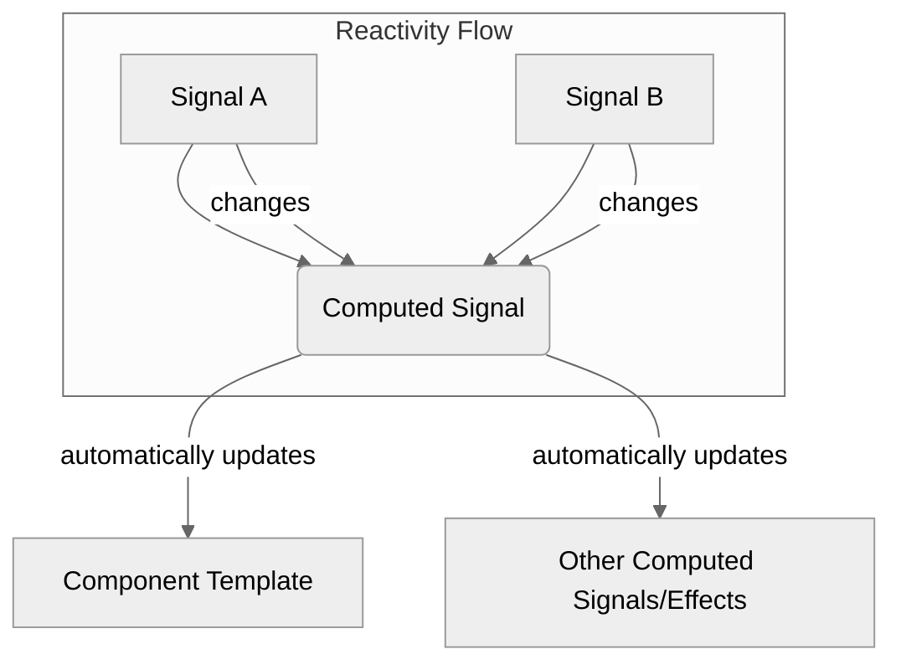

# Module 9.3: Computed Signals

**Objective:** To understand how to create derived state from existing signals using the `computed()` function, ensuring that derived values are automatically updated when their dependencies change.

---

### The Need for Derived State

In many applications, some pieces of data are not stored directly but are instead derived from other pieces of data. For example:

*   A `fullName` derived from `firstName` and `lastName`.
*   A `totalPrice` derived from `itemPrice` and `quantity`.
*   A `filteredList` derived from a `fullList` and a `searchTerm`.

Manually updating these derived values whenever their source values change can lead to errors and boilerplate code. Angular Signals provide a clean and efficient way to handle this with `computed()`.

### What are Computed Signals?

A computed signal is a special type of signal that derives its value from one or more other signals. It automatically re-evaluates its value whenever any of its dependent signals change. This ensures that your derived state is always up-to-date and consistent.


**Alt text:** Diagram illustrating how a Computed Signal derives its value from Signal A and Signal B. When Signal A or Signal B changes, the Computed Signal automatically updates, which then updates the Component Template and other Computed Signals/Effects.

#### Key Characteristics of Computed Signals:

*   **Derived Value:** Their value is always a function of other signals.
*   **Memoization:** Computed signals are **memoized**. This means they only re-evaluate their value if one of their dependencies actually changes. If you call a computed signal multiple times without its dependencies changing, it will return the cached value, which is great for performance.
*   **Read-Only:** Computed signals are read-only. You cannot `set()` or `update()` their values directly.

--- 

### Creating a Computed Signal

Computed signals are created using the `computed()` function from `@angular/core`. It takes a function as an argument, which defines how the computed value is derived.

**Syntax:**

```typescript
import { signal, computed } from '@angular/core';

const myComputedSignal = computed(() => {
  // Access other signals here
  return someSignal() + anotherSignal();
});
```

**Example 1: Full Name**

```typescript
import { Component, signal, computed } from '@angular/core';

@Component({
  standalone: true,
  selector: 'app-full-name-demo',
  template: `
    <p>First Name: <input type="text" [value]="firstName()" (input)="firstName.set($event.target.value)"></p>
    <p>Last Name: <input type="text" [value]="lastName()" (input)="lastName.set($event.target.value)"></p>
    <h3>Full Name: {{ fullName() }}</h3>
  `
})
export class FullNameDemoComponent {
  firstName = signal('John');
  lastName = signal('Doe');

  // fullName is a computed signal that depends on firstName and lastName
  fullName = computed(() => `${this.firstName()} ${this.lastName()}`);
}
```

**Explanation:**

*   When `firstName` or `lastName` signals are updated, `fullName` will automatically re-evaluate its value.
*   The template `{{ fullName() }}` will then display the updated full name.

#### Example 2: Shopping Cart Total

```typescript
import { Component, signal, computed } from '@angular/core';

interface Product {
  name: string;
  price: number;
  quantity: number;
}

@Component({
  standalone: true,
  selector: 'app-cart-total-demo',
  template: `
    <h2>Shopping Cart</h2>
    <ul>
      @for (item of cartItems(); track item.name) {
        <li>
          {{ item.name }} - ${{ item.price }} x {{ item.quantity }}
          <button (click)="updateQuantity(item.name, item.quantity + 1)">+</button>
          <button (click)="updateQuantity(item.name, item.quantity - 1)">-</button>
        </li>
      }
    </ul>
    <h3>Total Items: {{ totalItems() }}</h3>
    <h3>Total Price: ${{ totalPrice() | number:'1.2-2' }}</h3>
  `
})
export class CartTotalDemoComponent {
  cartItems = signal<Product[]>([
    { name: 'Laptop', price: 1200, quantity: 1 },
    { name: 'Mouse', price: 25, quantity: 2 }
  ]);

  // Computed signal for total number of items
  totalItems = computed(() =>
    this.cartItems().reduce((sum, item) => sum + item.quantity, 0)
  );

  // Computed signal for total price
  totalPrice = computed(() =>
    this.cartItems().reduce((sum, item) => sum + (item.price * item.quantity), 0)
  );

  updateQuantity(name: string, newQuantity: number): void {
    this.cartItems.update(items =>
      items.map(item =>
        item.name === name ? { ...item, quantity: Math.max(0, newQuantity) } : item
      )
    );
  }
}
```

**Explanation:**

*   `totalItems` and `totalPrice` are `computed` signals that depend on the `cartItems` signal.
*   When `cartItems` is updated (e.g., by changing a quantity), both `totalItems` and `totalPrice` will automatically recalculate their values.
*   The template will then reflect these new totals without any manual intervention.

### Best Practices for Computed Signals

*   **Keep them Pure:** The function passed to `computed()` should be a pure function. It should only read from its dependencies and return a new value. Avoid side effects within a `computed` function.
*   **Avoid Expensive Computations:** While memoized, if a computed signal's dependencies change frequently and the computation is very expensive, it can still impact performance. Optimize the derivation logic if necessary.
*   **Read-Only:** Remember that computed signals are read-only. If you need to change their value, you must change one of their underlying signal dependencies.

Computed signals are a powerful addition to Angular's reactivity model, allowing you to manage derived state efficiently and declaratively. They ensure that your UI always reflects the latest data without manual synchronization.

---

**Previous:** [9.2 Creating & Updating Signals](./9.2-creating-updating-signals.md)

**Next:** [9.4 Effects](./9.4-effects.md)
