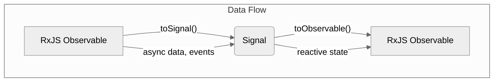
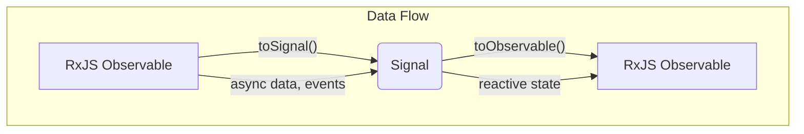

# Module 9.5: Interoperability with RxJS

**Objective:** To understand how Angular Signals and RxJS Observables can seamlessly interoperate, allowing you to convert between them using `toSignal()` and `toObservable()` for flexible reactive programming.

---

### Signals and RxJS: Complementary Tools

As discussed in Module 9.1, Signals and RxJS Observables serve different primary purposes. However, in a real-world Angular application, you will inevitably need to use both. For instance:

*   HTTP requests (`HttpClient`) return Observables.
*   Router events are Observables.
*   User input streams are often best handled with Observables.
*   But your component state and UI updates might benefit from the fine-grained reactivity of Signals.

Angular provides utility functions to bridge the gap between these two reactive paradigms, allowing them to work together harmoniously.


**Alt text:** Diagram illustrating the interoperability between RxJS Observables and Angular Signals. An RxJS Observable can be converted to a Signal using `toSignal()`, and a Signal can be converted back to an RxJS Observable using `toObservable()`, facilitating data flow between asynchronous data/events and reactive state.

--- 

### 1. `toSignal()`: Converting an Observable to a Signal

`toSignal()` is a utility function that converts an RxJS `Observable` into an Angular `Signal`. This is incredibly useful when you have an Observable (e.g., from an HTTP call) and you want to manage its resulting data using the Signal-based reactivity system.

**Syntax:**

```typescript
import { toSignal } from '@angular/core/rxjs-interop'; // Or @angular/core in newer versions

const mySignal = toSignal(myObservable, options);
```

**Options:**

*   `initialValue`: An optional initial value for the signal before the observable emits its first value. If not provided, the signal will be `undefined` until the first emission.
*   `requireSync`: If `true`, the observable must emit synchronously. Useful for ensuring a value is immediately available.
*   `injector`: The injector to use for the signal's lifecycle. Typically, you provide the component's injector.

**Example: Fetching User Data with `HttpClient` and `toSignal()`**

```typescript
import { Component, inject } from '@angular/core';
import { HttpClient } from '@angular/common/http';
import { toSignal } from '@angular/core/rxjs-interop'; // Import toSignal
import { Observable } from 'rxjs';
import { CommonModule } from '@angular/common'; // For @if

interface User {
  id: number;
  name: string;
  email: string;
}

@Component({
  standalone: true,
  selector: 'app-user-profile-signal',
  imports: [CommonModule],
  template: `
    <h2>User Profile (Signals)</h2>
    @if (user()) {
      <p>Name: {{ user()?.name }}</p>
      <p>Email: {{ user()?.email }}</p>
    } @else if (user() === undefined) {
      <p>Loading user data...</p>
    } @else {
      <p>User not found or an error occurred.</p>
    }
  `
})
export class UserProfileSignalComponent {
  private http = inject(HttpClient);
  private userId = 1; // Example user ID

  // Convert the HttpClient Observable to a Signal
  user = toSignal(this.http.get<User>(`https://jsonplaceholder.typicode.com/users/${this.userId}`), {
    initialValue: undefined // Signal will be undefined until data arrives
  });

  // You can also provide an initial value to avoid undefined state
  // userWithInitial = toSignal(this.http.get<User>(`...`), { initialValue: { id: 0, name: 'Loading...', email: '' } });
}
```

**Benefits of `toSignal()`:**

*   **Automatic Subscription Management:** Just like the `async` pipe, `toSignal()` handles subscribing and unsubscribing, preventing memory leaks.
*   **Simplified Template Logic:** You can directly call the signal in the template (`user()`) without using the `async` pipe.
*   **Fine-Grained Reactivity:** When the signal's value changes, only the parts of the template that depend on it will re-render.

--- 

### 2. `toObservable()`: Converting a Signal to an Observable

`toObservable()` is the inverse: it converts an Angular `Signal` into an RxJS `Observable`. This is useful when you need to integrate a signal's value into an existing RxJS pipeline or use RxJS operators that are not directly available for signals.

**Syntax:**

```typescript
import { toObservable } from '@angular/core/rxjs-interop';

const myObservable = toObservable(mySignal, options);
```

**Options:**

*   `injector`: The injector to use for the observable's lifecycle.

**Example: Debouncing Signal Changes with RxJS**

Suppose you have a search input whose value is stored in a signal, and you want to debounce API calls.

```typescript
import { Component, signal, inject, OnInit } from '@angular/core';
import { toObservable } from '@angular/core/rxjs-interop'; // Import toObservable
import { HttpClient } from '@angular/common/http';
import { debounceTime, distinctUntilChanged, switchMap } from 'rxjs/operators';
import { of } from 'rxjs';

@Component({
  standalone: true,
  selector: 'app-search-signal-rxjs',
  template: `
    <h2>Search Products</h2>
    <input type="text" [value]="searchTerm()" (input)="searchTerm.set($event.target.value)" placeholder="Search...">
    @if (searchResults()) {
      <ul>
        @for (result of searchResults(); track result) {
          <li>{{ result }}</li>
        }
      </ul>
    } @else {
      <p>No results.</p>
    }
  `
})
export class SearchSignalRxjsComponent implements OnInit {
  searchTerm = signal('');
  searchResults = signal<string[] | null>(null);
  private http = inject(HttpClient);

  ngOnInit(): void {
    // Convert searchTerm signal to an Observable
    toObservable(this.searchTerm).pipe(
      debounceTime(300), // Wait for 300ms of inactivity
      distinctUntilChanged(), // Only emit if the value has changed
      switchMap(query => {
        if (query.length > 2) {
          // Simulate API call
          console.log(`Making API call for: ${query}`);
          return this.http.get<any[]>(`https://jsonplaceholder.typicode.com/posts?q=${query}`).pipe(
            map(posts => posts.map(post => post.title))
          );
        } else {
          return of([]); // Return empty array for short queries
        }
      })
    ).subscribe(results => {
      this.searchResults.set(results); // Update the searchResults signal
    });
  }
}
```

**Explanation:**

*   `toObservable(this.searchTerm)`: Creates an Observable that emits whenever the `searchTerm` signal changes.
*   The RxJS `pipe()` then applies `debounceTime`, `distinctUntilChanged`, and `switchMap` to control the API calls.
*   Finally, the `subscribe()` method updates the `searchResults` signal with the fetched data.

### Conclusion

The interoperability functions `toSignal()` and `toObservable()` are powerful bridges that allow you to leverage the strengths of both Angular Signals and RxJS Observables. This flexibility enables you to choose the best reactive primitive for each specific use case, leading to more efficient, readable, and maintainable Angular applications.

---

### Hands-on Exercise: Convert an Observable-based Component to Signals

1.  **Create a `DataService`** that has a method `getData()` which returns an `Observable<string[]>` of some sample data (e.g., `of(['Apple', 'Banana', 'Cherry']).pipe(delay(1000))`).
2.  **Create a `ProductListComponent`** that:
    *   Injects the `DataService`.
    *   Has a property `products$: Observable<string[]>`.
    *   In `ngOnInit`, it assigns the result of `dataService.getData()` to `products# Module 9.5: Interoperability with RxJS

**Objective:** To understand how Angular Signals and RxJS Observables can seamlessly interoperate, allowing you to convert between them using `toSignal()` and `toObservable()` for flexible reactive programming.

---

### Signals and RxJS: Complementary Tools

As discussed in Module 9.1, Signals and RxJS Observables serve different primary purposes. However, in a real-world Angular application, you will inevitably need to use both. For instance:

*   HTTP requests (`HttpClient`) return Observables.
*   Router events are Observables.
*   User input streams are often best handled with Observables.
*   But your component state and UI updates might benefit from the fine-grained reactivity of Signals.

Angular provides utility functions to bridge the gap between these two reactive paradigms, allowing them to work together harmoniously.



--- 

### 1. `toSignal()`: Converting an Observable to a Signal

`toSignal()` is a utility function that converts an RxJS `Observable` into an Angular `Signal`. This is incredibly useful when you have an Observable (e.g., from an HTTP call) and you want to manage its resulting data using the Signal-based reactivity system.

**Syntax:**

```typescript
import { toSignal } from '@angular/core/rxjs-interop'; // Or @angular/core in newer versions

const mySignal = toSignal(myObservable, options);
```

**Options:**

*   `initialValue`: An optional initial value for the signal before the observable emits its first value. If not provided, the signal will be `undefined` until the first emission.
*   `requireSync`: If `true`, the observable must emit synchronously. Useful for ensuring a value is immediately available.
*   `injector`: The injector to use for the signal's lifecycle. Typically, you provide the component's injector.

**Example: Fetching User Data with `HttpClient` and `toSignal()`**

```typescript
import { Component, inject } from '@angular/core';
import { HttpClient } from '@angular/common/http';
import { toSignal } from '@angular/core/rxjs-interop'; // Import toSignal
import { Observable } from 'rxjs';
import { CommonModule } from '@angular/common'; // For @if

interface User {
  id: number;
  name: string;
  email: string;
}

@Component({
  standalone: true,
  selector: 'app-user-profile-signal',
  imports: [CommonModule],
  template: `
    <h2>User Profile (Signals)</h2>
    @if (user()) {
      <p>Name: {{ user()?.name }}</p>
      <p>Email: {{ user()?.email }}</p>
    } @else if (user() === undefined) {
      <p>Loading user data...</p>
    } @else {
      <p>User not found or an error occurred.</p>
    }
  `
})
export class UserProfileSignalComponent {
  private http = inject(HttpClient);
  private userId = 1; // Example user ID

  // Convert the HttpClient Observable to a Signal
  user = toSignal(this.http.get<User>(`https://jsonplaceholder.typicode.com/users/${this.userId}`), {
    initialValue: undefined // Signal will be undefined until data arrives
  });

  // You can also provide an initial value to avoid undefined state
  // userWithInitial = toSignal(this.http.get<User>(`...`), { initialValue: { id: 0, name: 'Loading...', email: '' } });
}
```

**Benefits of `toSignal()`:**

*   **Automatic Subscription Management:** Just like the `async` pipe, `toSignal()` handles subscribing and unsubscribing, preventing memory leaks.
*   **Simplified Template Logic:** You can directly call the signal in the template (`user()`) without using the `async` pipe.
*   **Fine-Grained Reactivity:** When the signal's value changes, only the parts of the template that depend on it will re-render.

--- 

### 2. `toObservable()`: Converting a Signal to an Observable

`toObservable()` is the inverse: it converts an Angular `Signal` into an RxJS `Observable`. This is useful when you need to integrate a signal's value into an existing RxJS pipeline or use RxJS operators that are not directly available for signals.

**Syntax:**

```typescript
import { toObservable } from '@angular/core/rxjs-interop';

const myObservable = toObservable(mySignal, options);
```

**Options:**

*   `injector`: The injector to use for the observable's lifecycle.

**Example: Debouncing Signal Changes with RxJS**

Suppose you have a search input whose value is stored in a signal, and you want to debounce API calls.

```typescript
import { Component, signal, inject, OnInit } from '@angular/core';
import { toObservable } from '@angular/core/rxjs-interop'; // Import toObservable
import { HttpClient } from '@angular/common/http';
import { debounceTime, distinctUntilChanged, switchMap } from 'rxjs/operators';
import { of } from 'rxjs';

@Component({
  standalone: true,
  selector: 'app-search-signal-rxjs',
  template: `
    <h2>Search Products</h2>
    <input type="text" [value]="searchTerm()" (input)="searchTerm.set($event.target.value)" placeholder="Search...">
    @if (searchResults()) {
      <ul>
        @for (result of searchResults(); track result) {
          <li>{{ result }}</li>
        }
      </ul>
    } @else {
      <p>No results.</p>
    }
  `
})
export class SearchSignalRxjsComponent implements OnInit {
  searchTerm = signal('');
  searchResults = signal<string[] | null>(null);
  private http = inject(HttpClient);

  ngOnInit(): void {
    // Convert searchTerm signal to an Observable
    toObservable(this.searchTerm).pipe(
      debounceTime(300), // Wait for 300ms of inactivity
      distinctUntilChanged(), // Only emit if the value has changed
      switchMap(query => {
        if (query.length > 2) {
          // Simulate API call
          console.log(`Making API call for: ${query}`);
          return this.http.get<any[]>(`https://jsonplaceholder.typicode.com/posts?q=${query}`).pipe(
            map(posts => posts.map(post => post.title))
          );
        } else {
          return of([]); // Return empty array for short queries
        }
      })
    ).subscribe(results => {
      this.searchResults.set(results); // Update the searchResults signal
    });
  }
}
```

**Explanation:**

*   `toObservable(this.searchTerm)`: Creates an Observable that emits whenever the `searchTerm` signal changes.
*   The RxJS `pipe()` then applies `debounceTime`, `distinctUntilChanged`, and `switchMap` to control the API calls.
*   Finally, the `subscribe()` method updates the `searchResults` signal with the fetched data.

### Conclusion

.
    *   In the template, it uses the `async` pipe to display the list of products (e.g., `@if (products$ | async; as products)`).
3.  **Refactor the `ProductListComponent` to use Signals:**
    *   In the component, create a `products` signal using `toSignal(this.dataService.getData())`.
    *   Remove the `products# Module 9.5: Interoperability with RxJS

**Objective:** To understand how Angular Signals and RxJS Observables can seamlessly interoperate, allowing you to convert between them using `toSignal()` and `toObservable()` for flexible reactive programming.

---

### Signals and RxJS: Complementary Tools

As discussed in Module 9.1, Signals and RxJS Observables serve different primary purposes. However, in a real-world Angular application, you will inevitably need to use both. For instance:

*   HTTP requests (`HttpClient`) return Observables.
*   Router events are Observables.
*   User input streams are often best handled with Observables.
*   But your component state and UI updates might benefit from the fine-grained reactivity of Signals.

Angular provides utility functions to bridge the gap between these two reactive paradigms, allowing them to work together harmoniously.


--- 

### 1. `toSignal()`: Converting an Observable to a Signal

`toSignal()` is a utility function that converts an RxJS `Observable` into an Angular `Signal`. This is incredibly useful when you have an Observable (e.g., from an HTTP call) and you want to manage its resulting data using the Signal-based reactivity system.

**Syntax:**

```typescript
import { toSignal } from '@angular/core/rxjs-interop'; // Or @angular/core in newer versions

const mySignal = toSignal(myObservable, options);
```

**Options:**

*   `initialValue`: An optional initial value for the signal before the observable emits its first value. If not provided, the signal will be `undefined` until the first emission.
*   `requireSync`: If `true`, the observable must emit synchronously. Useful for ensuring a value is immediately available.
*   `injector`: The injector to use for the signal's lifecycle. Typically, you provide the component's injector.

**Example: Fetching User Data with `HttpClient` and `toSignal()`**

```typescript
import { Component, inject } from '@angular/core';
import { HttpClient } from '@angular/common/http';
import { toSignal } from '@angular/core/rxjs-interop'; // Import toSignal
import { Observable } from 'rxjs';
import { CommonModule } from '@angular/common'; // For @if

interface User {
  id: number;
  name: string;
  email: string;
}

@Component({
  standalone: true,
  selector: 'app-user-profile-signal',
  imports: [CommonModule],
  template: `
    <h2>User Profile (Signals)</h2>
    @if (user()) {
      <p>Name: {{ user()?.name }}</p>
      <p>Email: {{ user()?.email }}</p>
    } @else if (user() === undefined) {
      <p>Loading user data...</p>
    } @else {
      <p>User not found or an error occurred.</p>
    }
  `
})
export class UserProfileSignalComponent {
  private http = inject(HttpClient);
  private userId = 1; // Example user ID

  // Convert the HttpClient Observable to a Signal
  user = toSignal(this.http.get<User>(`https://jsonplaceholder.typicode.com/users/${this.userId}`), {
    initialValue: undefined // Signal will be undefined until data arrives
  });

  // You can also provide an initial value to avoid undefined state
  // userWithInitial = toSignal(this.http.get<User>(`...`), { initialValue: { id: 0, name: 'Loading...', email: '' } });
}
```

**Benefits of `toSignal()`:**

*   **Automatic Subscription Management:** Just like the `async` pipe, `toSignal()` handles subscribing and unsubscribing, preventing memory leaks.
*   **Simplified Template Logic:** You can directly call the signal in the template (`user()`) without using the `async` pipe.
*   **Fine-Grained Reactivity:** When the signal's value changes, only the parts of the template that depend on it will re-render.

--- 

### 2. `toObservable()`: Converting a Signal to an Observable

`toObservable()` is the inverse: it converts an Angular `Signal` into an RxJS `Observable`. This is useful when you need to integrate a signal's value into an existing RxJS pipeline or use RxJS operators that are not directly available for signals.

**Syntax:**

```typescript
import { toObservable } from '@angular/core/rxjs-interop';

const myObservable = toObservable(mySignal, options);
```

**Options:**

*   `injector`: The injector to use for the observable's lifecycle.

**Example: Debouncing Signal Changes with RxJS**

Suppose you have a search input whose value is stored in a signal, and you want to debounce API calls.

```typescript
import { Component, signal, inject, OnInit } from '@angular/core';
import { toObservable } from '@angular/core/rxjs-interop'; // Import toObservable
import { HttpClient } from '@angular/common/http';
import { debounceTime, distinctUntilChanged, switchMap } from 'rxjs/operators';
import { of } from 'rxjs';

@Component({
  standalone: true,
  selector: 'app-search-signal-rxjs',
  template: `
    <h2>Search Products</h2>
    <input type="text" [value]="searchTerm()" (input)="searchTerm.set($event.target.value)" placeholder="Search...">
    @if (searchResults()) {
      <ul>
        @for (result of searchResults(); track result) {
          <li>{{ result }}</li>
        }
      </ul>
    } @else {
      <p>No results.</p>
    }
  `
})
export class SearchSignalRxjsComponent implements OnInit {
  searchTerm = signal('');
  searchResults = signal<string[] | null>(null);
  private http = inject(HttpClient);

  ngOnInit(): void {
    // Convert searchTerm signal to an Observable
    toObservable(this.searchTerm).pipe(
      debounceTime(300), // Wait for 300ms of inactivity
      distinctUntilChanged(), // Only emit if the value has changed
      switchMap(query => {
        if (query.length > 2) {
          // Simulate API call
          console.log(`Making API call for: ${query}`);
          return this.http.get<any[]>(`https://jsonplaceholder.typicode.com/posts?q=${query}`).pipe(
            map(posts => posts.map(post => post.title))
          );
        } else {
          return of([]); // Return empty array for short queries
        }
      })
    ).subscribe(results => {
      this.searchResults.set(results); // Update the searchResults signal
    });
  }
}
```

**Explanation:**

*   `toObservable(this.searchTerm)`: Creates an Observable that emits whenever the `searchTerm` signal changes.
*   The RxJS `pipe()` then applies `debounceTime`, `distinctUntilChanged`, and `switchMap` to control the API calls.
*   Finally, the `subscribe()` method updates the `searchResults` signal with the fetched data.

### Conclusion

 property and the `ngOnInit` logic.
    *   Update the template to read from the `products` signal directly (e.g., `products()`) instead of using the `async` pipe.
    *   Add a loading state to the template that displays a message while the signal is `undefined`.

---

**End of Module 9.**

**Previous:** [9.4 Effects](./9.4-effects.md)

**Next:** [10-advanced-components-and-performance](../10-advanced-components-and-performance)
