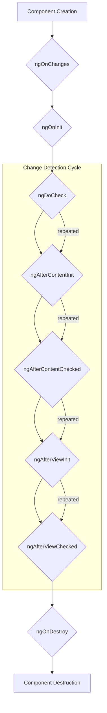

# Module 10.1: Component Lifecycle Hooks

**Objective:** To understand the various lifecycle hooks available in Angular components and how to leverage them to execute code at specific stages of a component's existence.

---

### The Component Lifecycle

Every Angular component has a lifecycle, managed by Angular itself. From the moment Angular instantiates a component until it destroys it, it progresses through a series of distinct phases. Angular provides **lifecycle hook interfaces** that allow you to tap into these moments and execute custom logic.

Understanding these hooks is crucial for:

*   Performing initialization tasks (e.g., fetching data).
*   Responding to changes in input properties.
*   Cleaning up resources to prevent memory leaks.


**Alt text:** Diagram illustrating the lifecycle hooks of an Angular component: ngOnChanges, ngOnInit, ngDoCheck, ngAfterContentInit, ngAfterContentChecked, ngAfterViewInit, ngAfterViewChecked, and ngOnDestroy. It also shows the change detection cycle.

### Key Lifecycle Hooks

To use a lifecycle hook, you implement the corresponding interface and define the method in your component class.

#### 1. `ngOnChanges`

*   **When it runs:** Called before `ngOnInit` and whenever one or more data-bound input properties change. It receives a `SimpleChanges` object containing the current and previous values of the changed properties.
*   **Use Case:** Performing actions when input properties change, especially if you need to react to changes in multiple inputs or compare old and new values.

```typescript
import { Component, Input, OnChanges, SimpleChanges } from '@angular/core';

@Component({
  standalone: true,
  selector: 'app-child-component',
  template: `<p>Message: {{ message }}</p><p>Count: {{ count }}</p>`
})
export class ChildComponent implements OnChanges {
  @Input() message: string = '';
  @Input() count: number = 0;

  ngOnChanges(changes: SimpleChanges): void {
    console.log('ngOnChanges fired!', changes);
    if (changes['message']) {
      console.log(`Message changed from ${changes['message'].previousValue} to ${changes['message'].currentValue}`);
    }
    if (changes['count'] && changes['count'].currentValue > 5) {
      console.log('Count exceeded 5!');
    }
  }
}
```

#### 2. `ngOnInit`

*   **When it runs:** Called once, after the first `ngOnChanges` and after Angular has initialized all data-bound properties of a directive or component.
*   **Use Case:** Performing initialization logic, fetching initial data from a service, setting up subscriptions.

```typescript
import { Component, OnInit } from '@angular/core';
import { DataService } from '../data.service'; // Assume a data service

@Component({
  standalone: true,
  selector: 'app-data-viewer',
  template: `<p>Data: {{ data }}</p>`
})
export class DataViewerComponent implements OnInit {
  data: any;

  constructor(private dataService: DataService) { }

  ngOnInit(): void {
    console.log('ngOnInit fired! Fetching data...');
    this.dataService.fetchInitialData().subscribe(result => {
      this.data = result;
    });
  }
}
```

#### 3. `ngDoCheck`

*   **When it runs:** Called during every change detection cycle, immediately after `ngOnChanges` and `ngOnInit`.
*   **Use Case:** Implementing custom change detection logic. This hook is rarely used and should be avoided unless absolutely necessary, as it can impact performance if not implemented carefully.

#### 4. `ngAfterContentInit`

*   **When it runs:** Called once after Angular has projected external content into the component's view (content projection is covered in Module 10.2).
*   **Use Case:** Performing initialization tasks on projected content.

#### 5. `ngAfterContentChecked`

*   **When it runs:** Called after `ngAfterContentInit` and after every subsequent `ngDoCheck`. It's invoked after Angular checks the content projected into the component.
*   **Use Case:** Performing actions after projected content has been checked for changes.

#### 6. `ngAfterViewInit`

*   **When it runs:** Called once after `ngAfterContentChecked` and after Angular has initialized the component's view and its child views.
*   **Use Case:** Interacting with child components or DOM elements that are part of the component's own view (e.g., using `@ViewChild`).

```typescript
import { Component, AfterViewInit, ViewChild, ElementRef } from '@angular/core';

@Component({
  standalone: true,
  selector: 'app-view-child-demo',
  template: `
    <input #myInput type="text" placeholder="Focus me">
    <button (click)="focusInput()">Focus Input</button>
  `
})
export class ViewChildDemoComponent implements AfterViewInit {
  @ViewChild('myInput') myInput!: ElementRef;

  ngAfterViewInit(): void {
    console.log('ngAfterViewInit fired! Input element is available.');
    // this.myInput.nativeElement.focus(); // Auto-focus on load
  }

  focusInput(): void {
    this.myInput.nativeElement.focus();
  }
}
```

#### 7. `ngAfterViewChecked`

*   **When it runs:** Called after `ngAfterViewInit` and after every subsequent `ngAfterContentChecked`. It's invoked after Angular checks the component's view and its child views.
*   **Use Case:** Performing actions after the view has been checked for changes. Use with caution to avoid infinite loops.

#### 8. `ngOnDestroy`

*   **When it runs:** Called just before Angular destroys the component.
*   **Use Case:** Performing cleanup tasks to prevent memory leaks. This is critical for:
    *   Unsubscribing from Observables (if not using `async` pipe).
    *   Detaching event listeners.
    *   Clearing intervals or timeouts.

```typescript
import { Component, OnInit, OnDestroy } from '@angular/core';
import { interval, Subscription } from 'rxjs';

@Component({
  standalone: true,
  selector: 'app-timer',
  template: `<p>Timer: {{ seconds }}</p>`
})
export class TimerComponent implements OnInit, OnDestroy {
  seconds: number = 0;
  private timerSubscription: Subscription | undefined;

  ngOnInit(): void {
    this.timerSubscription = interval(1000).subscribe(val => {
      this.seconds = val;
    });
  }

  ngOnDestroy(): void {
    console.log('ngOnDestroy fired! Unsubscribing from timer.');
    if (this.timerSubscription) {
      this.timerSubscription.unsubscribe();
    }
  }
}
```

### Summary of Hook Order

```mermaid
graph TD
    A[Constructor] --> B{ngOnChanges (on input change)};
    B --> C{ngOnInit (once)};
    C --> D{ngDoCheck (every change detection)};
    D --> E{ngAfterContentInit (once, after projected content init)};
    E --> F{ngAfterContentChecked (every change detection, after projected content checked)};
    F --> G{ngAfterViewInit (once, after view and child views init)};
    G --> H{ngAfterViewChecked (every change detection, after view and child views checked)};
    H --> I{ngOnDestroy (before destruction)};
```

Understanding and correctly utilizing component lifecycle hooks is fundamental to building robust, performant, and memory-efficient Angular applications. They provide precise control over when your code executes in response to Angular's internal processes.

---

**Previous:** [9.5 Interoperability with RxJS](../09-angular-signals/9.5-rxjs-interop.md)

**Next:** [10.2 Content Projection with `ng-content`](./10.2-content-projection.md)
