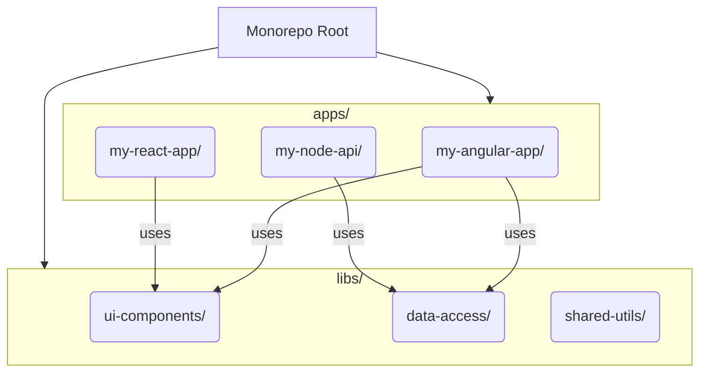

# Module 11.1: Monorepos with Nx

**Objective:** To understand the concept of monorepos and how tools like Nx (Nrwl Extensions) facilitate their management for large-scale Angular applications and shared codebases.

---

### The Challenge of Large Codebases

As applications grow, or as organizations develop multiple applications that share common functionalities, managing code can become complex. Traditionally, this has been handled with **polyrepos** (multiple repositories), where each application or library has its own Git repository.

**Problems with Polyrepos:**

*   **Code Duplication:** Common utilities, UI components, or business logic might be copied across repositories.
*   **Version Mismatch:** Keeping shared libraries in sync across multiple applications is difficult.
*   **Complex Dependencies:** Managing dependencies between different repositories can be a nightmare.
*   **Refactoring Overhead:** A change in a shared library might require updating and deploying multiple applications.

### The Solution: Monorepos

A **monorepo** (monolithic repository) is a single version-controlled repository that contains multiple distinct projects (applications and libraries). Instead of having separate repositories for each piece of code, everything lives together.



#### Advantages of Monorepos:

*   **Code Sharing:** Easy to share code (libraries, components, types) across applications within the same repository.
*   **Atomic Changes:** A single commit can update a shared library and all applications that consume it, ensuring consistency.
*   **Simplified Dependency Management:** All dependencies are managed in one place.
*   **Easier Refactoring:** Changes to shared code can be tested and deployed across all affected projects simultaneously.
*   **Consistent Tooling:** All projects can use the same build tools, linters, and testing frameworks.

#### Disadvantages of Monorepos:

*   **Initial Setup Complexity:** Can be more complex to set up initially than polyrepos.
*   **Tooling Requirement:** Requires specialized tooling to manage the various projects efficiently.
*   **Larger Repository Size:** The repository can grow very large over time.
*   **CI/CD Challenges:** Building and testing only affected projects requires smart CI/CD pipelines.

--- 

### Nx: The Monorepo Toolkit for Angular

While you can manually set up a monorepo, it quickly becomes unmanageable without dedicated tooling. **Nx (Nrwl Extensions)** is a powerful, open-source toolkit for monorepo development, especially popular in the Angular ecosystem.

Nx extends the Angular CLI and provides a comprehensive set of features for building, testing, and deploying multiple applications and libraries within a single monorepo.

#### Key Features of Nx:

1.  **Workspace Generation:** Nx provides its own CLI (`nx`) to create and manage monorepos.
    ```bash
    npx create-nx-workspace my-org --preset=angular
    ```

2.  **Project Graph:** Nx builds a dependency graph of all projects (apps and libs) within your monorepo. This graph is crucial for:
    *   **Affected Commands:** Running commands only on projects affected by a code change (e.g., `nx affected:build`, `nx affected:test`).
    *   **Dependency Visualization:** Understanding how projects relate to each other.

3.  **Code Generation:** Nx extends the Angular CLI's `ng generate` command with its own powerful generators for creating applications, libraries, components, services, and more, all within the monorepo structure.
    ```bash
    nx g @nrwl/angular:app my-new-angular-app
    nx g @nrwl/angular:lib shared-ui --directory=libs
    ```

4.  **Consistent Tooling:** Nx integrates with popular tools like Jest (for testing), Cypress (for E2E testing), ESLint (for linting), and Storybook (for UI component development), providing a unified development experience.

5.  **Build System:** Nx optimizes the build process by caching build artifacts and only rebuilding projects that have changed or whose dependencies have changed.

#### Nx Workspace Structure

An Nx workspace typically has the following structure:

```
my-org/
├── apps/             # Contains all your applications (Angular, React, Node, etc.)
│   ├── my-angular-app/
│   ├── my-react-app/
│   └── my-node-api/
├── libs/             # Contains all your reusable libraries
│   ├── ui-components/  # UI components library
│   ├── data-access/    # Data access logic library
│   └── shared-utils/   # General utility functions
├── tools/            # Custom Nx tools/scripts
├── nx.json           # Nx workspace configuration
├── package.json      # Root package.json for monorepo-wide dependencies
└── tsconfig.base.json # Base TypeScript configuration
```

#### Example: Sharing a UI Component Library

1.  **Create a UI library:**
    ```bash
    nx g @nrwl/angular:lib ui-components --directory=libs/shared
    ```
2.  **Create a component in the library:**
    ```bash
    nx g @nrwl/angular:component button --project=shared-ui
    ```
3.  **Export the component from the library's `index.ts`:**
    ```typescript
    // libs/shared/ui-components/src/index.ts
    export * from './lib/button/button.component';
    ```
4.  **Use the component in an application:**
    ```typescript
    // apps/my-angular-app/src/app/app.component.ts
    import { ButtonComponent } from '@my-org/shared/ui-components'; // Import from the library

    @Component({
      standalone: true,
      selector: 'app-root',
      imports: [ButtonComponent],
      template: `<app-button>Click Me</app-button>`
    })
    export class AppComponent { }
    ```

Nx simplifies the development experience in a monorepo by providing powerful tools for code generation, dependency management, and optimized build processes. For large Angular projects or organizations with multiple applications, adopting an Nx monorepo can significantly improve developer productivity and code consistency.

---

**Previous:** [10.5 Performance Optimization Techniques](../10-advanced-components-and-performance/10.5-performance-optimization.md)

**Next:** [11.2 Micro Frontends](./11.2-micro-frontends.md)
