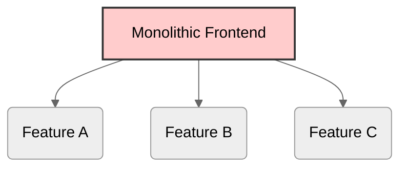
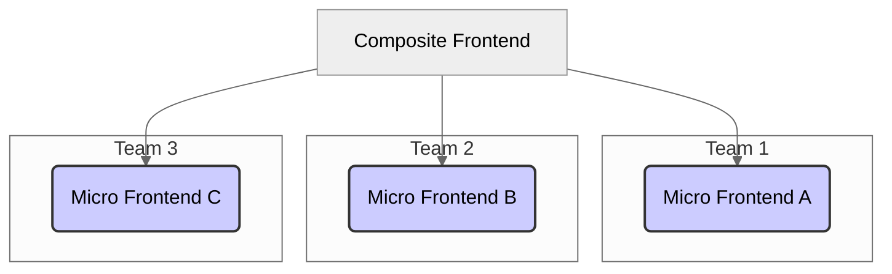

# Module 11.2: Micro Frontends

**Objective:** To understand the architectural pattern of Micro Frontends and explore how Angular applications can be designed and implemented as independent, deployable units within a larger, composite user interface.

---

### The Problem: Monolithic Frontends

Just as monolithic backend applications can become unwieldy, so too can large, single-codebase frontend applications. A monolithic frontend often leads to:

*   **Slow Development Cycles:** A single team owns the entire frontend, leading to bottlenecks and slower feature delivery.
*   **Technology Lock-in:** Difficult to introduce new technologies or upgrade existing ones without affecting the entire application.
*   **Deployment Challenges:** Even a small change requires redeploying the entire frontend application.
*   **Scalability Issues:** Hard to scale development across multiple, independent teams.


**Alt text:** Diagram illustrating a monolithic frontend architecture where a single large application contains multiple features.

### The Solution: Micro Frontends

**Micro Frontends** is an architectural style where a large, complex frontend application is broken down into smaller, independent, and deployable units. Each unit (or "micro frontend") is typically owned by a single, cross-functional team and can be developed, deployed, and scaled independently.

This approach extends the principles of microservices to the frontend.


**Alt text:** Diagram illustrating a micro frontend architecture where a composite frontend integrates multiple independent micro frontends, each owned by a different team.

#### Advantages of Micro Frontends:

*   **Independent Development & Deployment:** Teams can work and deploy their micro frontends without affecting others.
*   **Technology Agnostic:** Different micro frontends can be built using different frameworks (e.g., Angular, React, Vue), allowing teams to choose the best tool for the job or gradually migrate technologies.
*   **Scalability:** Easier to scale development across multiple, autonomous teams.
*   **Resilience:** A failure in one micro frontend is less likely to bring down the entire application.
*   **Faster Feature Delivery:** Reduced coordination overhead leads to quicker time-to-market for new features.

#### Disadvantages of Micro Frontends:

*   **Increased Complexity:** Requires careful planning for integration, communication, and shared infrastructure.
*   **Bundle Size:** Can lead to larger overall bundle sizes if not optimized (e.g., shared dependencies).
*   **Operational Overhead:** More services to manage, deploy, and monitor.
*   **Communication Challenges:** Defining clear communication patterns between micro frontends.

--- 

### Integration Strategies for Micro Frontends

There are several ways to compose micro frontends into a single user experience:

1.  **Build-Time Integration:** Each micro frontend is built and deployed as a separate package, and a container application imports them at build time. This is simpler but loses some of the independent deployment benefits.

2.  **Server-Side Composition (Server-Side Includes, Edge Side Includes):** The server stitches together different HTML fragments from various micro frontends before sending the complete page to the browser.

3.  **Run-Time Integration (Client-Side Composition):** This is the most common approach for SPAs, where the browser dynamically loads and renders micro frontends.
    *   **Iframes:** Simple but limited in communication and styling.
    *   **Web Components (Angular Elements):** Encapsulate micro frontends as custom HTML elements. (Covered in Module 15.2).
    *   **JavaScript Orchestration (e.g., Single-SPA, Module Federation):** A JavaScript framework or library manages the loading, mounting, and unmounting of micro frontends.

### Angular and Micro Frontends

Angular applications are well-suited for micro frontend architectures. Here are common ways Angular fits into this pattern:

#### 1. Angular Elements (Web Components)

*   **Concept:** Angular Elements allow you to package an Angular component and its dependencies as a custom HTML element (a Web Component). This custom element can then be used in any web application, regardless of the framework it's built with.
*   **Use Case:** Embedding small, self-contained Angular features into a larger application (e.g., a login widget, a product card, a chat component).
*   **Benefit:** Provides strong encapsulation and framework agnosticism.

#### 2. Module Federation (Webpack 5)

*   **Concept:** A feature of Webpack 5 that allows multiple separate builds to form a single application. Each build can expose modules (components, services, etc.) that can be consumed by other builds at runtime.
*   **Use Case:** Building large-scale micro frontend architectures where different teams own different parts of the application, and these parts need to share code or be composed dynamically.
*   **Benefit:** Enables true runtime integration and sharing of dependencies, leading to smaller overall bundle sizes.

```mermaid
%%{init: {'theme':'neutral'}}%%
graph TD
    A[Host Application (Shell)] --> B(Remote App 1);
    A --> C(Remote App 2);
    B -- exposes modules --> D[Shared Module];
    C -- consumes modules --> D;

    subgraph Module Federation
        direction LR
        B -- runtime load --> A;
        C -- runtime load --> A;
    end
```
**Alt text:** Diagram illustrating Webpack Module Federation. A Host Application (Shell) dynamically loads Remote App 1 and Remote App 2 at runtime. These remote applications can expose and consume shared modules.

#### 3. Nx Workspaces

*   **Concept:** As discussed in Module 11.1, Nx is a powerful tool for managing monorepos. It provides excellent support for building and deploying multiple Angular applications and libraries within a single repository, which is a common precursor to or enabler of micro frontend architectures.
*   **Benefit:** Simplifies the development and build process for multiple independent applications.

### Communication Between Micro Frontends

Communication is a critical aspect of micro frontends. Common patterns include:

*   **Custom Events:** Using browser's custom events (`CustomEvent`) for simple, decoupled communication.
*   **Shared State Libraries:** Using a shared state management library (e.g., a lightweight RxJS `Subject` or a dedicated micro-state library) for more complex state synchronization.
*   **API Gateway:** For backend communication, micro frontends might communicate through a shared API gateway.

Micro frontends offer a compelling solution for scaling frontend development in large organizations. While they introduce new complexities, the benefits in terms of team autonomy, technology flexibility, and faster delivery often outweigh the challenges, especially when supported by robust tools like Angular Elements and Webpack Module Federation.

---

**Previous:** [11.1 Monorepos with Nx](./11.1-monorepos-with-nx.md)

**Next:** [11.3 Server-Side Rendering (SSR) & Hydration](./11.3-ssr-hydration.md)
