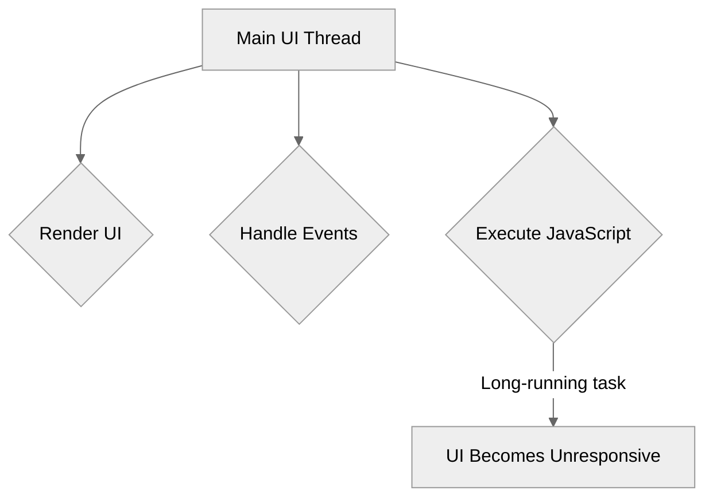
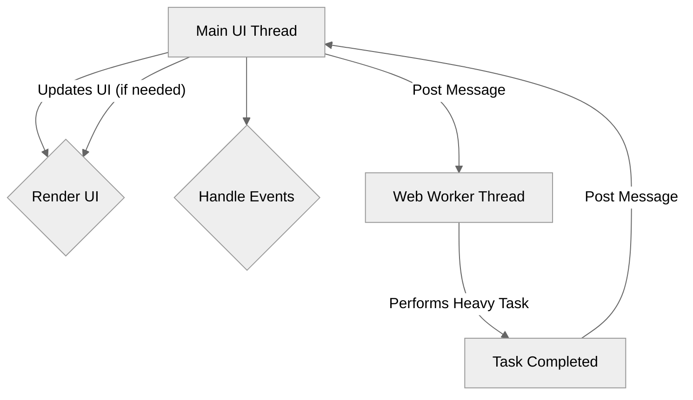

# Module 11.5: Web Workers

**Objective:** To understand what Web Workers are, their benefits for performance, and how to use them in Angular applications to offload CPU-intensive tasks from the main UI thread.

---

### The Problem: Blocking the Main Thread

JavaScript in a web browser is single-threaded. This means that all operations—DOM manipulation, event handling, network requests, and complex calculations—run on a single **main thread**. If a computationally intensive task runs on this thread, it can block the UI, making the application unresponsive and leading to a poor user experience.


**Alt text:** Diagram illustrating the problem of a blocking main UI thread. The Main UI Thread is responsible for rendering UI, handling events, and executing JavaScript. A long-running JavaScript task can cause the UI to become unresponsive.

**Examples of CPU-intensive tasks:**

*   Heavy data processing (e.g., large array manipulations, complex calculations).
*   Image processing (e.g., resizing, filtering).
*   Real-time data analysis.
*   Encryption/decryption.
*   Parsing large files.

### The Solution: Web Workers

**Web Workers** provide a way to run JavaScript in the background, in a separate thread, without interfering with the main UI thread. This allows you to perform long-running, CPU-intensive computations without freezing the user interface.


**Alt text:** Diagram illustrating the solution with Web Workers. The Main UI Thread posts a message to a Web Worker Thread to perform a heavy task. The Web Worker performs the task without blocking the UI, and then posts a message back to the Main UI Thread upon completion, which can then update the UI.

#### Key Characteristics of Web Workers:

*   **Separate Thread:** Runs in its own isolated thread, preventing UI blocking.
*   **No DOM Access:** Web Workers do not have direct access to the DOM, `window` object, or `document` object. They communicate with the main thread via messages.
*   **Communication:** Communication between the main thread and a Web Worker happens via `postMessage()` and `onmessage` event listeners.
*   **Limited API Access:** They have access to a subset of JavaScript APIs (e.g., `XMLHttpRequest`, `fetch`, `setTimeout`, `self` for the worker's global scope).

--- 

### Using Web Workers in Angular

Angular CLI provides built-in support for generating and configuring Web Workers.

#### 1. Generating a Web Worker

Use the Angular CLI to add a new Web Worker to your project:

```bash
ng generate web-worker calculate-prime
```

This command will:

*   Create a new file, typically `src/app/calculate-prime.worker.ts`.
*   Update `angular.json` to include the worker in the build process.

**Example `calculate-prime.worker.ts`:**

```typescript
/// <reference lib="webworker" />

addEventListener('message', ({ data }) => {
  const number = data as number;
  const isPrime = checkPrime(number);

  // Send the result back to the main thread
  postMessage(isPrime);
});

function checkPrime(num: number): boolean {
  if (num <= 1) return false;
  for (let i = 2; i <= Math.sqrt(num); i++) {
    if (num % i === 0) return false;
  }
  return true;
}
```

*   `/// <reference lib="webworker" />`: This triple-slash directive tells TypeScript that this file is a Web Worker script and provides access to Web Worker-specific global types (like `addEventListener`, `postMessage`).
*   `addEventListener('message', ...)`: The worker listens for messages from the main thread.
*   `postMessage(data)`: The worker sends data back to the main thread.

#### 2. Communicating with the Web Worker from an Angular Component

In your Angular component, you will create an instance of the `Worker` and set up message listeners.

```typescript
// src/app/prime-calculator/prime-calculator.component.ts
import { Component, OnInit } from '@angular/core';
import { CommonModule } from '@angular/common';
import { FormsModule } from '@angular/forms';

@Component({
  standalone: true,
  selector: 'app-prime-calculator',
  imports: [CommonModule, FormsModule],
  template: `
    <h2>Prime Number Calculator</h2>
    <input type="number" [(ngModel)]="inputNumber" placeholder="Enter a number">
    <button (click)="calculatePrime()">Calculate</button>
    <p>Is Prime: {{ isPrimeResult }}</p>
    <p>Calculation Time: {{ calculationTime }} ms</p>
    <p>UI Status: {{ uiStatus }}</p>
  `
})
export class PrimeCalculatorComponent implements OnInit {
  inputNumber: number = 0;
  isPrimeResult: boolean | null = null;
  calculationTime: number | null = null;
  uiStatus: string = 'Ready';

  private primeWorker: Worker | undefined;

  ngOnInit(): void {
    // Check if Web Workers are supported by the browser
    if (typeof Worker !== 'undefined') {
      // Create a new Web Worker instance
      // The URL is relative to the base URL of your application
      this.primeWorker = new Worker(new URL('../calculate-prime.worker', import.meta.url));

      // Listen for messages from the Web Worker
      this.primeWorker.onmessage = ({ data }) => {
        const endTime = performance.now();
        this.calculationTime = endTime - startTime;
        this.isPrimeResult = data;
        this.uiStatus = 'Calculation Complete!';
        console.log(`Worker response: ${data}`);
      };

      // Handle errors from the Web Worker
      this.primeWorker.onerror = (error) => {
        console.error('Web Worker error:', error);
        this.uiStatus = 'Error in calculation.';
      };
    } else {
      // Web Workers are not supported in this browser
      this.uiStatus = 'Web Workers not supported.';
      console.warn('Web Workers are not supported in this environment.');
    }
  }

  private startTime: number = 0;

  calculatePrime(): void {
    if (this.primeWorker) {
      this.uiStatus = 'Calculating...';
      this.isPrimeResult = null;
      this.calculationTime = null;
      this.startTime = performance.now();

      // Send data to the Web Worker
      this.primeWorker.postMessage(this.inputNumber);
    } else {
      // Fallback for browsers without Web Worker support
      this.uiStatus = 'Calculating on main thread (no worker)...';
      const startTime = performance.now();
      const isPrime = this.checkPrimeMainThread(this.inputNumber);
      const endTime = performance.now();
      this.calculationTime = endTime - startTime;
      this.isPrimeResult = isPrime;
      this.uiStatus = 'Calculation Complete (main thread)!';
    }
  }

  // Fallback function for browsers without Web Worker support
  private checkPrimeMainThread(num: number): boolean {
    if (num <= 1) return false;
    for (let i = 2; i <= Math.sqrt(num); i++) {
      if (num % i === 0) return false;
    }
    return true;
  }

  ngOnDestroy(): void {
    // Terminate the worker when the component is destroyed
    if (this.primeWorker) {
      this.primeWorker.terminate();
    }
  }
}
```

**Explanation:**

*   `new Worker(new URL('../calculate-prime.worker', import.meta.url))`: This creates a new `Worker` instance. The `new URL()` syntax is important for Angular CLI to correctly bundle the worker script.
*   `this.primeWorker.onmessage`: This event listener receives messages from the worker.
*   `this.primeWorker.postMessage(this.inputNumber)`: This sends data to the worker. Data is copied, not shared, between threads.
*   `this.primeWorker.terminate()`: It's crucial to terminate workers when they are no longer needed to free up resources.

### When to Use Web Workers

*   **CPU-Bound Tasks:** Any operation that takes a significant amount of time and involves heavy computation.
*   **Large Data Processing:** Parsing or manipulating large datasets.
*   **Background Synchronization:** Performing data synchronization without affecting UI responsiveness.

### When Not to Use Web Workers

*   **DOM Manipulation:** Workers cannot directly access the DOM.
*   **Small Tasks:** The overhead of creating a worker and communicating with it might outweigh the benefits for very short tasks.
*   **Network Requests (often):** While workers can make network requests, `HttpClient` and RxJS in the main thread are often sufficient and simpler for most API calls, especially if the response processing is not CPU-intensive.

Web Workers are a powerful tool for improving the responsiveness of your Angular applications by offloading heavy computations. By using them judiciously, you can ensure a smooth and fluid user experience, even for complex applications.

---

**End of Module 11.**

**Previous:** [11.4 Progressive Web Apps (PWAs)](./11.4-progressive-web-apps.md)

**Next:** [12-security-i18n-a11y](../12-security-i18n-a11y)
