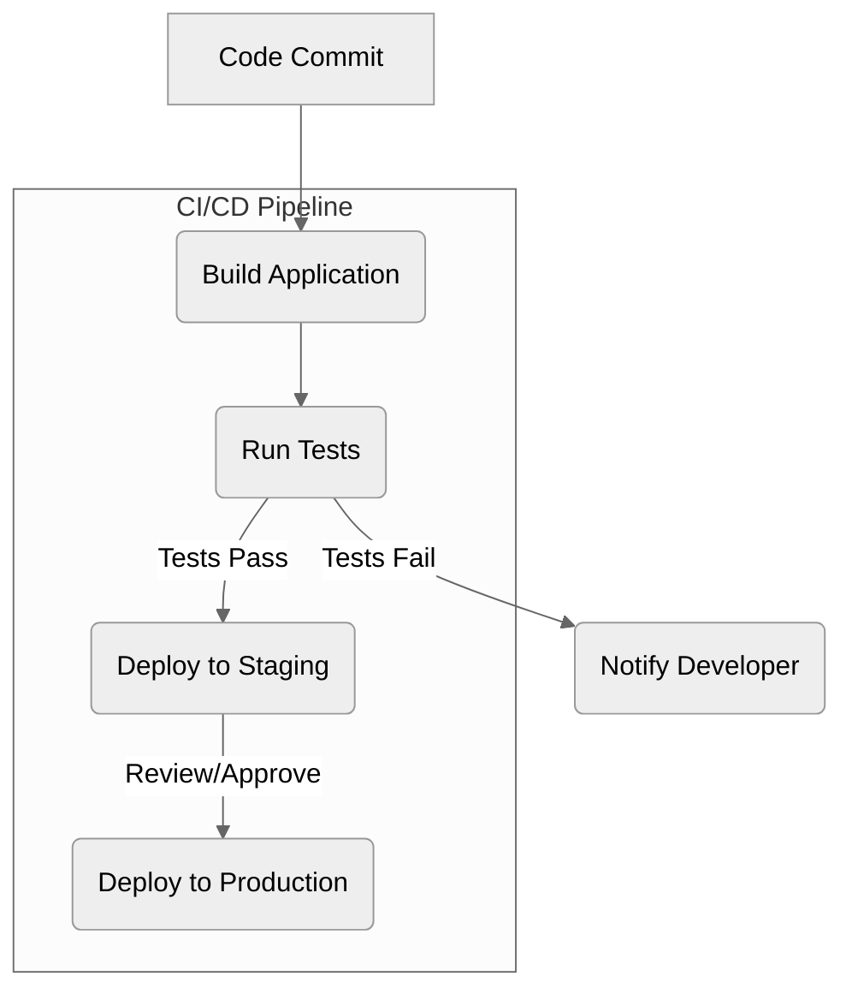

# Module 14.2: Deployment Strategies

**Objective:** To explore various methods and platforms for deploying a production-ready Angular application, from simple static hosting to more complex cloud environments.

---

### The Goal: Making Your App Accessible

Once your Angular application is built for production (as discussed in Module 14.1), the next step is to make it accessible to users. This involves deploying the generated static files (`dist/your-app-name/`) to a web server or a hosting platform.

Angular applications are client-side applications, meaning the server only needs to serve the static HTML, CSS, and JavaScript files. All the application logic runs in the user's browser.


**Alt text:** Diagram illustrating a CI/CD pipeline. Code commit triggers application build and test execution. If tests pass, the application is deployed to staging, then to production after review/approval. If tests fail, the developer is notified.

```mermaid
%%{init: {'theme':'neutral'}}%%
graph TD
    A[Angular Production Build] --> B{Static File Hosting};
    B --> C[Cloud Hosting Platforms];
    B --> D[Containerization (Docker)];

    C --> C1[Firebase Hosting];
    C --> C2[Netlify/Vercel];
    C --> C3[AWS S3/CloudFront];
    C --> C4[Azure Static Web Apps];

    D --> D1[Kubernetes];
    D --> D2[Docker Compose];
```
**Alt text:** Diagram illustrating various deployment strategies for an Angular Production Build, including Static File Hosting, Cloud Hosting Platforms (Firebase, Netlify/Vercel, AWS S3/CloudFront, Azure Static Web Apps), and Containerization (Docker with Kubernetes or Docker Compose).

### 1. Static File Hosting

This is the simplest and most common way to deploy an Angular application. You just need a web server that can serve static files.

#### a) Local Web Server (for testing deployment)

For quick local testing of your production build, you can use a simple Node.js HTTP server.

1.  **Build your app:** `ng build --configuration production`
2.  **Install `http-server`:** `npm install -g http-server`
3.  **Serve:** `http-server -p 8080 -c-1 dist/your-app-name`
    *   `-p 8080`: Serves on port 8080.
    *   `-c-1`: Disables caching (useful for development).
    *   `dist/your-app-name`: The path to your build output.

#### b) Nginx / Apache

These are traditional web servers. You configure them to serve the contents of your `dist/` folder.

**Nginx Example Configuration (`nginx.conf` snippet):**

```nginx
server {
    listen 80;
    server_name yourdomain.com;

    root /usr/share/nginx/html/your-app-name; # Path to your dist/ folder
    index index.html;

    location / {
        try_files $uri $uri/ /index.html; # Important for Angular routing
    }
}
```

*   **`root`**: Points to the directory containing your Angular build output.
*   **`try_files $uri $uri/ /index.html;`**: This is crucial for Angular's client-side routing. It tells Nginx to try serving the requested URI, then try a directory with that URI, and if neither is found, fall back to `index.html`. This ensures that direct URL access (e.g., `yourdomain.com/products`) works correctly, as Angular's router will then take over.

--- 

### 2. Cloud Hosting Platforms

Many cloud providers offer specialized services for hosting static sites, often with built-in CDN (Content Delivery Network) for faster global delivery.

#### a) Firebase Hosting

*   **What it is:** A fast, secure, and global static hosting service provided by Google Firebase.
*   **Advantages:** Very easy to set up, integrated with Firebase services (Auth, Firestore), global CDN, free tier available.
*   **Deployment Steps:**
    1.  **Install Firebase CLI:** `npm install -g firebase-tools`
    2.  **Login:** `firebase login`
    3.  **Initialize:** `firebase init hosting` (select your project, set public directory to `dist/your-app-name`, configure as SPA).
    4.  **Deploy:** `firebase deploy --only hosting`

#### b) Netlify / Vercel

*   **What they are:** Popular platforms for deploying static sites and serverless functions. They offer continuous deployment from Git repositories.
*   **Advantages:** Extremely easy to use, automatic builds on Git push, global CDN, free tier, custom domains, HTTPS.
*   **Deployment Steps:**
    1.  **Connect Git Repository:** Link your GitHub/GitLab/Bitbucket repository.
    2.  **Configure Build Settings:** Specify build command (`ng build --configuration production`) and publish directory (`dist/your-app-name`).
    3.  **Deploy:** Pushes to your Git branch will automatically trigger a new deployment.

#### c) AWS S3 & CloudFront

*   **What they are:** Amazon S3 (Simple Storage Service) is object storage, and CloudFront is a global content delivery network (CDN).
*   **Advantages:** Highly scalable, cost-effective for large-scale deployments, fine-grained control.
*   **Deployment Steps:**
    1.  **Upload `dist/` to S3 bucket.**
    2.  **Configure S3 bucket for static website hosting.**
    3.  **Create CloudFront distribution** pointing to your S3 bucket as the origin.
    4.  **Configure CloudFront for SPA routing** (error page for 403/404 to `index.html`).

#### d) Azure Static Web Apps

*   **What it is:** A service from Microsoft Azure for building and deploying modern web apps with static frontends and optional serverless APIs.
*   **Advantages:** Integrated with GitHub Actions for CI/CD, global distribution, free SSL, custom domains.
*   **Deployment Steps:** Similar to Netlify/Vercel, integrates directly with your Git repository.

--- 

### 3. Containerization (Docker)

For more complex deployments, especially in enterprise environments or when integrating with microservices, you might containerize your Angular application using Docker.

#### a) Dockerfile Example

```dockerfile
# Stage 1: Build the Angular application
FROM node:20-alpine as build
WORKDIR /app
COPY package.json package-lock.json ./ # Copy package files
RUN npm install # Install dependencies
COPY . .
RUN npm run build -- --configuration production # Build for production

# Stage 2: Serve the application with Nginx
FROM nginx:alpine
COPY --from=build /app/dist/your-app-name /usr/share/nginx/html # Copy build output
COPY nginx.conf /etc/nginx/conf.d/default.conf # Copy custom Nginx config
EXPOSE 80
CMD ["nginx", "-g", "daemon off;"]
```

*   **Multi-stage build:** This Dockerfile uses a multi-stage build. The first stage builds the Angular app, and the second stage takes only the build artifacts and serves them with a lightweight Nginx server. This results in a much smaller final Docker image.

#### b) Deployment with Docker

*   **Docker Compose:** For local development or simple multi-container setups.
*   **Kubernetes:** For orchestrating containerized applications at scale in production environments.

### Continuous Integration/Continuous Delivery (CI/CD)

Regardless of your chosen deployment strategy, integrating with a CI/CD pipeline is crucial for automated, reliable, and frequent deployments.

*   **Concept:** Every time code is pushed to your repository (e.g., `main` branch), the CI/CD pipeline automatically builds, tests, and deploys your application.
*   **Tools:** GitHub Actions, GitLab CI/CD, Jenkins, Azure DevOps, CircleCI.

Deployment is the final step in bringing your Angular application to life. Choosing the right strategy depends on your project's scale, budget, and specific requirements. For most modern Angular applications, static hosting platforms like Netlify, Vercel, or Firebase Hosting offer an excellent balance of ease of use, performance, and cost-effectiveness.

---

### Hands-on Exercise: Deploy to Netlify/Vercel

1.  **Create a simple Angular application** (if you don't have one already).
2.  **Initialize a Git repository** in your project and push it to GitHub/GitLab/Bitbucket.
3.  **Go to Netlify (netlify.com) or Vercel (vercel.com)** and sign up/log in.
4.  **Connect your Git repository** to the platform.
5.  **Configure the build settings:**
    *   **Build Command:** `ng build --configuration production`
    *   **Publish Directory:** `dist/your-app-name` (replace `your-app-name` with your actual project name).
6.  **Deploy the site.** The platform will automatically build and deploy your Angular application.
7.  **Make a change** to your Angular application, commit it, and push to your Git repository. Observe that the platform automatically triggers a new build and deployment.

---

**Previous:** [14.1 Building for Production](./14.1-building-for-production.md)

**Next:** [14.3 Continuous Integration/Continuous Delivery (CI/CD)](./14.3-ci-cd.md)
