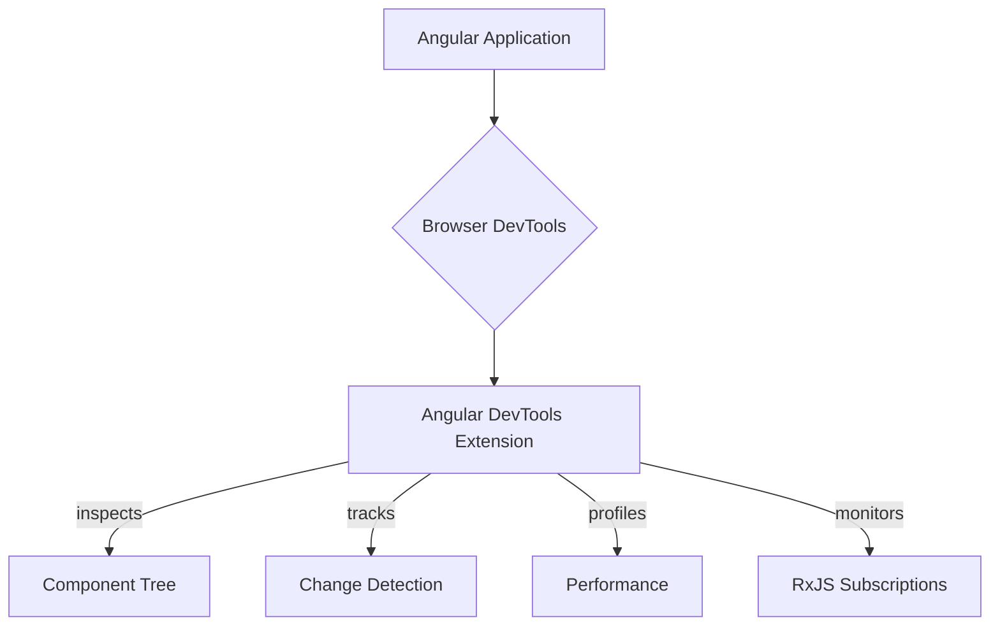

# Module 15.3: Angular DevTools

**Objective:** To learn about Angular DevTools, a browser extension that provides powerful debugging and profiling capabilities for Angular applications.

---

### The Challenge of Debugging Complex Applications

As Angular applications grow in size and complexity, traditional browser developer tools (like the Elements and Console tabs) can become insufficient for effective debugging. It can be challenging to:

*   Inspect the component tree and its state.
*   Understand change detection cycles.
*   Profile application performance specifically related to Angular operations.
*   Track RxJS Observable subscriptions.

### The Solution: Angular DevTools

**Angular DevTools** is an official browser extension developed by the Angular team. It integrates directly into your browser's developer tools (Chrome, Edge, Firefox) and provides Angular-specific insights, making debugging and profiling much more efficient.

#### Key Features of Angular DevTools:

1.  **Component Explorer:** Visualize the component tree of your application, inspect component properties, inputs, outputs, and state.
2.  **Profiler:** Analyze change detection cycles, identify performance bottlenecks, and understand how long each component takes to render.
3.  **Dependency Injection Tree (Experimental):** View the DI hierarchy and the instances of services.
4.  **RxJS Debugging (Experimental):** Monitor RxJS Observable subscriptions and emissions.

--- 

### Installation

Angular DevTools is available as a browser extension:

*   **Chrome Web Store:** Search for "Angular DevTools" or visit [https://chrome.google.com/webstore/detail/angular-devtools/ienfalfjdbkpepbkmlfnpcebplpgjneo](https://chrome.google.com/webstore/detail/angular-devtools/ienfalfjdbkpepbkmlfnpcebplpgjneo)
*   **Firefox Add-ons:** Search for "Angular DevTools"
*   **Edge Add-ons:** Search for "Angular DevTools"

After installation, open your browser's developer tools (F12 or Ctrl+Shift+I). You should see a new tab labeled "Angular" (or similar).

### Using Angular DevTools

#### 1. Component Explorer

This is the default view when you open the Angular DevTools tab. It displays a hierarchical tree of all the Angular components rendered on the current page.

*   **Inspecting Components:** Click on any component in the tree to select it. The right-hand panel will then display its properties, inputs, outputs, and state.
*   **Modifying Properties:** You can often modify component properties directly in the DevTools, which can be useful for testing different states without changing code.
*   **Highlighting Components:** Hovering over a component in the tree will highlight its corresponding element in the browser, making it easy to locate.
*   **Searching:** Use the search bar to find specific components by name or selector.

#### 2. Profiler

The Profiler tab helps you identify performance issues related to Angular's change detection.

*   **Recording:** Click the "Record" button to start profiling. Interact with your application (e.g., click buttons, type in inputs) to trigger change detection cycles.
*   **Analyzing Results:** After stopping the recording, the profiler will show a flame graph or a list of change detection cycles. You can see:
    *   Which components were checked.
    *   How long each component took to check.
    *   The total time spent in change detection.
*   **Identifying Bottlenecks:** Look for components that take a long time to check or are checked unnecessarily. This can indicate areas where you might apply `OnPush` change detection (Module 10.4) or optimize component logic.

#### 3. RxJS Debugging (Experimental)

This feature allows you to visualize and debug RxJS Observable streams within your application.

*   **Enabling:** You might need to enable this feature in the DevTools settings or ensure your RxJS version is compatible.
*   **Monitoring:** It can show you:
    *   Active Observable subscriptions.
    *   Values emitted by Observables.
    *   Errors and completions.
*   **Use Case:** Extremely helpful for understanding complex RxJS pipelines and debugging issues related to asynchronous data flow.

### Best Practices for Using DevTools

*   **Use in Development:** Angular DevTools is primarily a development tool. While it can be used on production builds, some features might be limited due to optimizations (e.g., minification obfuscating variable names).
*   **Combine with Browser DevTools:** Angular DevTools complements, rather than replaces, the native browser developer tools. Use them together for a comprehensive debugging experience.
*   **Profile Regularly:** Make profiling a regular part of your development workflow, especially for complex features, to catch performance regressions early.
*   **Understand Change Detection:** A solid understanding of Angular's change detection mechanism (Module 10.4) will help you interpret the profiler's results effectively.

Angular DevTools is an indispensable tool for any serious Angular developer. It provides deep insights into your application's internal workings, allowing you to debug more efficiently, optimize performance, and build higher-quality applications.

---

### Hands-on Exercise: Debug with Angular DevTools

1.  **Install Angular DevTools** for your browser (Chrome, Edge, or Firefox).
2.  **Create a simple Angular application** or use an existing one.
3.  **Add a component** with a few properties (e.g., `counter: number`, `message: string`, `user: { name: string, email: string }`).
4.  **Add buttons** to your template that modify these properties (e.g., increment `counter`, change `message`, update `user.name`).
5.  **Open your browser's developer tools** and navigate to the "Angular" tab.
6.  **Explore the Component Explorer:**
    *   Select your component in the component tree.
    *   Observe its properties in the right-hand panel. Try modifying a property directly in DevTools and see the change reflected in your application.
    *   Use the "Highlight Component" feature to visually locate components on the page.
7.  **Use the Profiler:**
    *   Go to the "Profiler" tab and click "Record".
    *   Interact with your application (click buttons, type in inputs) to trigger change detection.
    *   Stop recording and analyze the flame graph. Identify which components were checked and how long it took.
8.  **(Optional) RxJS Debugging:** If your application uses RxJS, explore the RxJS tab to see active subscriptions and emitted values.

---

**Previous:** [15.2 Angular Elements](./15.2-angular-elements.md)

**Next:** [15.4 Angular CLI Beyond Basics](./15.4-angular-cli-beyond-basics.md)
